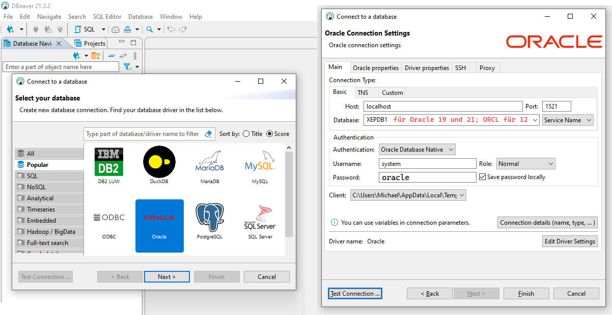
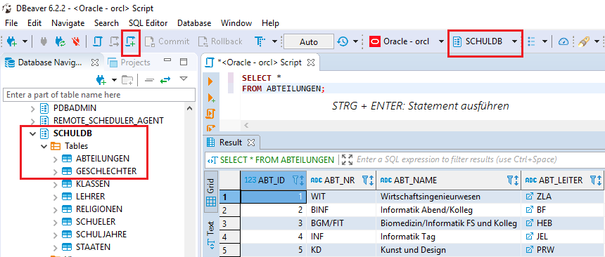

# Arbeiten mit DBeaver Community

Als SQL Editor kann auch DBeaver verwendet werden. Er kann sich über die JDBC Treiberarchitektur
zu verschiedenen Datenbanken - darunter auch Oracle - verbinden. Das Programm kann auf der [DBeaver Downloadseite](https://dbeaver.io/download/)
heruntergeladen werden.

## Voraussetzung

Die Oracle Datenbank muss hochgefahren sein und auf Port 1521 Verbindungen annehmen.

## Verbinden zur Oracle Datenbank in der VM (Oracle 19 XE oder 21 XE)

Durch den Button *New Database Connection* kann der Verbindungsdialog geöffnet werden. In diesem Dialog
muss Oracle als Datenbanksystem ausgewählt werden:



- **Host:** *localhost*
- **Database:** *XEPDB1* (Service Name)
- **Username:** *System* (oder ein anderer User wie z. B. SchulDb)
- **Passwort:** *oracle*

Beim ersten Verbinden wird der Treiber aus dem Netz geladen. Die angebotenen pluggable databases
können herausgefunden werden, indem man sich mit dem User *system* und dem Service Name *XE*
verbindet. Danach wird das SQL Statement `SELECT name FROM v$pdbs;` abgesetzt.

## Verbinden zur Oracle Datenbank in der VM (Oracle 11 oder 12)

> **Hinweis:** Die Unterlagen über die alte Oracle 12 VM werden in diesem Kurs bald entfernt werden.
> Bitte verwenden Sie das Docker Image von Oracle21c wie [hier](../03_Docker/README.md)
> beschrieben.

Zum Verbinden müssen wie in SQL Developer folgende Verbindungsdaten eingegeben werden:

- **Host:** *localhost*
- **Database:** *orcl* (Service Name)
- **Username:** *System* (oder ein anderer User wie z. B. SchulDb)
- **Passwort:** *oracle*

Beim ersten Verbinden wird der Treiber aus dem Netz geladen.

## Zugriff auf das Schema

DBeaver listet alle Schemata der Datenbank auf. Um SQL Abfragen im Schema *SchulDB*
auszuführen, muss ein SQL Editor geöffnet werden. Am Schnellsten geht das mit *STRG* + *ENTER*, es gibt
auch einen Button in der Symbolleiste. Achten Sie darauf, dass das richtige Schema in der Symbolleiste
als Ziel der Abfrage ausgewählt ist. Sonst bekommen Sie den Fehler *table or view does not exist*.

EInzelne Abfragen werden mit *STRG* + *ENTER* ausgeführt. Möchten Sie das ganze SQL Skript ausführen, so
klicken Sie auf *Execute Script* oder drücken *ALT* + *X*.



## Erstellen weiterer User

Mit folgenden Statements kann ein weiterer User (*NewUser*) mit dem Passwort *oracle* (wird nach *IDENTIFIED BY*
geschrieben) erstellt werden.

```sql
CREATE USER NewUser IDENTIFIED BY oracle;
GRANT CONNECT, RESOURCE, CREATE VIEW TO NewUser;
GRANT UNLIMITED TABLESPACE TO NewUser;
```

## Diagramme erzeugen

Ein nettes Feature ist das automatische Erzeugen von ER Diagrammen von einem Schema aus. Dies erreicht
man im Kontextmenü des Schemas in der Navigation:


## Zugriff auf Access Datenbanken

Sie können auch eine neue Verbindung zu einer Access Datenbank herstellen. Dabei wird beim erstmaligen
Verbinden der JDBC Treiber geladen.

