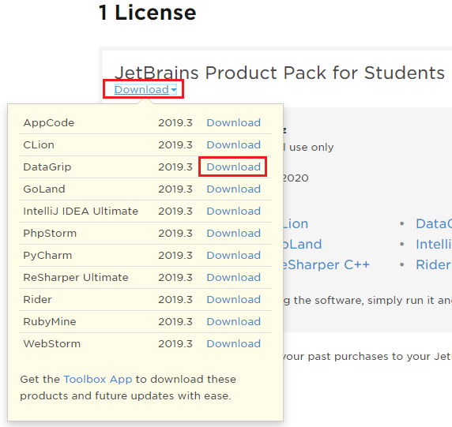
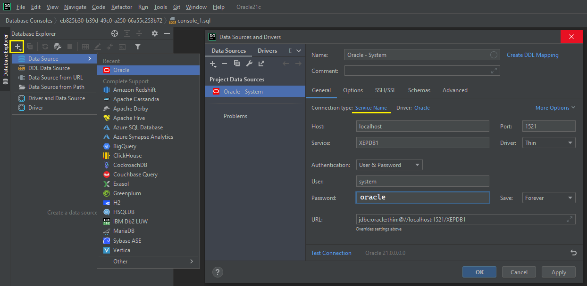

# JetBrains DataGrip

Nach der Registrierung mit der Schul Mailadresse können Produkte von
https://account.jetbrains.com/licenses/assets - unter anderem auch DataGrip - geladen werden:



## Zugriff auf Oracle

Der Oracle Container muss natürlich für eine Verbindung gestartet sein. Für den Zugriff auf den
Docker Container von Oracle 19 oder 21 wird eine neue Verbindung mit folgenden
Daten angelegt:

- **Connection type:** Service Name
- **Host:** localhost
- **Service:** XEPDB1
- **User:** system (oder ein anderer erstellter User)
- **Password:** oracle



## Erstellen weiterer User

Mit folgenden Statements kann ein weiterer User (*NewUser*) mit dem Passwort *oracle* (wird nach *IDENTIFIED BY*
geschrieben) erstellt werden.

```sql
CREATE USER NewUser IDENTIFIED BY oracle;
GRANT CONNECT, RESOURCE, CREATE VIEW TO NewUser;
GRANT UNLIMITED TABLESPACE TO NewUser;
```
