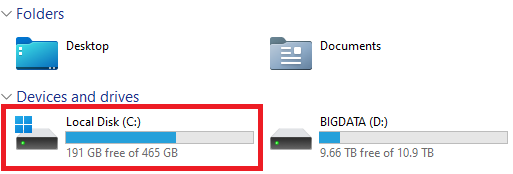
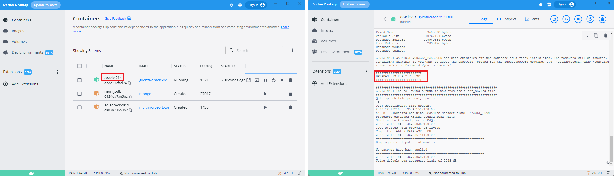

# Docker Container für Oracle 21 XE

Die neueste Express Edition (XE) von Oracle gibt es auch als Docker Container. Lade dafür
Docker für dein Betriebssystem von [docs.docker.com](https://docs.docker.com/get-docker/).

## Vor der Installation zu prüfen

Prüfe vor der Installation, ob **genügend Speicher auf der Systemplatte** (C) frei ist. Die virtuelle
Harddisk wird im Userprofile angelegt und hat - je nach Nutzung - **20 bis 50 GB**.



Achte auch darauf, dass du **keine zusätzliche Virenscanner** wie Avira, ... neben dem Windows Defender
laufen hast. Sie können den Schreibzugriff auf die virtuelle Harddisk sperren und dann wird Docker
einfach stehenbleiben.

## Installation von Docker

### Windows

Die Installation von Docker Desktop und das Laden des Containers ist als Video
verfügbar: https://youtu.be/ekmGqHBVNTM. Es sind folgende Schritte erforderlich:

- Laden des Linux kernel update packages über den Punkt
  [WSL2 Linux kernel update package for x64 machines](https://learn.microsoft.com/en-us/windows/wsl/install-manual#step-4---download-the-linux-kernel-update-package)
- Laden und Installieren von [Docker Desktop](https://www.docker.com/products/docker-desktop/)

Nach der erfolgreichen Installation wird der Container für Oracle 21 XE mittels der folgenden
Befehle in der Windows Konsole geladen und ausgeführt. Der Container hat rund 3.5 GB.

Der *docker run* Befehl verwendet ein Verzeichnis (*C:/Temp/oracle-home*), um das Homeverzeichnis
zu mappen. Bei anderen Betriebssystemen (macOS, Linux) muss dieser Pfad angepasst werden, da es
dort keine Laufwerke gibt. **Achte darauf, dass vor dem Schließen der Konsole der Befehl auch
abgeschlossen wurde. Das ist daran zu erkennen, dass der Prompt wieder erscheint.**

```text
docker run -d -p 1521:1521 -e ORACLE_PASSWORD=oracle -v C:/Temp/oracle-home:/home --name oracle21c gvenzl/oracle-xe:21-full
```

Die Umgebungsvariable *ORACLE_PASSWORD* setzt das Systempasswort. Da es keine Produktionsdatenbank
ist, verwenden wir zur Vereinfachung *oracle*.

### MacOS (x86 Geräte)

Installiere Docker Desktop von [www.docker.com](https://www.docker.com/products/docker-desktop/).
Achte auf die *Intel Chip* Version. Führe nach der Installation im Terminal den folgenden Befehl aus:

```text
docker run -d -p 1521:1521 -e ORACLE_PASSWORD=oracle -v /tmp/oracle-home:/home --name oracle21c gvenzl/oracle-xe:21-full
```

**Achte darauf, dass vor dem Schließen des Terminals der Befehl auch
abgeschlossen wurde. Das ist daran zu erkennen, dass der Prompt wieder erscheint.** Klicke danach
auf den Namen des Containers in Docker Desktop, um das Log anzusehen. Am Anfang wird die Datenbank
initialisiert. Sie ist erst betriebsbereit, wenn die Meldung *DATABASE IS READY TO USE* erscheint.

### MacOS (M1, M2 Geräte)

Installiere Docker Desktop von [www.docker.com](https://www.docker.com/products/docker-desktop/).
Achte auf die *Apple Chip* Version. Danach installiere - wenn nicht schon
geschehen - [Homebrew](https://brew.sh/), einen Packagemanager für macOS. Schließe nun Docker
Desktop mit Command+Q (⌘ + Q) und führe danach im Terminal die folgenden Befehle aus.

```bash
brew install colima
colima start --memory 4 --arch x86_64
docker run -d -p 1521:1521 -e ORACLE_PASSWORD=oracle -v /tmp/oracle-home:/home --name oracle21c gvenzl/oracle-xe:21-full
docker logs -f oracle21c
```

Der letzte Befehl zeigt das Log des Containers an. Da beim ersten Starten des Containers die Datenbank
noch initialisiert wird, ist es wichtig, diese Initialisierung abzuwarten. Warte, bis
*DATABASE IS READY TO USE* erscheint. Danach kannst du mit CtrL+C (⌃ + C) das Log verlassen.

*Colima* kann x86 Container auf der Apple ARM Plattform emulieren. Daher muss zum Starten des
Containers der Oracle Container mit folgenden Befehlen im Terminal gestartet werden:

```bash
colima start && docker start oracle21c
```

Um die Ressourcen wieder freizugeben, solltest du nach der Arbeit colima mit `colima stop` beenden.

Der Container *oracle21c* erscheint **nicht in Docker Desktop**, da er von colima verwaltet wird.
Um Befehle in der Shell des Containers auszuführen, gib `docker exec -it oracle21c bash` bei
gestartetem Oracle Container im Terminal ein.

## Starten und Stoppen des Containers

Durch *docker run* wird unser Container bereits gestartet. Aber wie verhält es sich nach einem
Neustart von Windows? Docker Desktop startet automatisch mit
Microsoft Windows, der Container wird allerdings nicht automatisch gestartet.
Daher die zwei folgenden Befehle in der Konsole zum Starten bzw. manuellen Stoppen (wenn notwendig)
des Containers wichtig:

```text
docker start oracle21c
docker stop oracle21c
```

Natürlich kann mit Docker Desktop der Container ebenfalls gestartet und beendet werden.

> **Hinweis:** Gerade nach dem ersten Start des Containers vergeht etwas Zeit, bis die Datenbank 
> hochgefahren ist. Kontrolliere die Ausgaben in Docker Desktop, indem du auf den Containernamen
> klickst. Es muss die Meldung *DATABASE IS READY TO USE!* im Log Fenster erscheinen.



## Alternative: Oracle Docker Image selbst erzeugen mit docker build

Oracle stellt selbst ein Dockerfile bereit, mit dem du das Image selbst erzeugen kannst. Du
brauchst eine gestartete Installation von Docker Desktop und eine Installation von git.
Gehe danach in die Konsole und wechsle z. B. in dein Download Verzeichnis. Gibt danach die folgenden
Befehle ein. Ersetze *C:/Temp/oracle-home* durch das Verzeichnis, wo das Homeverzeichnis gemappt
werden soll. Unter macOS/Linux muss es natürlich eine Unix Pfadangabe (Schrägstrich) sein.

> Hinweis: Das Dockerfile unterstützt nur x86/x64 Plattformen, nicht ARM basierende Plattformen wie
> M1 oder M2.

```
git clone https://github.com/oracle/docker-images.git
cd docker-images/OracleDatabase/SingleInstance/dockerfiles/21.3.0
docker build -t oracle/database:21.3.0-xe -f Dockerfile.xe .
docker create -p 1521:1521 -e ORACLE_PASSWORD=oracle -v C:/Temp/oracle-home:/home --name oracle21c oracle/database:21.3.0-xe
```

Das erzeugte Image ist ca. 6.5 GB groß, beim Buildvorgang werden daher recht viele Daten aus dem
Netz geladen.

Klicke beim ersten Start in Docker Desktop auf den Namen des Containers, um die Ausgaben zu sehen.
Beim ersten Start werden noch Arbeiten verrichtet, deswegen müssen diese noch abgewartet werden
bis du dich verbinden kannst. Das kann einige Minuten dauern, Fehlermeldungen wie *can't read...*
bewirken keinen Abbruch, es muss nur bis 100% gewartet werden.

### SQL*Plus 

SQL*Plus ist ein Kommandozeilentool, welches direkt SQL Befehle absetzen kann. Wollen wir als
System User direkt Befehle in der pluggable database absetzen, können wir
mittels *docker exec* das Dienstprogramm *sqlplus* starten. Das Passwort ist *oracle* und wurde
im *docker run* Befehl weiter oben als Umgebungsvariable *ORACLE_PASSWORD* gesetzt.

```text
docker exec -it oracle21c sqlplus system/oracle@//localhost/XEPDB1
```

Wollen wir *systemweite Änderungen* machen, gibt es noch den User *SYS*. Hier können Konfigurationen,
die das ganze System betreffen, gelesen und gesetzt werden. Beachte, dass *oracle* das Passwort
des Users sys ist.

```text
docker exec -it oracle21c sqlplus sys/oracle AS SYSDBA
```

Mit dem Befehl *quit* kann der SQL*Plus Prompt verlassen werden.

### Shell (bash) und Datenaustausch mit dem Host

Wir können auch eine Shell öffnen und Befehle in Linux absetzen:

```text
docker exec -it oracle21c /bin/bash
```

Mit *exit* kann die Shell verlassen und zu Windows zurückgekehrt werden. Du kannst auch in
Docker Desktop auf den Button *CLI*, der beim Container angeboten wird, klicken.

Beim Anlegen des Containers mit *docker run* haben wir mit dem Parameter
*-v C:/Temp/oracle-home:/home* einen Ordner angegeben, der auch im Container sichtbar ist.
Nun können wir z. B. in Windows in *C:/Temp/oracle-home* eine Textdatei anlegen. In der bash
ist sie im Homeverzeichnis sichtbar:

```text
bash-4.4$ cd /home/
bash-4.4$ ls
test.txt

bash-4.4$ cat test.txt
Das
ist
ein
Test!
```

## Andere Datenbanksysteme als Docker

### MariaDB (MySQL fork)

Über Docker kann auch MariaDb (ein Fork von MySQL) geladen werden. Die nachfolgende Anweisung
in der Konsole lädt die letzte Version von MariaDb in den Container mit dem Namen *mariadb*
und prüft die Version. Der root Benutzer hat kein Passwort.

```bash
docker run -d -p 3306:3306 --name mariadb -e MARIADB_ALLOW_EMPTY_ROOT_PASSWORD=true  mariadb:latest
docker exec -it mariadb mysql

MariaDB [(none)]> SELECT VERSION();
+-------------------------------------+
| VERSION()                           |
+-------------------------------------+
| 10.6.5-MariaDB-1:10.6.5+maria~focal |
+-------------------------------------+

MariaDB [(none)]> quit
```

### Microsoft SQL Server

Natürlich steht auch SQL Server zur Verfügung. Die nachfolgende Anweisung legt einen Container
mit dem Namen *sqlserver2019* an. Das Passwort wird in *SA_PASSWORD* gesetzt und ist in diesem
Beispiel *SqlServer2019*. Der Benutzer ist *sa*. Das Passwort muss folgender Richtlinie genügen:

> This password needs to include at least 8 characters of at least three of these four categories:
> uppercase letters, lowercase letters, numbers and non-alphanumeric symbols.

```text
docker run -d -p 1433:1433  --name sqlserver2019 -e "ACCEPT_EULA=Y" -e "SA_PASSWORD=SqlServer2019" mcr.microsoft.com/mssql/server:2019-latest      
```

## Ubuntu unter Windows nutzen

Durch das Windows-Subsystem für Linux (WSL) kann auch Ubuntu sehr leicht installiert und
gestartet werden. Zuerst stellen wir die Standardversion von WSL auf WSL 2 um. Dafür

- gib im Startmenü Powershell ein.
- klicke mit der rechten Maustaste auf *Windows PowerShell* und wähle *Run as Administrator*.
- Der Befehl `wsl --set-default-version 2` aktiviert WSL 2 standardmäßig für neu installierte Images.
  
Öffne danach im Startmenü den Store und gib als Suchbegriff *Ubuntu* ein. Klicke
in der Ergebnisliste auf die neueste Version (derzeit *Ubuntu 20.04 LTS*). Nach der Installation
wird eine kleine Einrichtung gestartet, wo das root Kennwort eingestellt wird.

Danach kann Ubuntu einfach über das Startmenü geöffnet werden. Die Windows Verzeichnisse sind
automatisch in */mnt* gemappt.

### Umstellen einer bestehenden Distribution

Falls du schon Ubuntu über den Store installiert hast, kannst du auch nachträglich die WSL Version
für ein Image setzen. Dafür öffne wieder PowerShell als Administrator. Mit dem ersten Befehl
(*--list*) werden alle Distributionen angezeigt. Mit dem zweiten Befehl wird die Version gesetzt.
Der Name *Ubuntu-20.04* ist die verwendete Distribution, prüfe in der Liste ob sie auch so heißt.

```
wsl --list --verbose
wsl --set-version Ubuntu-20.04 2
```

### Integration in Docker Desktop

Damit in der Ubuntu Installation auch Docker genutzt werden kann, öffne in Windows Docker Desktop.
Unter *Settings - Resources - WSL Integration* kann dann die installierte Ubuntu Version aktiviert
werden. Nun ist es möglich, auch in Ubuntu den *docker run* Befehl auszuführen, wenn Docker dort
installiert wurde. Das folgende Beispiel startet den Docker Container von SQL Server aus Ubuntu
heraus. Die Installation von Docker muss natürlich nur 1x gemacht werden.


```
sudo apt-get update && sudo apt-get install docker
sudo docker run -d -p 1433:1433  --name sqlserver2019 -e "ACCEPT_EULA=Y" -e "SA_PASSWORD=SqlServer2019" mcr.microsoft.com/mssql/server:2019-latest      
```

### Setzen der Default Distribution in Docker Desktop

Ubuntu kann als Default Distribution in Docker Desktop konfiguriert werden. Dafür wird wieder
in der PowerShell als Administrator z. B. *Ubuntu-20.04* als Standard konfiguriert. Prüfe aber,
ob die Distribution auch so heißt (mit *wsl --list*).

```
wsl --list --verbose
wsl --set-default Ubuntu-20.04
```

## Oracle Docker Image selbst erzeugen mit docker build

Oracle stellt selbst ein Dockerfile bereit, mit dem du das Image selbst erzeugen kannst. Du
brauchst eine gestartete Installation von Docker Desktop und eine Installation von git.
Gehe danach in die Konsole und wechsle z. B. in dein Download Verzeichnis. Gibt danach die folgenden
Befehle ein:

```
git clone https://github.com/oracle/docker-images.git
cd docker-images\OracleDatabase\SingleInstance\dockerfiles\21.3.0
docker build -t oracle/database:21.3.0-xe -f Dockerfile.xe .
docker create -p 1521:1521 -e ORACLE_PASSWORD=oracle -v C:/Temp/oracle-home:/home --name oracle21c oracle/database:21.3.0-xe
```

Klicke beim ersten Start in Docker Desktop auf den Namen des Containers, um die Ausgaben zu sehen.
Beim ersten Start werden noch Arbeiten verrichtet, deswegen müssen diese noch abgewartet werden
bis du dich verbinden kannst.
