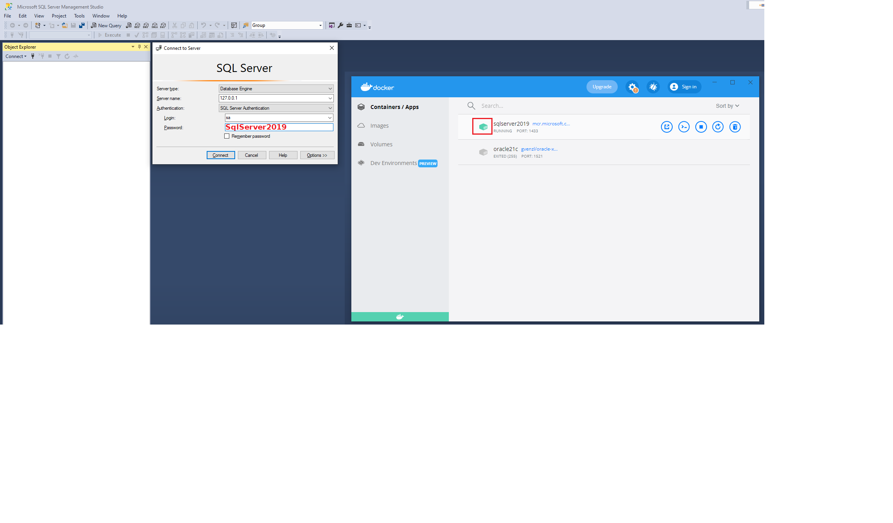

# Installation von SQL Server

### [Zum Video](https://youtu.be/EfZTHVe0Z_c) 


## Docker Image von SQL Server

Die einfachste Möglichkeit, mit SQL Server zu arbeiten, ist das Verwenden des Docker Images. Lade dafür
Docker für dein Betriebssystem von [docs.docker.com](https://docs.docker.com/get-docker/).

Die nachfolgende Anweisung in der Eingabeaufforderung (Konsole) legt einen Container
mit dem Namen *sqlserver2019* an. Das Passwort wird in *SA_PASSWORD* gesetzt und ist in diesem
Beispiel *SqlServer2019*. Der Benutzer ist *sa*. Das Passwort muss folgender Richtlinie genügen:

> This password needs to include at least 8 characters of at least three of these four categories:
> uppercase letters, lowercase letters, numbers and non-alphanumeric symbols.

```text
docker run -d -p 1433:1433  --name sqlserver2019 -e "ACCEPT_EULA=Y" -e "SA_PASSWORD=SqlServer2019" mcr.microsoft.com/mssql/server:2019-latest      
```

### Starten und Stoppen des Containers

Durch *docker run* wird unser Container bereits gestartet. Aber wie verhält es sich nach einem
Neustart von Windows? Docker Desktop startet automatisch mit
Microsoft Windows, der Container wird allerdings nicht automatisch gestartet.
Daher die zwei folgenden Befehle in der Konsole zum Starten bzw. manuellen Stoppen (wenn notwendig)
des Containers wichtig:

```text
docker start sqlserver2019
docker stop sqlserver2019
```

Natürlich kann mit Docker Desktop der Container ebenfalls gestartet und beendet werden.

> **Hinweis:** Gerade nach dem ersten Start des Containers vergeht etwas Zeit, bis die Datenbank 
> hochgefahren ist. Kontrolliere die Ausgaben in Docker Desktop, indem du auf den Containernamen
> klickst.


## SQL Server Management Studio

Das SQL Server Management Studio kann von https://docs.microsoft.com/en-us/sql/ssms/download-sql-server-management-studio-ssms?view=sql-server-ver16
geladen werden (*Free Download for SQL Server Management Studio (SSMS)*). Gib nach
der Installation im Startmenü *SSMS* ein, es wird dann in der Liste der Programme aufscheinen.

Die Verbindung kann über die IP (127.0.0.1), den User *sa* und das Passwort *SqlServer2019*
erfolgen. **Achte darauf, dass der Container von SQL Server 2019 in Docker Desktop läuft.**




## Andere Datenbanksysteme als Docker

### MariaDB (MySQL fork)

Über Docker kann auch MariaDb (ein Fork von MySQL) geladen werden. Die nachfolgende Anweisung
in der Konsole lädt die letzte Version von MariaDb in den Container mit dem Namen *mariadb*
und prüft die Version. Der root Benutzer hat kein Passwort.

```bash
docker run -d -p 3306:3306 --name mariadb -e MARIADB_ALLOW_EMPTY_ROOT_PASSWORD=true  mariadb:latest
docker exec -it mariadb mysql

MariaDB [(none)]> SELECT VERSION();
+-------------------------------------+
| VERSION()                           |
+-------------------------------------+
| 10.6.5-MariaDB-1:10.6.5+maria~focal |
+-------------------------------------+

MariaDB [(none)]> quit
```

## Ubuntu unter Windows nutzen (optional)

Durch das Windows-Subsystem für Linux (WSL) kann auch Ubuntu sehr leicht installiert und
gestartet werden. Zuerst stellen wir die Standardversion von WSL auf WSL 2 um. Dafür

- gib im Startmenü Powershell ein.
- klicke mit der rechten Maustaste auf *Windows PowerShell* und wähle *Run as Administrator*.
- Der Befehl `wsl --set-default-version 2` aktiviert WSL 2 standardmäßig für neu installierte Images.
  
Öffne danach im Startmenü den Store und gib als Suchbegriff *Ubuntu* ein. Klicke
in der Ergebnisliste auf die neueste Version (derzeit *Ubuntu 20.04 LTS*). Nach der Installation
wird eine kleine Einrichtung gestartet, wo das root Kennwort eingestellt wird.

Danach kann Ubuntu einfach über das Startmenü geöffnet werden. Die Windows Verzeichnisse sind
automatisch in */mnt* gemappt.

### Umstellen einer bestehenden Distribution

Falls du schon Ubuntu über den Store installiert hast, kannst du auch nachträglich die WSL Version
für ein Image setzen. Dafür öffne wieder PowerShell als Administrator. Mit dem ersten Befehl
(*--list*) werden alle Distributionen angezeigt. Mit dem zweiten Befehl wird die Version gesetzt.
Der Name *Ubuntu-20.04* ist die verwendete Distribution, prüfe in der Liste ob sie auch so heißt.

```
wsl --list --verbose
wsl --set-version Ubuntu-20.04 2
```

### Integration in Docker Desktop

Damit in der Ubuntu Installation auch Docker genutzt werden kann, öffne in Windows Docker Desktop.
Unter *Settings - Resources - WSL Integration* kann dann die installierte Ubuntu Version aktiviert
werden. Nun ist es möglich, auch in Ubuntu den *docker run* Befehl auszuführen, wenn Docker dort
installiert wurde. Das folgende Beispiel startet den Docker Container von SQL Server aus Ubuntu
heraus. Die Installation von Docker muss natürlich nur 1x gemacht werden.


```
sudo apt-get update && sudo apt-get install docker
sudo docker run -d -p 1433:1433  --name sqlserver2019 -e "ACCEPT_EULA=Y" -e "SA_PASSWORD=SqlServer2019" mcr.microsoft.com/mssql/server:2019-latest      
```

### Setzen der Default Distribution in Docker Desktop

Ubuntu kann als Default Distribution in Docker Desktop konfiguriert werden. Dafür wird wieder
in der PowerShell als Administrator z. B. *Ubuntu-20.04* als Standard konfiguriert. Prüfe aber,
ob die Distribution auch so heißt (mit *wsl --list*).

```
wsl --list --verbose
wsl --set-default Ubuntu-20.04
```
