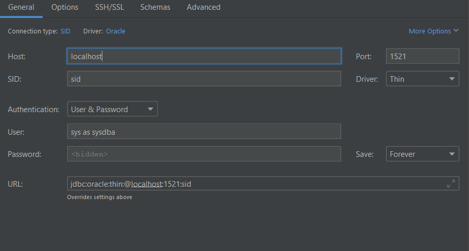

# Installation einer Oracle-Datenbank via Docker


## Installationsvoraussetzungen

Um mit Docker-Containern arbeiten zu können braucht man:
 - ``Docker Desktop``: https://www.docker.com/products/docker-desktop für einen Standard docker Installation
 - ``Windows Subsystem for Linux``: https://docs.microsoft.com/en-us/windows/wsl/install um eine Linux-Umgebung zu bekommen. Im späteren Verlauf müssen wir ein Shellskript ausführen. Auch ist Docker performanter beim Ausführen von Linux-Containern wenn bereits ein Linux (via WSL) vorhanden ist. 

## Buildprozess für einen Oracle-Container
Da Oracle für Entwickler keine fertigen Container auf Docker-Hub anbietet müssen wir uns diesen selber bauen. Als grundlage dafür kann ich folgendes Video empfehlen: https://yewtu.be/watch?v=bFy8pmmpSHU Darin gibt es eine Schritt-für-Schritt Anleitung sowie einige Hintergrundinformationen. 

1. Zunächst müssen wir folgendes Repository klonen: https://github.com/oracle/docker-images 
2. Im Unterverzeichniss https://github.com/oracle/docker-images/blob/main/OracleDatabase/SingleInstance befindet sich der Ordner ``dockerfiles``. Das darin enthaltene Shell-Skript benötigt um mit dem Inageaufbau beginnen zu können noch die Datenbank in gezippter form welche man sich von der Oracle-Homnepage herunterladen muss.
3. Um sich die zip-Datei herunterladen zu können benötigt man ein oracel konto. Wer sich kein Konto anlegen möchte kann auf http://bugmenot.com/view/oracle.com oder anderen Diensten nachsehen ob schon jemand sein Konto dort veröffentlicht hat. 
4. Nachdem die zip-Datei heruntergeladen und im richtigen Ordner enthalten ist kann der buildprozess mit `./buildContainerImage.sh -e -v 19.3.0` begonnen werden. Mit dem Komando `docker images` sieht man dann die image-id den Namen sowie den Tag. 

5. Mit folgendem Befehl könnt ihr den Container dann starten. Falls das Image `oracle/database:19.3.0-ee` nicht gefunden wird kann man statt dieser auch die Image-id verwenden. 

```
docker run --name <container name> \
-p <host port>:1521 -p <host port>:5500 \
-e ORACLE_SID=<your SID> \
-e ORACLE_PDB=<your PDB name> \
-e ORACLE_PWD=<your database passwords> \
-e INIT_SGA_SIZE=<your database SGA memory in MB> \
-e INIT_PGA_SIZE=<your database PGA memory in MB> \
-e ORACLE_EDITION=<your database edition> \
-e ORACLE_CHARACTERSET=<your character set> \
-e ENABLE_ARCHIVELOG=true \
-v [<host mount point>:]/opt/oracle/oradata \
oracle/database:19.3.0-ee
```

6. Sobald der Container läuft ist es möglich sich in die Datenbank hinein zu verbinden. Anders als im oben angegebenen Youtube-Video werden wir aber keinen extra-Container als Client nehmen sondern DataGrip. Dazu bitte mit folgenden Einstellungen: 



7. Fertig! Sobald die Verbindung funktioniert können wir im weiteren Verlauf eine Datenbank importieren und unsere Übungen starten. Bei Fragen bitte das Youtube Video schauen oder mir eine E-Mail schreiben. 

## Extra: docker-compose

Um nicht jedes mal beim Containerstart `docker run ...` eingeben zu müssen können die Informationen für die Erstellung eines Containers auch in der Datei `docker-compose.yml` gespeichert werden. Docker Compose ist ein Zusatzprogramm für die schnelle Erstellung von Containern welche (im Normalfall) miteinander interagieren. Durch den Befehl `docker-compose up -d` im selbem Verzeichnis in dem sich auch die YML-Datei befindet werden automatisch Images von Docker Hub heruntergeladen, Volumes angelegt, Netzwerke eingerichtete uvm. Wichtig hierbei ist auf die Image-Id zu achten. Diese ist von Maschine zu Maschine anders. Leider funktioniert docker-compose in diesem Fall nicht mit dem Imagenamen da es Versucht ein solches Image von Docker Hub herunterzuladen, dieses jedoch nicht existiert. 

