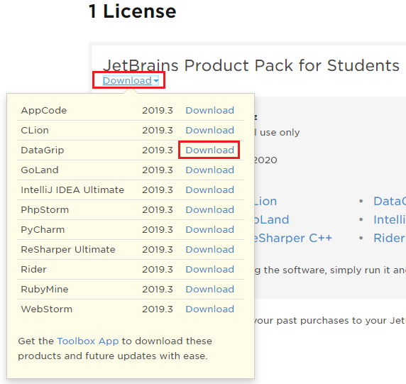
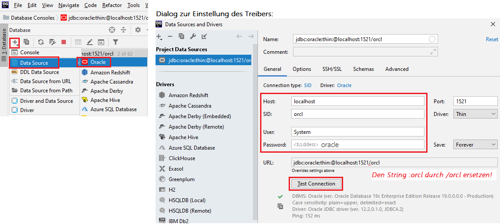

# JetBrains DataGrip

Aus https://intranet.spengergasse.at/news/jetbrains-produkte-in-den-laboren-und-auf-den-laptops-von-studierenden-und-lehrkraeften/:
> In enger Zusammenarbeit mit dem ZID (herzlichen Dank hierfür) ist es uns gelungen den von der
> Firma JetBrains zur Verfügung gestellten Lizenzserver für unsere Labor-Rechner aufzusetzen.
>
> Wir haben nun die Möglichkeit bis zu 300 Laborrechner nicht nur mit IntelliJ sondern vielmehr mit
> sämtlichen Produkten des Herstellers auszustatten. An den aktualisierten Images wird seitens des
> ZID gearbeitet.
>
> Selbstverständlich können sowohl Studierende als auch Lehrkräfte eine individuelle Lizenz über alle
> Produkte für den persönlichen Laptop auf der [JetBrains Registrierungsseite](https://www.jetbrains.com/student/) 
> mit einer @spengergasse.at eMail beantragen. Diese Lizenz läuft wie immer ein Jahr und kann solange man eine @spengergasse.at
> eMail Adresse hat, verlängert werden.

Nach der Registrierung können die beliebtesten Produkte von https://account.jetbrains.com/licenses/assets
geladen werden:

## Voraussetzung in der Virtuellen Maschine

Das Portforwarding des Port 1521 muss - wie im Kapitel Installation beschrieben - in Virtual Box
gesetzt werden.

## Zugriff auf Oracle

Für den Zugriff auf die Oracle VM wird eine Data Source angelegt. Wichtig ist, dass die generierte
URL durch den String `jdbc:oracle:thin:@localhost:1521/orcl` getauscht wird. Dadurch wird *orcl* als
Service Name statt als SID eingestellt. Nach dem Klicken auf *Test Connection* wird der Treiber
geladen und die Verbindung kann hergestellt werden.

