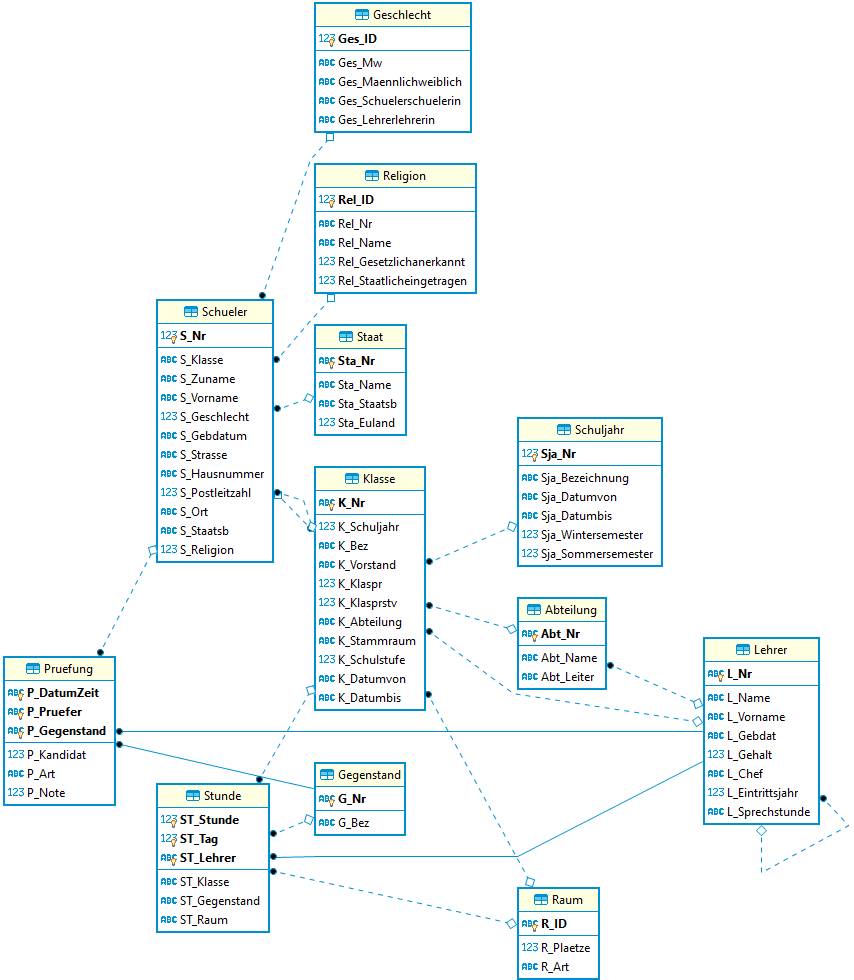

# Unterabfragen in SQL

## Kapitel

- [Nicht korrespondierende Unterabfragen, die einen Wert liefern](01_SingleValueNonCorresponding)
- [Korrespondierende Unterabfragen, die einen Wert liefern](02_SingleValueCorresponding)
- [Unterabfragen, die Listen liefern (IN, NOT IN, EXISTS)](03_ListSubqueries)
- [Unterabfragen, die in FROM verwendet werden](04_FromSubqueries)

## Die verwendete Schuldatenbank

- [Download als SQLite Datenbank](Schule.db)
- [Download als Access Datenbank](Schule.mdb)

