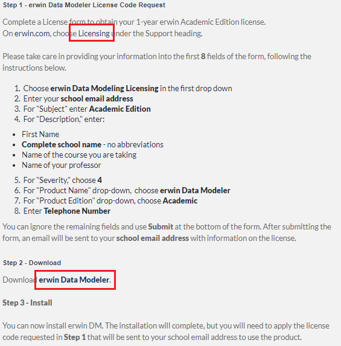

# Installation von erwin Data Modeler

erwin Data Modeler ist eine Software, mit der Datenmodelle erstellt und in eine beliebige
Zieldatenbank übertragen werden kann. In der Academic Edition gelten folgende Limitierungen:

- Diagramming is limited to 25 entities
- The license is limited to one year
- Single user only
- APIs and other advanced functionality is disabled

Quelle: https://support.erwin.com/hc/en-us/articles/115001820927-What-is-erwin-Data-Modeler-Academic-Edition-What-are-the-limitations-and-usages-

## So kommen Sie zu Ihrer Version

**(1)** Auf [go.erwin.com](http://go.erwin.com/erwin-academic-edition-free-trial) können Sie eine
Academic Licence beantragen. Verwenden Sie dafür folgende Daten:

- Ihren Namen
- Ihre Schul-Mailadresse (endet auf *@spengergasse.at*), diese wird akzeptiert.
- Den Schulnamen *HTL Spengergasse*
- Den Namen Ihres DBI Lehrers.
- Den Kursnamen *Data Modeling*

**(2)** Nach dem Absenden der Daten kommen Sie auf eine Seite mit weiteren Instruktionen und dem
Downloadlink:

Sie bekommen diese Anweisungen auch als Email mit dem Titel *Thank You for Requesting erwin Data Modeler Academic Edition*
von *info@erwin.com*. Hinweis: Bei Telefonnummer können Sie die Nummer der Schule (+43154615) angeben.

**(3)** Warten Sie auf eine Email mit dem Lizenzkey.

**(4)** Installieren Sie die Software, die Sie in Punkt (2) heruntergeladen habem.