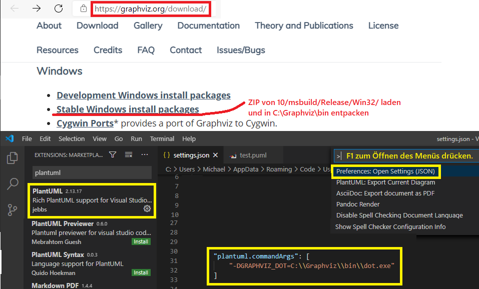

# PlantUML Klassendiagramme und ER Diagramme

## Installation mit VS Code

Für die Erstellung von Diagrammen in PlantUML gibt es unter Windows mit VS Code folgende Möglichkeit:

(1) *graphviz-2.44.1-win32.zip* von https://www2.graphviz.org/Packages/stable/windows/10/msbuild/Release/Win32/
    laden und das ZIP nach *C:\Graphviz* entpacken. In C:\Graphviz\bin muss die Datei dot.exe zu finden sein.
    
(2) In VS Code die Erweiterung PlantUML installieren und in der settings.json die Konfiguration

```javascript
"plantuml.commandArgs":
	[ "-DGRAPHVIZ_DOT=C:\\Graphviz\\bin\\dot.exe" ]
```
einfügen.

(3) Eine neue Datei mit der Erweiterung .puml erstellen. Alt+D aktiviert die Vorschau.
Syntax: https://plantuml.com/class-diagram bzw. https://plantuml.com/ie-diagram



