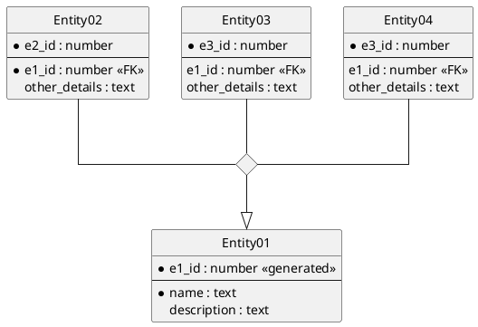

# PlantUML Klassendiagramme und ER Diagramme

## Installation mit VS Code

Für die Erstellung von Diagrammen in PlantUML gibt es unter Windows mit VS Code folgende Möglichkeit:

**(1)** Installiere in VS Code die Erweiterung PlantUML und Markdown PDF.

**(2)** Füge in der Datei *settings.json* (*F1* - *Open Settings (JSON)*) folgende Zeilen ein:

```javascript
"plantuml.server": "https://www.plantuml.com/plantuml"
"markdown-pdf.plantumlOpenMarker": "```plantuml",
"markdown-pdf.plantumlCloseMarker": "```"
```

Nun kann folgendes Markdown Dokument gerendert und auch als PDF ausgegeben werden. Die PDF Ausgabe
erfolgt mit *F1* - *Markdown PDF: Export (pdf)*

```text
# Testdokument für Markdown und PlantUML

Lorem ipsum dolor sit amet, consetetur sadipscing elitr, sed diam nonumy eirmod tempor invidunt ut labore et dolore magna aliquyam erat, sed diam voluptua. At vero eos et accusam et justo duo dolores et ea rebum. Stet clita kasd gubergren, no sea takimata sanctus est Lorem ipsum dolor sit amet. Lorem ipsum dolor sit amet, consetetur sadipscing elitr, sed diam nonumy eirmod tempor invidunt ut labore et dolore magna aliquyam erat, sed diam voluptua. At vero eos et accusam et justo duo dolores et ea rebum. Stet clita kasd gubergren, no sea takimata sanctus est Lorem ipsum dolor sit amet.



```