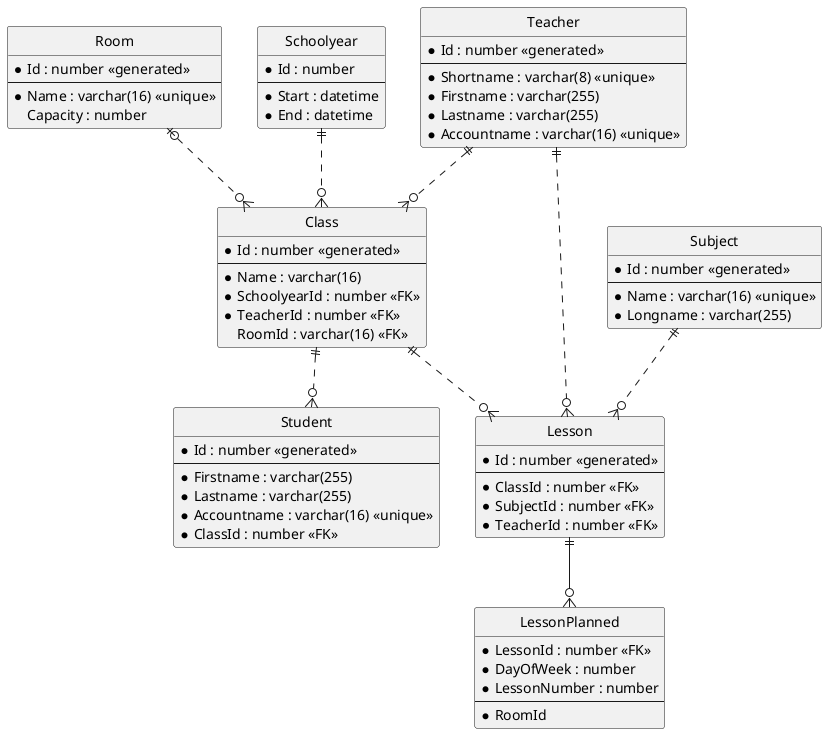

# PlantUML und VS Code als Modellierungswerkzeug

In der Konzeptionierungsphase ist ein grafisches Tool zum Erzeugen von Klassenmodellen sehr wichtig.
In diesen Kurs werden immer wieder UML Klassendiagramme hergezeigt. Sie können mit VS Code und
PlantUML erzeugt werden:

1. Prüfe, ob Java installiert und im PATH eingetragen ist. Der Befehl *java -version* muss erkannt werden.
1. Installiere [Visual Studio Code](https://code.visualstudio.com). Achtung: Aktiviere beim Setup
   die Option "In den Explorer integrieren", damit Sie im Kontextmenü VS Code starten können.
1. Installiere die folgenden Extensions:
   - Markdown PDF
   - Markdown Preview Enhanced
   - PlantUML
1. Öffne die VS Code Konfiguration (*F1* - "*settings*" eingeben - "*Preferences: Open Settings (JSON)*" wählen)
   und füge folgende Zeilen hinzu:

```javascript
    "markdown-pdf.plantumlOpenMarker": "```plantuml",
    "markdown-pdf.plantumlCloseMarker": "```"   
```

Nun steht durch die Extension *Markdown Preview Enhanced* ein Icon bereit, welches eine Vorschau mit dem gerenderten Diagramm bietet. Beachte: Dies ist nur bei Dokumenten mit der 
Endung *.md* Verfügbar.


## Demo Markdownfile mit PlantUML

Kopiere den nachfolgenden Code in eine neue Datei mit dem Namen
*er_demo.md*.
**Wichtig: Die Datei muss die Endung md haben, sonst werden die Extensions in VS Code nicht aktiviert!**
Es sollte in der Vorschau mit Markdown Preview Enhanced ein ER Diagramm gerendert werden.
Mit *F1* - *Markdown PDF: Export (PDF)* kann ein PDF erzeugt werden.

## Musterdatei

````text
# Ein kleines Diagramm

Mit der Extension *Markdown Preview Enhanced* können Sie PlantUML Diagramme in Markdown
Dateien einbetten. Die Voransicht sollte unter der Beschreibung ein kleines ER Diagramm rendern. Es
gelten folgende Regeln:

- Erforderliche Felder (*NOT NULL*) werden mit einem Stern (\*) gekennzeichnet.
- Primärschlüssel werden im oberen Teil angegeben. Danach kommen 3 Striche.
  Darunter die restlichen Attribute.
- Generierte Werte (wie autoincrement Werte) werden mit *\<\<generated\>\>* gekennzeichnet.
- Beziehungen kommen in mehreren Arten vor:
  - `||..o{` definiert eine nicht identifizierende 1 : n Beziehung. Der FK ist also ein Attribut.
  - `|o..o{` definiert eine (0, 1) : n Beziehung. Der FK ist also optional (nullable).
  -  `||--0{` definiert eine identifizierende 1 : n Beziehung. Der FK ist also Teil des Primärschlüssels.
- Fremdschlüssel werden mit *\<\<FK\>\>* gekennzeichnet.
- Constraints werden in 2 spitzen Klammern angegeben (z. B. *\<\<unique\>\>*, *\<\<index\>\>*).


````