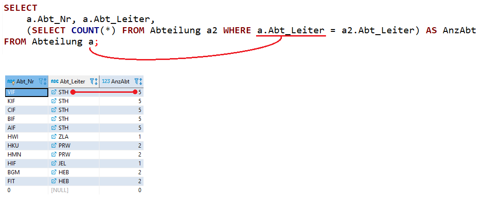

# Korrelierte Unterabfragen, die einen Wert liefern

Bis jetzt haben unsere Unterabfragen keinen Wert von der äußeren Abfrage bezogen. Es gibt allerdings
Situationen, in denen das notwendig ist. Wir betrachten die folgende Abfrage, bei der wir ermitteln,
wie viele Abteilungen ein Abteilungsvorstand leitet:



Da hier die Abteilungstabelle 2x verwendet wird, ist der Alias *a* und *a2* notwendig. Für das
Verständnis ist es hilfreich, sich die äußere Abfrage als Schleife vorzustellen, die durch die
einzelnen Werte geht. Für jeden Wert wird dann eine Funktion (hier *MySubQuery*) aufgerufen.

```c#
foreach (Abteilung a in db.Abteilungen)
{
    var value = MySubQuery(a.AbtLeiter);
    Console.WriteLine($"{a.AbtNr} {a.AbtLeiter} {value}")
}
```

Im vorigen Kapitel stand der Aufruf von *MySubQuery()* *vor* der Schleife. Nun ist er in der Schleife.
Das erklärt schon einige Nachteile der korrespondierenden Unterabfragen:

- Das Ergebnis kann nicht zwischengespeichert werden, da es sich bei jedem Durchlauf ändert.
- Unsere Unterabfrage - also hier die Funktion *MySubQuery()* - kann nicht unabhängig ausgeführt
  und getestet werden, da sie Parameter der äußeren Abfrage braucht.

Wenn Problemstellungen sich als nicht korrespondierende Unterabfragen umsetzen lassen, sollte also
immer dieser Weg gegangen werden.

Es gelten alle Regeln die im vorigen Kapitel behandelt wurden, da sich die Art der Unterabfrage
nicht geändert hat. Sie können daher an Stellen verwendet werden, wo Spalten oder Werte in SQL
stehen können.

## Übungen

Bearbeiten Sie die folgenden Abfragen. Die korrekte Lösung ist in der Tabelle darunter. Die
Bezeichnung der Spalten, die Formatierung und die Sortierung muss nicht exakt übereinstimmen.

**(1)** Geben Sie die Klassen der Abteilung HBG und die Anzahl der männlichen (S_Geschlecht = 1)
und weiblichen (S_Geschlecht = 2) SchülerInnen aus.

|KLASSE|ANZMAENNL|ANZWEIBL|
|------|---------|--------|
|1AHBGM|20|12|
|1BHBGM|16|16|
|2AHBGM|18|10|
|2BHBGM|12|13|
|3AHBGM|14|8|
|3BHBGM|10|19|
|4AHBGM|12|15|
|4BHBGM|15|8|
|5AHBGM|13|16|
|5BHBGM|11|14|

**(2)** In welchen Klassen gibt es mehr als doppelt so viel weibliche wie männliche Schüler?

|KLASSE|ANZMAENNL|ANZWEIBL|
|------|---------|--------|
|1BFITM|10|22|
|3BHWIT|9|19|

**(3)** Wie viele Stunden pro Woche sehen die Klassen der Abteilung AIF ihren Klassenvorstand? Lösen Sie
das Beispiel zuerst mit einem klassischen JOIN in Kombination mit einer Gruppierung. Danach lösen Sie
das Beispiel mit einer Unterabfrage ohne JOIN. Betrachten Sie nur Klassen mit eingetragenem Klassenvorstand.

|K_NR|ANZKVSTUNDEN|
|----|------------|
|2AAIF|0|
|2BAIF|0|
|2CAIF|0|
|2DAIF|0|
|3AAIF|6|
|3BAIF|2|
|3CAIF|2|
|4AAIF|0|
|4BAIF|0|
|4CAIF|0|
|5AAIF|2|
|5BAIF|6|
|6AAIF|0|
|6BAIF|0|

**(4)** Wie viele Wochenstunden haben die Klassen der Abteilung HWI? Hinweis: Sind 2 Lehrer in
einer Klasse, werden diese Stunden doppelt gezählt. Das Ergebnis ist daher größer als die "echten"
Wochenstunden.

|K_NR|ANZSTUNDEN|
|----|----------|
|1AHWII|76|
|1AHWIT|78|
|2AHWII|66|
|2AHWIT|74|
|3AHWIT|68|
|3BHWIT|63|
|4AHWIT|74|
|4BHWIT|76|
|5AHWIT|66|

**(5)** Wie viel Prozent der Stunden verbringen die Schüler der Abteilung KKU (Kolleg für Design) in ihrem
Stammraum? Für diese Anzahl werden einfach die Anzahl der Datensätze in der Stundentabelle gezählt.

|K_NR|K_STAMMRAUM|ANZSTUNDENGESAMT|ANZSTUNDENSTAMMRAUM|PROZENTIMSTAMMRAUM|
|----|-----------|----------------|-------------------|------------------|
|3AKKUI|A2.05|89|54|60.67|
|4AKKUI|A2.05|77|54|70.12|
|5AKKUI|A2.04|78|48|61.53|
|6AKKUI|A2.04|60|44|73.33|

**(6)** Welche Lehrer verdienen über 2000 Euro mehr als die Lehrer, die nachher in
die Schule eingetreten sind (Eintrittsjahr > Eintrittsjahr des Lehrers)?

|L_NR|L_NAME|L_VORNAME|L_GEHALT|L_EINTRITTSJAHR|AVGGEHALTJUENGERE|
|----|------|---------|--------|---------------|-----------------|
|GUW|Guttmann|Wolfgang|5285|1988|3060.72|
|KY|Kerry|Florian|5570|1986|3073.22|
|SCG|Schildberger|Gerald|5355|1989|3047.69|

**(7)** Welche Schüler haben im Gegenstand POS1 schlechtere Noten als der Durchschnitt der Prüfungen
bei diesem Prüfer in POS1?

|S_NR|S_ZUNAME|S_VORNAME|S_KLASSE|P_PRUEFER|P_NOTE|P_GEGENSTAND|PRUEFERPOSMITTEL|
|----|--------|---------|--------|---------|------|------------|----------------|
|1817|Halvorson|Frederick|3BAIF|WES|4|POS1|3.33|
|1864|Weber|Forrest|5AKIF|SRM|3|POS1|1.875|
|1884|Ward|Donna|5AKIF|SRM|3|POS1|1.875|
|1905|Anderson|Damon|5BKIF|HAV|5|POS1|4|
|1906|Waelchi|Ginger|5BKIF|HAV|5|POS1|4|
|1939|O'Kon|Bob|5BAIF|SRM|3|POS1|1.875|
|2646|Cummings|Jermaine|2BHIF|GT|4|POS1|3|
|2650|Schulist|Darrel|2BHIF|BOM|4|POS1|3.25|
|2662|Schuster|Michael|2BHIF|BOM|4|POS1|3.25|
|3105|Gerlach|Dallas|5EHIF|WES|5|POS1|3.33|
|3337|Reichert|Geneva|5ACIF|SLM|4|POS1|3.5|
|3364|Conroy|Angel|7ABIF|UK|5|POS1|3.375|
|3366|Dach|Trevor|7ABIF|UK|5|POS1|3.375|
|3379|Ratke|Elaine|7ABIF|UK|5|POS1|3.375|
|3381|Crona|Teri|7ACIF|SRM|2|POS1|1.875|

**(8)** Verallgemeinern Sie das vorige Beispiel auf beliebige Fächer: Welche Schüler der 1AHIF 
haben schlechtere Noten als der Prüfer im Mittel für diesen Gegenstand vergibt?

|S_NR|S_ZUNAME|S_VORNAME|S_KLASSE|P_PRUEFER|P_NOTE|P_GEGENSTAND|PRUEFERMITTEL|
|----|--------|---------|--------|---------|------|------------|-------------|
|2462|Smith|Rudy|1AHIF|SEM|5|E1x|3.75|
|2464|Gleason|Anthony|1AHIF|SEM|5|E1x|3.75|
|2470|Mosciski|Ellis|1AHIF|STC|4|CABS_1|3|
|2474|Volkman|Lena|1AHIF|STC|4|CABS_1|3|

**(9)** Geben Sie die letzte Stunde der 3BAIF für jeden Wochentag aus. Beachten Sie, dass
auch mehrere Datensätze für die letzte Stunde geliefert werden können (wenn 2 Lehrer dort unterrichten).

|ST_KLASSE|ST_TAG|ST_STUNDE|ST_GEGENSTAND|ST_LEHRER|
|---------|------|---------|-------------|---------|
|3BAIF|1|14|DBI1|BAM|
|3BAIF|1|14|DBI1|KOR|
|3BAIF|2|14|NVS1|AH|
|3BAIF|2|14|NVS1|OM|
|3BAIF|3|12|E1x|HAS|
|3BAIF|3|12|E1y|RUD|
|3BAIF|4|13|DBI1|BAM|
|3BAIF|4|13|DBI1|KOR|
|3BAIF|5|6|WIR3|CES|
|3BAIF|6|7|FDSAI|HIK|
