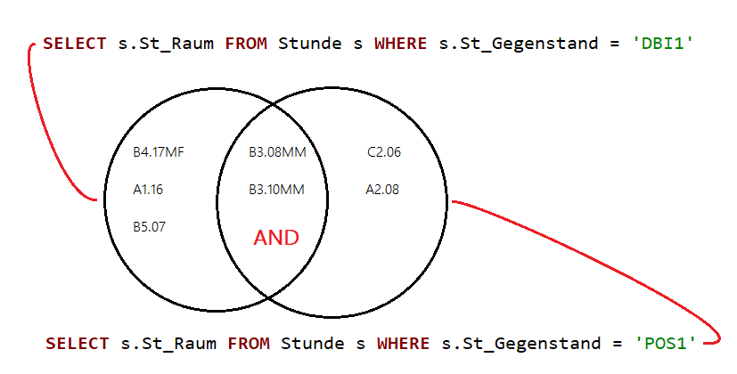

# Unterabfragen, die Listen liefern (IN, NOT IN, EXISTS)

Eine Liste ist hier ein Ergebnis, welches aus einer Spalte, aber mehreren Werten besteht. Wir
haben solche Listen bereits in Kombination mit dem *IN* Operator kennengelernt, nämlich indem
wir Stringlisten fix angegeben haben.

Die folgende Abfrage liefert alle Unterrichtsstunden, die in *DBI1*, *DBI1x* oder *DBI1y* abgehalten
werden.

```sql
SELECT *
FROM Stunde s
WHERE s.St_Gegenstand IN ('DBI1', 'DBI1x', 'DBI1y');
```

Die logische Bedeutung haben wir auch schon kennengelernt, denn die obere Abfrage entspricht einer
*OR* Verknüpfung aus den einzelnen Elementen der Liste.

```sql
SELECT *
FROM Stunde s
WHERE s.St_Gegenstand = 'DBI1' OR s.St_Gegenstand = 'DBI1x' OR s.St_Gegenstand = 'DBI1y';
```

> **Merke:** Der IN Operator prüft, ob ein Element in der angegebenen Liste vorkommt. Das zu
> prüfende Element und die Liste müssen den gleichen Typ haben. Er entspricht
> dem Existenzquantor in der Aussagenlogik und prüft, ob das Element in der Liste existiert.

## Unterabfragen mit IN

Wir können nicht nur fixe Werte, sondern auch Unterabfragen in IN angeben. Diese Abfragen dürfen
natürlich nur 1 Spalte, allerdings beliebig viele Werte zurückgeben.

Das folgende Beispiel ermittelt alle Räume, in denen unterrichtet wird. Dafür wird zuerst die
Liste der Räume abgefragt, in denen unterrichtet wird. Danach wird für jeden Raum geprüft, ob
er Element dieser Liste ist.


Natürlich kann man das Beispiel auch mit einem JOIN gelöst werden, allerdings wird dann jeder
Raum mehrfach angezeigt (1x pro Unterrichtsstunde). Erst die Gruppierung löst das Problem:

```sql
SELECT r.R_ID, r.R_Plaetze, r.R_Art
FROM Raum r INNER JOIN Stunde s ON (r.R_ID = s.St_Raum)
GROUP BY r.R_ID, r.R_Plaetze, r.R_Art;
```

Wir sehen, dass Unterabfragen oft intuitiver als die entsprechende JOIN Lösung zu lesen ist.

Folgendes Beispiel hat keine (einfache) Alternative als JOIN. Wir wollen nun wissen, in welchen
Räumen DBI1 **und** POS1 unterrichtet wird. Der erste Ansatz, den viele Studierende wählen,
führt zu keinem Ergebnis:

```sql
SELECT r.*
FROM Raum r INNER JOIN Stunde s ON (r.R_ID = s.St_Raum)
WHERE s.St_Gegenstand = 'DBI1' AND s.St_Gegenstand = 'POS1';
```

Das Ergebnis ist natürlich leer, denn keine Unterrichtsstunde ist zugleich DBI und POS. Die Lösung
führt über 2 Vergleiche mit IN:

```sql
SELECT *
FROM Raum r
WHERE
    r.R_ID IN (SELECT s.St_Raum FROM Stunde s WHERE s.St_Gegenstand = 'DBI1') AND
    r.R_ID IN (SELECT s.St_Raum FROM Stunde s WHERE s.St_Gegenstand = 'POS1');
```

Im Gegensatz zur vorigen Lösung werden hier 2 Mengen geschnitten. Die Menge der Räume, in denen
DBI1 unterrichtet wird und die Menge der Räume, in denen POS1 unterrichtet wird.



## NOT IN

Nun wollen wir die Räume wissen, in denen niemals DBI1 unterrichtet wird. Auch hier wählen viele
oft den falschen Ansatz mit einem JOIN und der Abfrage auf ungleich DBI:

```sql
SELECT r.*
FROM Raum r INNER JOIN Stunde s ON (r.R_ID = s.St_Raum)
WHERE s.St_Gegenstand <> 'DBI1';
```

Angenommen in einem Raum wird neben DBI1 auch AM unterrichtet. Dieser Raum würde in die Liste
aufgenommen, obwohl er auch eine DBI1 Stunde hat. Die korrekte Lösung führt zu *NOT IN*:

```sql
SELECT *
FROM Raum r
WHERE r.R_ID NOT IN (SELECT s.St_Raum FROM Stunde s WHERE s.St_Raum IS NOT NULL AND s.St_Gegenstand = 'DBI1');
```

> **Vorsicht:** Kommt NULL in der Liste vor, so liefert NOT IN auch den Wert NULL. Daher müssen diese
> Werte ausgeschlossen werden. Folgendes Beispiel zeigt das Verhalten von NULL Werten in Kombination
> mit *NOT IN*:

```sql
SELECT 1 WHERE 'A' IN ('A', NULL);     -- Liefert 1, denn A ist sicher in der Liste.
SELECT 1 WHERE 'B' NOT IN ('A', NULL); -- Liefert kein Ergebnis, denn B ist vielleicht der NULL Wert.
```

Alternativ kann auch mit *COALESCE()* gearbeitet werden, um NULL Werte zu vermeiden:

```sql
SELECT *
FROM Raum r
WHERE r.R_ID NOT IN (SELECT COALESCE(s.St_Raum, '?') FROM Stunde s WHERE s.St_Gegenstand = 'DBI1');
```

## Abfragen mit "für alle": ein bisschen Aussagenlogik

Wir betrachten das folgende Beispiel: Welche Lehrer unterrichten nur in den HIF Klassen? Dafür
reicht das *IN* alleine nicht aus, denn es würde alle Lehrer liefern, die **unter anderem** eine
HIF Klasse unterrichten.

Wir formulieren das Problem daher um: *Ein Lehrer, der nur HIF Klassen unterrichtet* ist
gleichbedeutend mit der Aussage *Ein Lehrer, der keine nicht-HIF Klasse unterrichtet*. Diese
Umformulierung erlaubt es uns, wieder mit *IN* zu arbeiten, denn wir haben eine Existenzabfrage
vorliegen.

```sql
SELECT *
FROM Lehrer l
WHERE l.L_Nr NOT IN (SELECT s.St_Lehrer FROM Stunde s WHERE s.St_Klasse NOT LIKE '%HIF%');
```

> Abfragen, bei denen eine Eigenschaft für alle Elemente gelten muss, kann durch Negation des
> Prädikats und einer Negation der Gesamtaussage in ein Existenzproblem umgewandelt werden.

Nachfolgend wird die Bedeutung der möglichen Kombinationen dieser Abfrage beschrieben:

Liefert alle Lehrer, die **mindestens eine** HIF Klasse unterrichten.

```sql
SELECT *
FROM Lehrer l
WHERE l.L_Nr IN (SELECT s.St_Lehrer FROM Stunde s WHERE s.St_Klasse LIKE '%HIF%');
```

Liefert alle Lehrer, die **keine einzige** HIF Klasse unterrichten.

```sql
SELECT *
FROM Lehrer l
WHERE l.L_Nr NOT IN (SELECT s.St_Lehrer FROM Stunde s WHERE s.St_Klasse LIKE '%HIF%');
```

Liefert alle Lehrer, die **mindestens eine** nicht-HIF Klasse unterrichten.

```sql
SELECT *
FROM Lehrer l
WHERE l.L_Nr IN (SELECT s.St_Lehrer FROM Stunde s WHERE s.St_Klasse NOT LIKE '%HIF%');
```

## EXISTS

SQL bietet noch eine 2. Möglichkeit zu prüfen, ob ein Element im Ergebnis einer Unterabfrage
vorkommt: *EXISTS*. Dieser Operator liefert - im Gegensatz zu *IN* - nur *true* oder *false*.
*true* wird dann geliefert, wenn die Liste einen (beliebigen) Wert enthält, ansonsten wird
*false* geliefert.

Diese Abfragen sind meist korrespondierend, das bedeutet dass Werte der äußeren Abfrage
verwendet werden. Das folgende Beispiel liefert ebenfalls die Liste aller Räume, in denen
überhaupt Unterricht statt findet:

```sql
SELECT *
FROM Raum r
WHERE EXISTS (SELECT 1 FROM Stunde s WHERE s.St_Raum == r.R_ID);
```

Da es nur darum geht, ob überhaupt Elemente geliefert werden, schreiben wir einfach 1 als
Wert. Ob 1, NULL, *, ... verwendet wird ist Geschmackssachte.

Die Räume, in denen DBI1 unterrichtet wird, werden durch folgende Abfrage geliefert:

```sql
SELECT *
FROM Raum r
WHERE EXISTS (SELECT 1 FROM Stunde s WHERE s.St_Raum == r.R_ID AND s.St_Gegenstand == 'DBI1');
```

### EXISTS oder IN?

Die Stärke von *EXISTS* ist der Umgang mit mehreren Schlüsselteilen. Da *IN* nur eine Spalte
liefern kann, gibt es ein Problem wenn eine Tabelle einen mehrteiligen Schlüssel hat.

Das folgende Beispiel listet alle Prüfungen auf, wo der Prüfer das gleiche Fach am gleichen
Tag nochmals prüft. Überlegen Sie, was ohne die letzte AND Bedingung geliefert werden würde.
*DATE()* ruft in SQLite die Datumskomponente ab, schneidet also die Zeit weg.

```sql
SELECT *
FROM Pruefung p
WHERE EXISTS(
    SELECT 1
    FROM Pruefung p2
    WHERE
        p.P_Pruefer = p2.P_Pruefer AND
        p.P_Gegenstand = p2.P_Gegenstand AND
        DATE(p.P_DatumZeit) = DATE(p2.P_DatumZeit) AND
        p.P_DatumZeit < p2.P_DatumZeit
);
```

Mit *IN* müssten wir ebenso eine korrespondierende Abfrage schreiben, die dann eine Spalte
(z. B. den Gegenstand) liefert, der dann verglichen werden kann. Das ist etwas willkürlich.

> **Hinweis:** Würde die *IN* Abfrage ohnehin korrespondierend sein, ist EXISTS meist die
> klarere Alternative.

Es gibt auch *NOT EXISTS*, welche die Aussage von *EXISTS* verneint.

Die Eigenschaften der jeweiligen Operatoren sind

- Abfragen mit *IN* sind oft nicht korrespondierend und können separat getestet werden.
- Bei mehrteiligen Schlüsseln ist die Abfrage mit *EXISTS* leichter zu schreiben.
- EXISTS ist fast immer korrespondierend und kann daher schwerer getestet werden.
- Über die Performance wird viel diskutiert. Der Optimizer der Datenbank arbeitet aber schon
  so gut, dass ein einfaches Umstellen der Abfrage keinen Mehrwert mehr bringt. Schreiben Sie
  daher die Abfragen so, wie es für Sie am klarsten erscheint.

## Übungen

Bearbeiten Sie die folgenden Abfragen. Die korrekte Lösung ist in der Tabelle darunter, die erste
Spalte (#) ist allerdings nur die Datensatznummer und kommt im Abfrageergebnis nicht vor. Die
Bezeichnung der Spalten, die Formatierung und die Sortierung muss nicht exakt übereinstimmen.

**(1)** In welchen Klassen der Abteilung HIF kommt das Fach NW2 nicht im Stundenplan vor? Hinweis:
Arbeiten Sie mit der Menge der Klassen, in denen NW2 unterrichtet wird.
| #   | KNr   |
| ---:| ----- |
|   1 | 5AHIF |
|   2 | 5BHIF |
|   3 | 5CHIF |
|   4 | 5EHIF |

**(2)** Welche Gegenstände werden gar nicht geprüft? Lösen Sie die Aufgabe mit einem LEFT JOIN und danach
mit einer Unterabfrage. Hinweis: Arbeiten Sie mit der Menge der Gegenstände, die in der
Prüfungstabelle eingetragen sind.
| #   | GNr    | GBez                                           |
| ---:| ------ | ---------------------------------------------- |
|   1 | WPT_4  | Werkstätte und Produktionstechnik              |
|   2 | DUKx   | Deutsch u. Komm.                               |
|   3 | DUKy   | Deutsch u. Komm.                               |
|   4 | EWD    | Entwurf und Design                             |
|   5 | KPRA   | KOMMUNIKATION & PRÄSENTATIONSTECHNIK (LVG 2)   |
|   6 | KOM2   | Kommunikation                                  |
|   7 | INFIx  | Informatik und Informationssysteme X-Gruppe    |
|   8 | M2     | Mathematik                                     |
|   9 | BMSVx  | Biomedizinische Signalverarbeitung, x-Gruppe   |
|  10 | BMSVy  | Biomedizinische Signalverarbeitung, y-Gruppe   |
|  11 | DAT    | Darstellungstechniken                          |
|  12 | DIWE   | Digitale Werkzeuge                             |
|  13 | MEDTx  | Medientechnik x-Gruppe                         |
|  14 | POS1z  | Programmieren und Softwareengineering z-Gruppe |
|  15 | STK    | STILKUNDE                                      |
|  16 | SYT    | Systemtechnik                                  |
|  17 | WPT_3  | Werkstätte und Produktionstechnik              |
|  18 | UNF    | Unternehmensführung                            |
|  19 | TINFy  | Technische Informatik und Computerpraktikum    |
|  20 | TINFx  | Technische Informatik und Computerpraktikum    |
|  21 | TICP4A | Techn.Informatik und Computerpraktikum         |
|  22 | TEPH   | Technologie und Phänomenologie                 |
|  23 | UFW1   | Unternehmensführung und Wirtschaftsrecht       |
|  24 | MP3    | Medienprojekte (LP 2013-2018)                  |
|  25 | MGIN   | Medizin- und Gesundheitsinformatik             |
|  26 | MET1y  | Maschinen- und Elektrotechnik                  |
|  27 | MEDTy  | Medientechnik y-Gruppe                         |
|  28 | NWT_1x | Netzwerktechnik x-Gruppe                       |
|  29 | NWG    | Naturwissenschaftl. Grundlagen                 |
|  30 | NVS1y  | Netzwerk- und verteilte Systeme y-Gruppe       |
|  31 | MPGD   | Medienproduktion - Gamedesign                  |
|  32 | AINF   | Angew. Informatik                              |

**(3)** Welche Gegenstände werden nur praktisch geprüft (*P_Art* ist p)? Können Sie die Aufgabe auch mit
LEFT JOIN lösen? Begründen Sie wenn nicht. Hinweis: Arbeiten Sie mit der Menge der Gegenstände,
die NICHT praktisch geprüft werden. Betrachten Sie außerdem nur Gegenstände, die überhaupt geprüft
werden. Würden Gegenstände, die gar nicht geprüft werden, sonst aufscheinen? Macht das einen
(aussagenlogischen) Sinn?
| #   | GNr   | GBez                                            |
| ---:| ----- | ----------------------------------------------- |
|   1 | BSPM  | Bewegung und Sport - Mädchen                    |
|   2 | DBI1  | Datenbank- und Informationssysteme              |
|   3 | DBI1x | Datenbank- und Informationssysteme x-Gruppe     |
|   4 | DBI1y | Datenbank- und Informationssysteme y-Gruppe     |
|   5 | DBI2x | Datenbank- und Informationssysteme  x-Gruppe    |
|   6 | DBI2y | Datenbank- und Informationssysteme y-Gruppe     |
|   7 | MEP_3 | Medienproduktion 3 - 2013 - 2018                |
|   8 | NWG2  | Naturwissenschaftliche Grundlagen               |
|   9 | POS1  | Programmieren und Softwareengineering           |
|  10 | POS1x | Programmieren und Softwareengineering x-Gruppe  |
|  11 | POS1y | Programmieren und Softwareengineeriing y-Gruppe |
|  12 | PRMNy | Kein Langname definiert!                        |
|  13 | PSB   | Persönlichkeitsbildung                          |

**(4)** Gibt es Prüfungen im Fach BWM, die von Lehrern abgenommen wurden, die die Klasse gar nicht
unterrichten? Hinweis: Arbeiten Sie über die Menge der Lehrer, die den angezeigten Schüler unterrichten.
| #   | PPruefer | PDatumZeit          | SNr  | SZuname | SVorname | PGegenstand | PNote |
| ---:| -------- | ------------------- | ----:| ------- | -------- | ----------- | -----:|
|   1 | BIE      | 08.03.2020 14:55:00 | 2446 | Purdy   | Georgia  | BWM         | 2     |
|   2 | ENU      | 27.09.2019 08:45:00 | 2399 | Terry   | Tonya    | BWM         | 4     |
|   3 | ENU      | 20.05.2020 10:20:00 | 2413 | Kovacek | Beatrice | BWM         | 4     |
|   4 | HAU      | 01.12.2019 08:10:00 | 2435 | Deckow  | Jane     | BWM         | 2     |

**(5)** Für die Maturaaufsicht in POS werden Lehrer benötigt, die zwar in POS (Filtern nach POS%) unterrichten,
aber in keiner 5. HIF Klasse (*K_Schulstufe* ist 13 und *K_Abteilung* ist HIF) sind.
| #   | LNr | LName        | LVorname |
| ---:| --- | ------------ | -------- |
|   1 | BAM | Balluch      | Manfred  |
|   2 | BF  | Berger       | Franz    |
|   3 | CHA | Chwatal      | Andreas  |
|   4 | FZ  | Fanzott      | Leo      |
|   5 | HOV | Hofbauer     | Volker   |
|   6 | LC  | Lackinger    | Doris    |
|   7 | MIP | Michel       | Philip   |
|   8 | MOH | Moritsch     | Hans     |
|   9 | NIJ | Niklas       | Johanna  |
|  10 | PS  | Preissl      | Johann   |
|  11 | PUZ | Puljic       | Zeljko   |
|  12 | RX  | Renkin       | Max      |
|  13 | SCG | Schildberger | Gerald   |
|  14 | SE  | Schmid       | Erhard   |
|  15 | SRM | Schrutek     | Martin   |
|  16 | WES | Weselsky     | Rainer   |
|  17 | WK  | Wodnar       | Karl     |

**(6)** Lösen Sie das vorige Beispiel mit anderen Bedingungen: Geben Sie die Lehrer aus, die weder in einer
5. Klasse (*K_Schulstufe* ist 13) noch in einer HIF Klasse (*K_Abteilung* ist HIF) unterrichten.
Wie ändert sich Ihre Abfrage?
| #   | LNr | LName    | LVorname |
| ---:| --- | -------- | -------- |
|   1 | BAM | Balluch  | Manfred  |
|   2 | BF  | Berger   | Franz    |
|   3 | CHA | Chwatal  | Andreas  |
|   4 | SE  | Schmid   | Erhard   |
|   5 | WES | Weselsky | Rainer   |

**(7)** Welche Klassen der HIF Abteilung haben auch in den Abendstunden (*Stundenraster.Str_IstAbend* = 1)
Unterricht?
| #   | KNr   |
| ---:| ----- |
|   1 | 1EHIF |
|   2 | 2CHIF |
|   3 | 3EHIF |
|   4 | 5AHIF |
|   5 | 5BHIF |

**(8)** Welche Lehrer haben Montag und Freitag frei, also keinen Unterricht an diesen Tagen in der
Stundentabelle? Anmerkung, die nichts mit der Lösung zu tun hat: Religion und die Freifächer
wurden - in Abweichung zu den Realdaten - nicht importiert.
| #   | LNr | LName             | LVorname  |
| ---:| --- | ----------------- | --------- |
|   1 | AF  | Akyildiz          | Fatma     |
|   2 | BAB | Bauer             | Beatrice  |
|   3 | BAR | Bartl-Binder      | Petra     |
|   4 | BOA | Bohn              | Adele     |
|   5 | BR  | Brandtner         | Thomas    |
|   6 | BZ  | Betzler           | Therese   |
|   7 | GRJ | Grüneis           | Joachim   |
|   8 | GRP | Graf              | Petra     |
|   9 | HAE | Häring            | Susanna   |
|  10 | HAI | Haiker            | Andreas   |
|  11 | HIL | Hilbert           | Wolfgang  |
|  12 | HOS | Hofmair           | Sonja     |
|  13 | HUB | Huber             | Barbara   |
|  14 | KMO | Kmyta             | Olga      |
|  15 | LC  | Lackinger         | Doris     |
|  16 | LIC | Linke             | Christoph |
|  17 | OM  | Ollrom            | Martin    |
|  18 | PRW | Pramel            | Werner    |
|  19 | PUE | Pühringer         | Michael   |
|  20 | RAD | Radumilo          | Denio     |
|  21 | REI | Reichmann         | Eduard    |
|  22 | RGM | Roth-Gion         | Michaela  |
|  23 | SCV | Schreiber         | Vivienne  |
|  24 | SEL | SCHMIDL    :o))   | Erhard    |
|  25 | SL  | Stangl            | Astrid    |
|  26 | STS | Steiner           | Sigmund   |
|  27 | TSI | Tolic-Sapina      | Ivana     |
|  28 | WEI | Weilguny          | Markus    |

**(9)** Wie das vorherige Beispiel, allerdings sollen nur Lehrer, die auch Stunden haben (also in der
Tabelle Stunden überhaupt vorkommen), berücksichtigt werden? Anmerkung, die nichts mit der Lösung
zu tun hat: Religion und die Freifächer wurden  - in Abweichung zu den Realdaten - nicht importiert.
| #   | LNr | LName        | LVorname  |
| ---:| --- | ------------ | --------- |
|   1 | BAR | Bartl-Binder | Petra     |
|   2 | BOA | Bohn         | Adele     |
|   3 | GRJ | Grüneis      | Joachim   |
|   4 | HIL | Hilbert      | Wolfgang  |
|   5 | HOS | Hofmair      | Sonja     |
|   6 | LC  | Lackinger    | Doris     |
|   7 | LIC | Linke        | Christoph |
|   8 | OM  | Ollrom       | Martin    |
|   9 | PRW | Pramel       | Werner    |
|  10 | PUE | Pühringer    | Michael   |
|  11 | RGM | Roth-Gion    | Michaela  |
|  12 | SCV | Schreiber    | Vivienne  |
|  13 | STS | Steiner      | Sigmund   |
|  14 | WEI | Weilguny     | Markus    |

**(10)** Schwer, sozusagen ein SQL Hyperstar Problem: Welche Klassenvorstände unterrichten nur
in Abteilungen, die auch der Klasse
entsprechen, von der sie Klassenvorstand sind? Diese Abfrage hat eine besondere Schwierigkeit: Da
Lehrer auch von mehreren Klassen Klassenvorstand sein können, die in verschiedenen Abteilungen sein
können (z. B. Tag und Abend) brauchen Sie hier geschachtelte Unterabfragen.

1. Das Problem ist durch eine Negierung zu lösen, da IN den Existenzquantor darstellt, und wir hier
   einen Allquantor brauchen.
2. Finden Sie zuerst heraus, in welchen Abteilungen der Lehrer KV ist.
3. Finden Sie die Lehrer heraus, die nicht in der Liste der Abteilungen aus (2) unterrichten.
4. Der Lehrer darf nicht in der Liste von (3) vorkommen.
5. Betrachten Sie zum Schluss nur die Lehrer, die auch KV sind. Lehrer, die kein KV sind, würden
   nämlich aussagenlogisch auch nur in Abteilungen unterrichten, von denen sie KV sind.
   
Korrekte Ausgabe:
| #   | LNr | LName        | LVorname  |
| ---:| --- | ------------ | --------- |
|   1 | BAB | Bauer        | Beatrice  |
|   2 | BAR | Bartl-Binder | Petra     |
|   3 | BW  | Bergmann     | Wolfgang  |
|   4 | CAM | Camrda       | Christian |
|   5 | LJK | Ljubek       | Kristian  |
|   6 | MAH | Mahler       | Heinrich  |
|   7 | MEA | Metz         | Andreas   |
|   8 | RR  | Radlbauer    | Rudolf    |
|   9 | RX  | Renkin       | Max       |
|  10 | SK  | Schenk       | Andreas   |
|  11 | SM  | Schreiber    | Michael   |
|  12 | STM | Stamfest     | Sonja     |
|  13 | TT  | Tschernko    | Thomas    |
|  14 | ZOC | Zöchbauer    | Christian |
