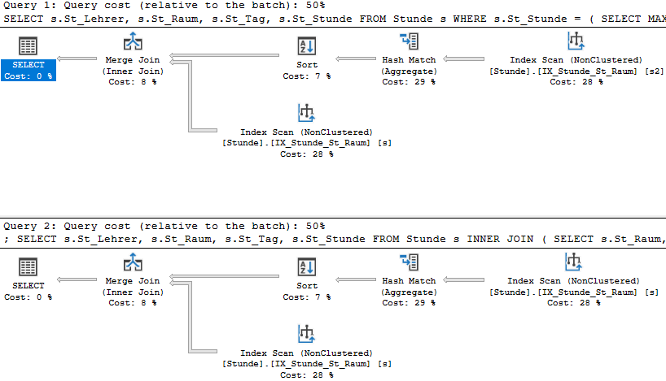

# Views und Unterabfragen in FROM

## Views sind gespeicherte Abfragen

Oftmals werden Ergebnisse von Abfragen in anderen Abfragen oder einem Programm, welches auf die
Datenbank zugreift, benötigt. Ein klassisches Beispiel sind Aggregierungen von Datenbeständen oder
das durchführen von mehreren JOIN Operationen:

- Ergebnisse werden für die weitere Verwendung (Seriendruck, Anzeige in einem Programm) aus mehreren
  Tabellen zusammengeführt.
- Datenbankseitige Berechnungen werden für ein Anzeigeprogramm zur Verfügung gestellt.  
- Aus den Ergebnissen der Wahlsprengel werden die Bezirksergebnisse berechnet.
- Aus den Bezirksergebnissen werden die Ergebnisse pro Bundesland berechnet.
- Aus den Ergebnissen pro Bundesland wird das österreichweite Gesamtergebnis berechnet.

Für solche Anwendungen gibt es die Möglichkeit, eine Abfrage in einer Datenbank zu speichern:
die VIEW. Views werden nach der Erstellung wie Tabellen angesprochen, was die Abfragen stark
vereinfachen kann.

In unserer Schuldatenbank werden ebenfalls häufig die folgenden Daten benötigt und weiterverwendet:

- Wie viele Schüler gibt es in der Klasse (männlich, weiblich und gesamt)?
- Wie viele Schüler gibt es in der Abteilung?

Betrachten Sie folgenden SQL Code:

**SQLite**

```sql
DROP VIEW IF EXISTS vKlassenstatistik;

CREATE VIEW vKlassenstatistik AS
SELECT k.K_Abteilung, k.K_Nr,
    (SELECT COUNT(*) FROM Schueler s WHERE s.S_Klasse = k.K_Nr) AS SchuelerGesamt,
    (SELECT COUNT(*) FROM Schueler s WHERE s.S_Klasse = k.K_Nr AND s.S_Geschlecht = 1) AS SchuelerMaennl,
    (SELECT COUNT(*) FROM Schueler s WHERE s.S_Klasse = k.K_Nr AND s.S_Geschlecht = 2) AS SchuelerWeibl
FROM Klasse k;

SELECT * FROM vKlassenstatistik;
```

**Oracle**

```sql
CREATE OR REPLACE VIEW vKlassenstatistik AS
SELECT k.K_Abteilung, k.K_Nr,
    (SELECT COUNT(*) FROM Schueler s WHERE s.S_Klasse = k.K_Nr) AS SchuelerGesamt,
    (SELECT COUNT(*) FROM Schueler s WHERE s.S_Klasse = k.K_Nr AND s.S_Geschlecht = 1) AS SchuelerMaennl,
    (SELECT COUNT(*) FROM Schueler s WHERE s.S_Klasse = k.K_Nr AND s.S_Geschlecht = 2) AS SchuelerWeibl
FROM Klasse k;

SELECT * FROM vKlassenstatistik;
```

- *DROP VIEW:* So wie bei *CREATE TABLE* führt das mehrmalige Anlegen einer View mit gleichem Namen
  zu einem Fehler. Falls die View noch geändert werden muss (was beim Erstellen häufig passiert),
  kann zu Beginn gleich dieses Statement geschrieben werden. Die Klausel *IF EXISTS* gibt es nur
  in SQLite, in Oracle steht hierfür *OR REPLACE* zur Verfügung.
- *CREATE VIEW:* Hier wird eine View erstellt. Vergessen Sie nicht auf das Schlüsselwort *AS*. Es
  gibt an, welche SELECT Anweisung ausgeführt werden soll, wenn die View angesprochen wird.

Im nachfolgenden SELECT sehen Sie, dass die View wie eine Tabelle angesprochen werden kann. Das
Ergebnis ist wie erwartet eine Ausgabe der Schülerzahlen:

| K_Abteilung | K_Nr  | SchuelerGesamt | SchuelerMaennl | SchuelerWeibl |
| ----------- | ----- | -------------- | -------------- | ------------- |
| VIF         | 1EVIF | 29             | 14             | 15            |
| AIF         | 2AAIF | 0              | 0              | 0             |
| AIF         | 2BAIF | 0              | 0              | 0             |
| AIF         | 2CAIF | 0              | 0              | 0             |

Möchten wir nun auch eine Abteilungsstatistik zur Verfügung stellen, so können wir diese ebenfalls
als VIEW anlegen.

**SQLite**

```sql
DROP VIEW IF EXISTS vAbteilungsstatistik;
CREATE VIEW vAbteilungsstatistik AS
SELECT a.Abt_Nr, a.Abt_Name,
    (SELECT SUM(SchuelerGesamt) FROM vKlassenstatistik k WHERE k.K_Abteilung = a.Abt_Nr) AS SchuelerGesamt,
    (SELECT SUM(SchuelerMaennl) FROM vKlassenstatistik k WHERE k.K_Abteilung = a.Abt_Nr) AS SchuelerMaennl,
    (SELECT SUM(SchuelerWeibl) FROM vKlassenstatistik k WHERE k.K_Abteilung = a.Abt_Nr) AS SchuelerWeibl
FROM Abteilung a;
```

| Abt_Nr | Abt_Name                                                  | SchuelerGesamt | SchuelerMaennl | SchuelerWeibl |
| ------ | --------------------------------------------------------- | -------------- | -------------- | ------------- |
| BKU    | Kolleg für Audivisuelles Mediendesign                     | 25             | 15             | 10            |
| CMN    | Kolleg für Medien                                         | 82             | 48             | 34            |
| KKU    | Kolleg für Design                                         | 52             | 27             | 25            |
| VIF    | Vorbereitungslehrgang                                     | 136            | 63             | 73            |
| KIF    | Kolleg Tagesform                                          | 75             | 33             | 42            |
| CIF    | Kolleg Abendform                                          | 78             | 35             | 43            |
| BIF    | Aufbaulehrgang Abendform                                  | 105            | 54             | 51            |
| AIF    | Aufbaulehrgang Tagesform                                  | 106            | 45             | 61            |
| HWI    | Höhere Lehranstalt für Wirtschaftsingenieure              | 294            | 143            | 151           |
| HKU    | Höhere Lehranstalt für Kunst                              | 132            | 57             | 75            |
| HMN    | Höhere Lehranstalt für Medien                             | 262            | 131            | 131           |
| HIF    | Höhere Lehranstalt für Informatik                         | 636            | 579            | 57            |
| HBG    | Höhere Lehranstalt für Biomedizin- und Gesundheitstechnik | 257            | 124            | 133           |
| FIT    | Fachschule für Informationstechnik                        | 195            | 99             | 96            |
| O      | Übergangsstufe                                            | 27             | 12             | 15            |

Nun können wir auch zusätzliche Informationen wie den Namen des Abteilungsvorstandes oder die Anzahl
der Klassen unterbringen, die unsere VIEW noch informativer machen:

```sql
DROP VIEW IF EXISTS vAbteilungsstatistik;
CREATE VIEW vAbteilungsstatistik AS
SELECT a.Abt_Nr, a.Abt_Name, a.Abt_Leiter AS Leiter, l.L_Name AS LeiterName, l.L_Vorname AS LeiterVorname,
    (SELECT SUM(SchuelerGesamt) FROM vKlassenstatistik k WHERE k.K_Abteilung = a.Abt_Nr) AS SchuelerGesamt,
    (SELECT SUM(SchuelerMaennl) FROM vKlassenstatistik k WHERE k.K_Abteilung = a.Abt_Nr) AS SchuelerMaennl,
    (SELECT SUM(SchuelerWeibl) FROM vKlassenstatistik k WHERE k.K_Abteilung = a.Abt_Nr) AS SchuelerWeibl,
    (SELECT COUNT(*) FROM Klasse k WHERE k.K_Abteilung = a.Abt_Nr) AS AnzKlassen
FROM Abteilung a LEFT JOIN Lehrer l ON (a.Abt_Leiter = l.L_Nr);
SELECT * FROM vAbteilungsstatistik;
```

| Abt_Nr | Abt_Name                                                  | Leiter | LeiterName  | LeiterVorname | SchuelerGesamt | SchuelerMaennl | SchuelerWeibl | AnzKlassen |
| ------ | --------------------------------------------------------- | ------ | ----------- | ------------- | -------------- | -------------- | ------------- | ---------- |
| BKU    | Kolleg für Audivisuelles Mediendesign                     | PRW    | Pramel      | Werner        | 25             | 15             | 10            | 2          |
| CMN    | Kolleg für Medien                                         | PRW    | Pramel      | Werner        | 82             | 48             | 34            | 6          |
| KKU    | Kolleg für Design                                         | PRW    | Pramel      | Werner        | 52             | 27             | 25            | 4          |
| VIF    | Vorbereitungslehrgang                                     | STH    | Steinwender | Heidi         | 136            | 63             | 73            | 5          |
| KIF    | Kolleg Tagesform                                          | STH    | Steinwender | Heidi         | 75             | 33             | 42            | 6          |
| CIF    | Kolleg Abendform                                          | STH    | Steinwender | Heidi         | 78             | 35             | 43            | 6          |
| BIF    | Aufbaulehrgang Abendform                                  | STH    | Steinwender | Heidi         | 105            | 54             | 51            | 9          |
| AIF    | Aufbaulehrgang Tagesform                                  | STH    | Steinwender | Heidi         | 106            | 45             | 61            | 12         |
| HWI    | Höhere Lehranstalt für Wirtschaftsingenieure              | ZLA    | Zlabinger   | Walter        | 294            | 143            | 151           | 11         |
| HKU    | Höhere Lehranstalt für Kunst                              | PRW    | Pramel      | Werner        | 132            | 57             | 75            | 5          |
| HMN    | Höhere Lehranstalt für Medien                             | PRW    | Pramel      | Werner        | 262            | 131            | 131           | 10         |
| HIF    | Höhere Lehranstalt für Informatik                         | JEL    | Jelinek     | Robert        | 636            | 579            | 57            | 23         |
| HBG    | Höhere Lehranstalt für Biomedizin- und Gesundheitstechnik | HEB    | Hesina      | Bernd         | 257            | 124            | 133           | 9          |
| FIT    | Fachschule für Informationstechnik                        | HEB    | Hesina      | Bernd         | 195            | 99             | 96            | 7          |
| O      | Übergangsstufe                                            |        |             |               | 27             | 12             | 15            | 1          |

Sie sehen, dass Views meist größere Abfragen mit vielen Joins sind, die verteilte Informationen
leichter zugänglich machen.

### Regeln für die Erstellung von Views

- Views speichern keine Daten. Die Abfragen werden immer neu ausgeführt und liefern die aktuellen
  Ergebnisse aus der Datenbank.
- Views müssen für jede Spalte einen Spaltennamen besitzen. Bei SQL Funktionen müssen Sie daher
  einen Alias zuordnen.
- Fügen Sie immer den Primärschlüssel der jeweiligen Tabelle zur View hinzu. Das erleichtert die
  weitere Verwendung.
- Beachten Sie, dass die Ergebnisse immer in Echtzeit ausgeführt werden. Verknüpfen Sie mehrere
  komplexe Views, kann die Abfrage entsprechend lange dauern.
- Das Sortieren in Views ist sinnlos. Sortierungen werden immer am Ende - also bei der Verwendung
  der View - durchgeführt.

## Unterabfragen in FROM

Wir wollen wissen, wer zuletzt an jedem Tag im Raum war. Dafür ermitteln wir einmal, die wievielte
Stunde die Letzte ist und verknüpfen dann unsere Stundentabelle mit dieser Information:

```sql
CREATE VIEW vLetzteStunde AS
SELECT s.St_Raum, s.St_Tag, MAX(s.St_Stunde) AS LetzteStunde
FROM Stunde s
GROUP BY s.St_Raum, s.St_Tag;

SELECT s.St_Lehrer, s.St_Raum, s.St_Tag, s.St_Stunde
FROM Stunde s INNER JOIN vLetzteStunde ls ON (
    s.St_Raum = ls.St_Raum AND
    s.St_Tag = ls.St_Tag AND
    s.St_Stunde = ls.LetzteStunde);
```

Für diesen speziellen Fall eine eigene View anzulegen ist jedoch unnötig. Sie können einfach den
Inhalt Ihrer View in das zweite SQL Statement kopieren:

```sql
SELECT s.St_Lehrer, s.St_Raum, s.St_Tag, s.St_Stunde
FROM Stunde s INNER JOIN (
    SELECT s.St_Raum, s.St_Tag, MAX(s.St_Stunde) AS LetzteStunde
    FROM Stunde s
    GROUP BY s.St_Raum, s.St_Tag
) ls ON (
    s.St_Raum = ls.St_Raum AND
    s.St_Tag = ls.St_Tag AND
    s.St_Stunde = ls.LetzteStunde);
```

Das Ergebnis ist ident. Sie sehen, dass statt der View im JOIN Ausdruck der ganze Block 1:1
hineinkopiert wurde. Dies ist eine Unterabfrage in der FROM Klausel.

Unterabfragen in FROM haben Einschränkungen

- Sie dürfen nicht auf die äußere Abfrage zugreifen.
- Sie müssen mit einem Alias (hier *ls* benannt werden).
- Jede Spalte muss einen Namen haben. Bei SQL Funktionen müssen Sie daher einen Alias zuweisen.

### Vergleich zu korrelierenden Unterabfragen

Sie haben in den Übungen dieses Problem im Kapitel korrelierende Unterabfragen gelöst:

```sql
SELECT s.St_Lehrer, s.St_Raum, s.St_Tag, s.St_Stunde
FROM Stunde s
WHERE s.St_Stunde = (
    SELECT MAX(St_Stunde)
    FROM Stunde s2
    WHERE s2.St_Raum = s.St_Raum AND s2.St_Tag = s.St_Tag);
```

Dieser Ansatz funktioniert genauso, und der Ausführungsplan in SQL Server ist auch exakt ident:



Was sollen Sie also verwenden? Die Unterabfrage in FROM mit einem JOIN Ausdruck
erscheint zwar komplizierter, allerdings greift sie nicht auf die äußere Abfrage zu. Dadurch können
Sie sie isoliert testen.

Im Prinzip ist es aber Geschmackssache, welchen Ansatz Sie wählen. Der Optimizer der Datenbank wird
die optimale Ausführung herausfinden und so durchführen.

### Übung

Nutzen Sie die erstellte View *vAbteilungsstatistik* in den folgenden Abfragen.

**(1)** Welche Abteilung hat mehr als 200 Schüler? Ordnen Sie nach der Schüleranzahl absteigend.

**(2)** Welche Abteilung hat mehr als 27 Schüler pro Klasse (im Durchschnitt,
also Schüleranzahl / Klassenanzahl)? Achten Sie auf die Kommastellen in der Berechnung.

Für die folgenden Beispiele erstellen Sie eine View *vPruefungsstatistik* mit folgenden Spalten:

| P_Pruefer | L_Name | L_Vorname | P_Gegenstand | P_Note | S_Nr | S_Zuname | S_Vorname | K_Nr | K_Abteilung |
| --------- | ------ | --------- | ------------ | ------ | ---- | -------- | --------- | ---- | ----------- |

Erstellen Sie eine View *vNotenspiegel*, die ausgehend von *vPruefungsstatistik* die Anzahl
der vergebenen Noten pro Lehrer und Fach ermittelt. Die Spalte *KeineNote* zählt alle mit NULL
eingetragenen Prüfungen. Die Spalte *Beurteilt* gibt die Anzahl der beurteilten Prüfungen (Note ist
nicht NULL) an. Beantworten Sie mit Hilfe der View *vNotenspiegel* die folgenden Beispiele.

| #   | P_Pruefer | L_Name    | L_Vorname  | P_Gegenstand | Note1 | Note2 | Note3 | Note4 | Note5 | KeineNote | Beurteilt |
| ---:| --------- | --------- | ---------- | ------------ | -----:| -----:| -----:| -----:| -----:| ---------:| ---------:|

**(3)** Wie viele Prüfungen gab es pro Prüfer?

**(4)** Wie viel Prozent negative Prüfungen (Prüfungen mit 5 in Relation zu den beurteilten Prüfungen)
gab es bei jedem Lehrer pro Gegenstand?

**(5)** Wie viel Prozent negative Prüfungen (Prüfungen mit 5 in Relation zu den beurteilten Prüfungen)
gab es bei jedem Lehrer über alle Gegenstände hinweg? Summieren Sie mit einer Unterabfrage
in FROM vorher die Prüfungen des Prüfers in *vNotenspiegel* in allen seinen Gegenständen auf.
