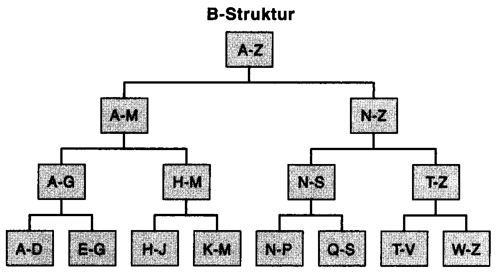
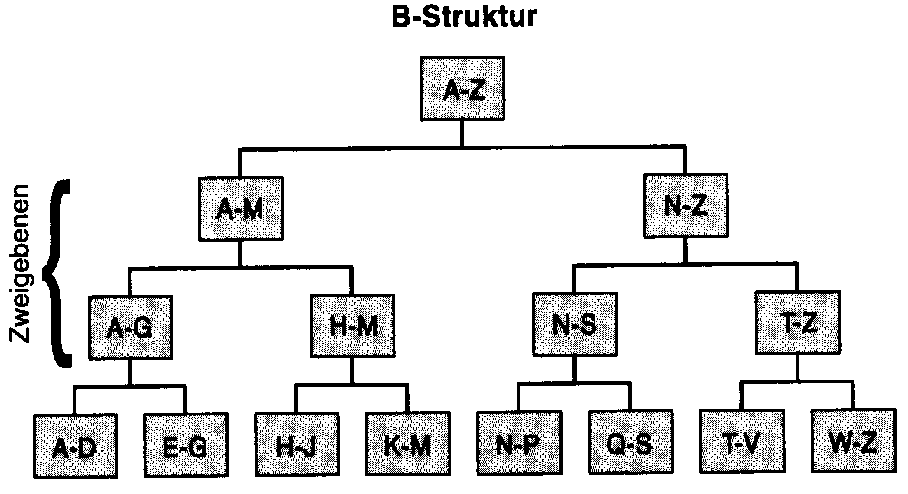

# Der Index

Indizes sind ein Feature, das entworfen wurde, um den Zugriff auf Daten in
der Datenbank zu beschleunigen. Sie ähneln dem Stichwortverzeichnis dieses Buchs. Durch die
Verwwendung von Indizes können Sie schnell bestimmte Daten finden, ohne alle Daten in der Tabelle
lesen zu müssen.

## Grundlagen von Indizes

Indizes sind eine optionale Struktur, die entworfen wurde, um Ihnen einen schnelleren und effizienteren
Zugriff auf Tabellendaten zu ermöglichen. Sie sind nicht erforderlich und beeinflussen auch nicht die
Funktionalität Ihrer Abfragen, sondern nur deren Leistung. Dieser Leistungsunterschied kann jedoch
dramatisch sein und sich auf die Gesamtleistung Ihres Systems auswirken. Die Abfrageleistung wird
verbessert, wenn der Arbeitsaufwand für die Suche nach den gewünschten Daten reduziert wird.
Ohne Indizes muss die gesamte Tabelle durchsucht werden, wodurch ein vollständiger Tabellenscan
verursacht wird, der alle Daten in einer Tabelle liest. Es gibt verschiedene
Typen von Indizes und unterschiedliche Möglichkeiten, wie diese konfiguriert werden können, aber
die Grundlagen gelten für alle Indextypen.

Ein Index beschleunigt den Datenzugriff, indem er Ihnen gestattet, für die Suche nach bestimmten
Daten eine Abkürzung zu nehmen. Vergleichbar mit einem Stichwortverzeichnis in einem Buch hilft
Ihnen der Index dabei, Daten anhand einer Reihe von Optionen schnell zu finden.

Der Index wird mit einem oder mehreren Indexschlüsseln erstellt. Ein solcher Indexschlüssel umfasst
die Spalten in der Tabelle, die definieren, welche Inhalte indiziert werden. Es ist der Wert, der verwendet wird, um die Daten in der Tabelle schnell zu finden. Er kann aus Zeichenfolgen,
ganzen Zahlen, Gleitkommazahlen usw. bestehen. Da diese Schlüssel als Kriterien verwendet werden, um die Daten
in der Tabelle zu finden, und Sie in der WHERE-Klausel Ihrer Abfrage nicht immer in denselben
Spalten nach Daten suchen möchten, sind mehrfache Indizes zugelassen. Die Ausnahme bildet der
gruppierte (clustered) Index, der noch erläutert wird. Pro Tabelle ist
nur ein gruppierter Index zulässig.

Da Indizes auf der Grundlage von Indexschlüsseln erstellt werden, müssen Sie die führenden Schlüsselwerte in die WHERE-Klausel Ihrer SQL-Anweisung einbinden, um einen Index zu verwenden.
Wenn Sie dies nicht tun, wird dieser Index nicht für die Datensuche verwendet. Vor allem die führende Seite des Index muss in die WHERE-Klausel der SELECT-Anweisung aufgenommen werden.
Zusätzlich gibt es eine Reihe weiterer Einschränkungen, die weiter hinten in diesem Kapitel beschrieben werden.
Ein Index, der mit nur einer Schlüsselspalte definiert wurde, wird einfacher Index genannt, ein Index
mit mehr als einer Schlüsselspalte
zusammengesetzter
Index. Im Indexschlüssel sollte mehr als eine
Spalte verwendet werden, wenn der Index dadurch eindeutiger oder selektiver wird. Je eindeutiger
der Index ist, desto besser ist er, da dadurch bei einer Abfrage weniger Zeilen abgerufen werden müssen. Wie Sie weiter hinten in diesem Kapitel lernen werden, sollten Indizes so eindeutig wie möglich
erstellt werden. Sehr umfangreiche Indizes mit vielen Schlüsselwerten sind jedoch aufgrund des
erforderlichen Speicherplatzes und der Änderungsleistung weniger effizient.

> **Hinweis:** Der Nutzen eines Index besteht darin, dass Sie Ihre Daten mit so wenig Lesevorgängen
> wie möglich finden können. Je umfangreicher der Index ist, desto mehr Indexseiten verbraucht er und
> desto mehr Speicherplatz und Seiten werden folglich benötigt, um die gewünschten Daten zu finden.
> Daher müssen Sie somit immer einen Kompromiss zwischen der Erstellung eindeutigerer und der
> Erstellung kleinerer Indizes finden.

Ein Index kann entweder eindeutig oder nicht eindeutig sein. Bei einem eindeutigen Index kann es
nur einen
Schlüsselwert für den Index geben, bei einem nicht eindeutigen Index können doppelte
Schlüsselwerte für Indizes auftreten. Wenn beispielsweise der eindeutige Index auf der Grundlage
von Lastname, Firstname erstellt wurde, kann es nur einen Eintrag für jeden Namen
geben. Ein doppelter Eintrag würde abgewiesen, wobei ein Fehler ausgegeben wird.
Ein eindeutiger Index hat die höchste Ebene an Selektivität, die ein Index haben kann, da jeder
Schlüsselwert nur einer Zeile zugeordnet ist bzw. jede Zeile einen eindeutigen Schlüsselwert hat.
Jeder Versuch, einen doppelten Index
schlüsselwert in einen eindeutigen Index einzufügen, führt zu einem Fehler. Ein Satz von Spalten,
der definiert wird, um jede Zeile in der
Tabelle eindeutig zu kennzeichnen, wird als Primärschlüssel (Primary Key) bezeichnet,
wie in Kapitel 13 »Durchsetzen der Datenintegrität«, erwähnt wird. Der Primärschlüssel ist für
gewöhnlich mit einer Beschränkung verknüpft und häufig ein sehr guter Kandidat für einen gruppierten
Index. Leider kann eine Tabelle nicht immer mit einem Primärschlüssel
definiert werden, da es unmöglich sein kann, eine Zeile eindeutig zu bezeichnen. Es kann nur einen
Primärschlüssel pro Tabelle geben, und dieser Primärschlüssel kann keine NULL-Werte enthalten
Wenn der Primärschlüssel definiert wird, wird ein eindeutiger Index erstellt und zum Erzwingen
Der Eindeutigkeit verwendet.

Die Indexstruktur ähnelt einem umgekehrten Baum (wie eine Verzeichnisstruktur). Dieser Baum
beginnt mit der ersten Seite des Index, die als Stammknoten bezeichnet wird. Der Stammknoten enthält
Schlüsselwertbereiche und Zeiger auf andere Seiten im Index. Diese Zwischenseiten werden
alle Zweigknoten bezeichnet. Sie enthalten ebenfalls Schlüsselwerte und Zeiger auf niedrigere
Zweigknoten und schließlich auf Blatt- oder Endknoten. Der Endknoten ist die Seite auf der
niedrigsten Index ebene und enthält Schlüsselwerte sowie entweder einen Wert für rowid, der auf die
Daten selbst zeigt (in einer Tabelle), oder einen gruppierten Schlüsselwert (in einer gruppierten
Indextabelle). Die Struktur des Indexbaums ist in folgender Abbildung dargestelllt:



Wie Sie sehen können, ist der Index in einer baumähnlichen Struktur aufgebaut, die als
B-Struktur bezeichnet wird. Die Indexstruktur wird von den Stammknoten über die Zweigknoten zu den
Endknoten aufgebaut, wie in der Abbildung zu sehen ist. Obwohl dieses Beispiel einen Index als einzelnes
Zeichen darstellt, werden die Indexseiten tatsächlich aus Werten des vollständigen Indexschlüssels
erstellt. Wie viele Seiten der Index beansprucht, hängt davon ab, wie umfangreich er ist. Die
Indexbreite wird durch die Anzahl der Spalten in den Indexschlüsseln und deren Größe bestimmt.
Die Anzahl der Zeilen in einer Indexseite wird durch seine Breite festgelegt.

Die Zweigknoten werden als Zweigebenen beschrieben. Eine Zweigebene ist die Menge der Zweigknoten,
die gleich weit vom Stammknoten entfernt sind, wie folgende Abbildung zeigt.



Die Anzahl der zum Abruf der angeforderten Daten erforderlichen E/A-Vorgänge hängt von der
Anzahl der Zweigebenen ab, die durchsucht werden müssen, um
den Endknoten zu erreichen. Dies beeinflusst direkt die Leistung für den Abruf der angeforderten
Daten. Die Anzahl der Zweigebenen hängt von der Breite des Index (der Anzahl der Schlüsselspalten
und ihrer Größen) und der Anzahl der Zeilen in der Tabelle ab. Theoretisch können sich in einer sehr
kleinen Tabelle der Stamm- und Endknoten auf derselben Seite befinden. In diesem Fall führt der
Index für gewöhnlich zu einem größeren Aufwand als ein Tabellenscan.

Bei der Verwendung eines Index wird der Stammknoten gelesen und je nach dem Wert
des verwendeten Indexschlüssels die Entscheidung getroffen, welcher Zweigknoten gelesen
werden soll. Die Zweigknoten erlauben Ihnen dann, Ihre Daten schnell abzurufen, indem
Sie dem Pfad und den an den Zweigknoten getroffenen Entscheidungen folgen. Schließlich erreichen
Sie den Endknoten, wo entweder ein Wert für rowid oder ein Schlüsselwert für die Suche in einem gruppierten Index zur
Verfügung gestellt wird. In einigen Fällen gelangen Sie vielleicht an eine Folge von Endknoten. An
diesem Punkt rufen Sie Ihre Daten entweder direkt ab oder durchsuchen einen gruppierten Index
(Lesezeichen-Suche). Nach der Einführung von gruppierten
Indizes erfahren Sie mehr darüber, wie dies genau funktioniert.

Je nachdem, wie Sie den Index erstellen, wird dieser entweder aufsteigend oder absteigend sortiert,
Da der Index die Sortierreihenfolge vorgibt, können Sie oftmals vermeiden, dass ein Sortiervorgang
ausgeführt wird, sofern die ORDER BY-Klausel in der SQL-Anweisung mit der Reihenfolge des Index
übereinstimmt (unter der Annahme, dass dieser Index verwendet wird). Dies bietet einen zusätzlichen
Vorteil, da die Sortiervorgänge in der Datenbank reduziert werden. Dies ist jedoch nicht immer der
Fall.

## Optimale Nutzung von Indizes

Um die Vorteile von Indizes nutzen zu können, muss in der WHERE-Klausel Ihrer SQL-Anweisung
ein Verweis auf den Indexschlüssel erfolgen. In einem Index mit mehreren Spalten muss der
Hauptschlüssel in der WHERE-Klausel Ihrer SQL-Anweisung bereitgestellt werden, da die Daten im Index
nach dem Wert des ersten Indexschlüssels und erst anschließend nach den nachfolgenden
Schlüsselwerten sortiert werden.

Wenn beispielsweise ein Index für die Spalte *last_name* und anschließend für *first_name* erstellt
wird, werden die Daten zuerst nach *last_name* sortiert und anschließend innerhalb jedes Nachnamens
nach *first_name*. Abbildung 12.3 zeigt ein Beispiel, das diesen Punkt verdeutlicht.


Da die Werte der zweiten Schlüsselspalte über den gesamten Index verstreut sind, können Sie nur
dann aus der Verwendung dieses Index einen Nutzen ziehen, wenn die erste Schlüsselspalte in der
WHERE-Klausel vorhanden ist. Wenn ein Index wie oben gezeigt für last_name und first_name
erstellt wird, kann auf ihn wie in der folgenden SQL-Anweisung sehr effektiv zugegriffen werden:

```sql
SELECT PhoneNumber FROM myTable
WHERE last_name = 'smith' AND first_name = 'john' ;
```

Des Weiteren kann dieser Index auch bei der folgenden Abfrage von Nutzen sein, da er die Anzahl der
abgerufenen Zeilen reduziert. Es werden jedoch möglicherweise viele Smiths abgerufen:

```sql
SELECT PhoneNumber FROM myTable
WHERE last_name = 'smith';
```

Die folgende Abfrage verwendet diesen Index jedoch nicht (sofern sie nicht dazu
gezwungen ist, d
es ein gruppierter Index ist), da zwar die Nachnamen an einer Stelle
zusammengehalten werden, di
Vornamen aber über den Index verstreut sind. In diesem Fall wird ein Tabellenscan
durchgeführt:

```sql
SELECT PhoneNumber FROM myTable
WHERE first_name = 'john' ;
```

Wie Sie weiter hinten in diesem Kapitel sehen werden, bestimmen die Indexschlüssel zusammen mit
den in der WHERE-Klausel verwendeten Werten, wie nützlich der Index ist, um die Leistung Ihrer
Abfrage zu verbessern. Daneben bestimmt auch der Indextyp die Wirksamkeit.

## Indextypen

Datenbanken stellten eine Reihe verschiedener Indextypen zur Verfügung, wie gruppierte Indizes, nicht
gruppierte Indizes, Indizes mit eingeschlossenen Spalten, indizierte Sichten, Volltextindizes und
XML-Indizes, die jeweils einen eigenen Zweck und eigene Merkmale haben. Wenn Sie verstehen, wie
Indizes funktionieren, sind Sie besser in der Lage, Indizes zu erstellen und zu optimieren. Je nach
Indextyp kann sich die Funktionsweise unterscheiden.

### Gruppierter (clustered) Index

Ein gruppierter Index speichert die Tabellendaten auf der Grundlage des Indexschlüssels in sortierter
Reihenfolge aufder Blattseite des Index. Aufgrund dieser Anforderung besteht die Notwendigkeit, die
Seiten im Index fortwährend neu anzuordnen. Sobald Daten in die Datenbank eingegeben werden,
wird möglicherweise Speicherplatz benötigt, um diese neuen Seiten zum Index hinzuzufügen.

Wenn neueEinträge zur Datenbank hinzugefügt werden, wird auch eine neue Seite erstellt, wobei
eine Seitenteilung auftritt. Diese Seitenteilung kann beträchtlichen Aufwand verursachen, ist aber
unvermeidlich, da ein gruppierter Index die Daten in sortierter Reihenfolge speichern muss. Ein
gruppierter Index ist in folgender Abbildung dargestellt.


Die Daten werden tatsächlich im Endknoten des Index gespeichert. Aufgrund dieser Tatsache muss
der Zugriff auf die in einem gruppierten Index gespeicherten Daten über die Indexstruktur erfolgen.
Es gibt keine andere Möglichkeit, auf diese Daten zuzugreifen, außer über den Index. Da die Daten
im Index selbst gespeichert werden, ist kein direkter Zugriff darauf möglich. Die Endknoten werden
über Zeiger miteinander verknüpft. In jedem Endknoten gibt es einen Zeiger auf den vorhergehenden
und den nachfolgenden Knoten. Dies wird als verknüpfte Liste bezeichnet. Da die Endknoten des
Index über eine verknüpfte Liste miteinander verbunden sind, werden
sie während eines Tabellenscans der Reihe nach gelesen.

Ein Index kann entweder für eine Tabelle oder einen gruppierten Index definiert werden. Wenn ein
nicht gruppierter Index verwendet wird, um Daten in einem gruppierten Index zu finden, stellen die
Endknoten des nicht gruppierten Index die Indexschlüssel für den gruppierten zur Verfügung, und
der zugrunde liegende gruppierte Index wird gescannt. Dieser Schritt wird als
Lesezeichensuche bezeichnet. Dabei handelt es sich entweder um den Zugriff auf eine Zeile über den
Wert einer rowid (kein gruppierter Index) oder eine Indexsuche mithilfe des gruppierten Indexschlüssels (gruppierter Index). Aus diesem Grund ist die Qualität des gruppierten Index von so großer Bedeutung.

Es ist sehr wichtig, dass der gruppierte Index so wirksam wie möglich ist. Ein eindeutiger Index oder
ein Primärschlüssel ist ein hervorragender Kandidat für einen gruppierten Index.

## Nicht gruppierter (nnclustered) Index

Ein nicht gruppierter Index ist sowohl logisch als auch physisch von den Tabellendaten unabhängig. Dieser Index ähnelt dem gruppierten Index, mit der Ausnahme, dass die Tabellendaten nicht im Endknoten des Index gespeichert werden. Stattdessen enthält der Endknoten entweder den Clusterschlüssel, wenn der Index auf einen gruppierten Index zeigt, oder eine rowid, die direkt auf die Tabellendaten zeigt, wenn kein gruppierter Index vorhanden ist.

Nicht gruppierte Indizes können entweder eindeutig oder nicht eindeutig definiert werden. Zusätzlich kann ein nicht gruppierter Index als Primärschlüsselindex verwendet werden, obwohl häufig empfohlen wird, auf der Grundlage des Primärschlüsselindex eine Gruppierung auszuführen. Für eine Tabelle können Sie nicht gruppierte Indizes definieren. Diese Indizes können für verschiedene Spaltenkombinationen definiert werden. Je mehr Indizes es gibt, desto besser können verschiedene Abfragen werden. Mehr Indizes bedeuten jedoch höheren Aufwand. Immer dann, wenn Daten eingefügt, aktualisiert oder gelöscht werden, müssen alle durch diese Zeile beeinflussten Indizes ebenfalls aktualisiert werden. Dies führt dazu, dass die Anzahl der Indizes wächst und die Aktualisierungs-, Einfüge- und Löschvorgänge langsamer werden.

Ein umfassender Index ist ein Index, der genug Informationen enthält, sodass es nicht notwendig ist, die Lesezeichensuche auszuführen. Dieses Werkzeug funktioniert in Verbindung mit einer umfassenden Abfrage. Wenn die ausgewählten Kriterien im hinteren Ende des Index eingeschlossen sind und das führende Ende des Index in der WHERE-Klausel einer Abfrage verwendet wird, können die Daten aus dem Index selbst an den Benutzer zurückgeben werden. Beispielsweise kann die folgende Abfrage ausgegeben werden, wenn ein Index auf der Grundlage von last_name, first_name und social_security_number erstellt wird:

```sql
SELECT social_security_number FROM myTable
WHERE last_name = 'smith' AND first_name = 'john';
```

Da die Sozialversicherungsnummer im Index zur Verfügung steht, wird der Wert zurückgegeben,
ohne die Lesezeichensuche auszuführen.

## Empfohlene Vorgehensweisen für Indizes

Der Mangel an Indizes sowie schlecht entworfene gruppierte Indizes verursachen viele der
Leistungsprobleme, die Ihnen in einer Datenbank begegnen können. Der Entwurf optimaler
Indizes kann den Unterschied zwischen einem System mit schlechter Leistung und einem System mit
optimaler Leistung ausmachen. Es ist schwierig, das Gleichgewicht zwischen zu vielen Indizes, die
die Aktualisierungsleistung verringern, und zu wenigen Indizes, die die Abfragen verlangsamen, zu
schaffen. Die Auswahl der richtigen Spalten für die Indizierung und des geeigneten Indextyps sind
ebenfalls beide sehr wichtig. In diesem Abschnitt lernen Sie einige Techniken und Tipps für die
Erstellung optimaler Indizes kennen.

Bei der Erstellung von Indizes sollten Sie eine Reihe von empfohlenen Vorgehensweisen befolgen.
Diese Leitlinien helfen Ihnen, die optimalen Indizes für Ihr System zu erstellen. Die folgende
Liste schließt sowohl allgemeine als auch besondere Empfehlungen ein, wobei die einzelnen Punkte
in keiner bestimmten Reihenfolge aufgeführt sind:

- **Erstellen von Indizes mit guter Selektivität oder Eindeutigkeit.** Ein Index mit guter Selektivität hat sehr wenige oder keine Duplikate. Ein eindeutiger Index weist die höchste Selektivität auf. Wenn ein nicht gruppierter Index keine gute Selektivität hat, wird er höchstwahrscheinlich nicht ausgewählt. Ein gruppierter Index mit schlechter Selektivität führt zu einer schlechten Leistung von Lesezeichen-Suchvorgängen und ist schlechter als kein gruppierter Index, da mehr Lesevorgänge erforderlich sind. Dies ist so, weil Suchaufwand für nicht gruppierte Indizes und gruppierte Indizes (Lesezeichensuche) entsteht.
- **Erstellen von Indizes, die die Anzahl von Zeilen verringern.** Wenn eine Abfrage einige Zeilen aus einer großen Tabelle auswählt, sollten Indizes erstellt werden, die diese Zeilenverringerung unterstützen. 
- **Erstellen von Indizes, die einen Zeilenbereich auswählen.** Wenn die Abfrage eine Menge von ähnlichen Zeilen zurückgibt, kann ein Index die Auswahl dieser Zeilen unterstützen.
- **Erstellen von gruppierten Indizes als eindeutige Indizes, wenn dies möglich ist.** Die besten Kandidaten für gruppierte Indizes sind Primärschlüssel und eindeutige Indizes. Wenn der Primärschlüsselindex zu groß ist, ist es jedoch nicht immer eine gute Idee, ihn zum gruppierten Index zu machen. In einigen Fällen ist es besser, den Primärschlüsselindex als nicht gruppiert zu erstellen und zusätzlich einen kleineren gruppierten Index zu verwenden.
- **Indizes so schmal wie möglich halten.** Ein Index, der auf der Grundlage einer oder mehrerer schmaler Spalten erstellt wird, wird als schmaler Index bezeichnet, ein Index mit vielen umfang
- reichen Schlüsselspalten breiter Index. Je weniger Spalten im Index enthalten sind, desto besser, aber Sie müssen genug Spalten haben, damit der Index wirksam ist. 
- **Indizes sparsam für Tabellen verwenden, die zahlreichen Aktualisierungen unterliegen.** Sie können mehr Indizes für Tabellen erstellen, die nicht vielen Aktualisierungen unterliegen. Sehr kleine Tabellen nicht indizieren Bei sehr kleinen Tabellen ist der Aufwand für einen Inde: höher als dessen Nutzen. Da ein Index Seiten hinzufügt, die gelesen werden müssen, ist ein Tabellenscan manchmal effizienter.
- **Erstellen von umfassenden Indizes, wenn dies möglich ist.** Umfassende Indizes sind mit de Einführung von Indizes mit eingeschlossenen Spalten stark im Wert gestiegen.
- **Sichten indizieren, wenn dies angemessen ist.** Indizierte Sichten können bei Aggregaten un einigen Verknüpfungen sehr wirksam sein. Wenn Sie diese Richtlinien befolgen, werden Ihre Indizes wirksamer und daher wahrscheinlich ehe verwendet. Ein unwirksamer Index wird voraussichtlich nicht verwendet und fügt daher nur unnötigen Aufwand zu den Systemen hinzu. Indizes, insbesondere gruppierte, sollten sorgsam entworfen und sparsam verwendet werden, da sie Aufwand verursachen und die Leistung von Datenaktualisierungen reduzieren.

