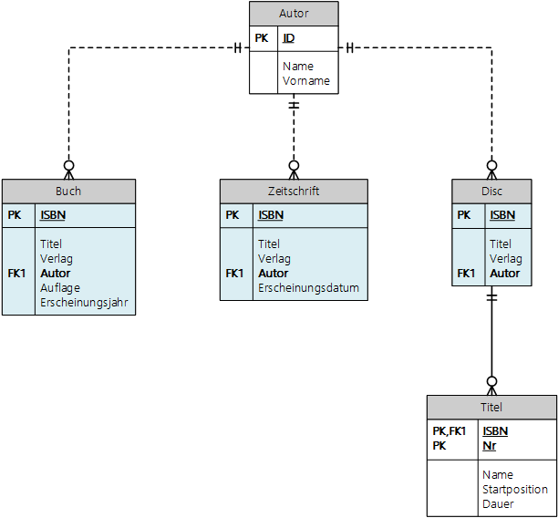
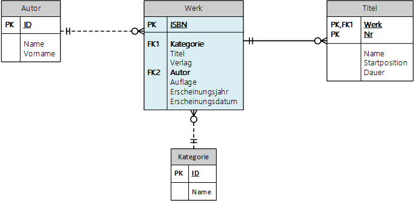
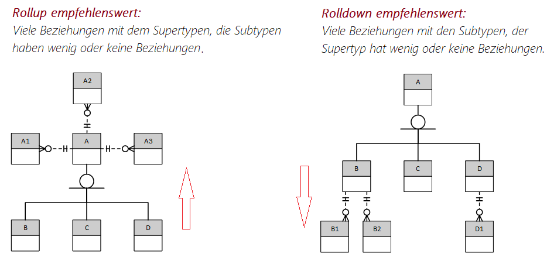

# Generalisierung

Betrachten Sie die folgenden Datenmodelle:


## Variante 1: Eine kleine Bibliothek

In einer Bibliothek können verschiedene Werke ausgeliehen werden. Jedes Werk hat einen Titel, einen
Verlag und einen Autor. Bücher haben zusätzlich noch eine Auflage und ein Erscheinungsjahr. Bei
einer Zeitschrift soll zusätzlich noch ein Erscheinungsdatum gespeichert werden. Eine Disc hat
mehrere Titel mit Namen.

Aus dieser Information können wir die benötigten Attribute schon herausfinden:

| Entity      | Attribute                                                 |
| ----------- | --------------------------------------------------------- |
| Buch        | **ISBN**, Titel, Verlag, Autor, Auflage, Erscheinungsjahr |
| Zeitschrift | **ISBN**, Titel, Verlag, Autor, Erscheinungsdatum         |
| Disc        | **ISBN**, Titel, Verlag, Autor                            |

Nun sehen wir, dass einige Attribute in jeder Tabelle vorkommen. Diese können wir in einem eigenen
Obertyp (*Supertyp*) zusammenfassen. Diesen Vorgang nennt man *Generalisierung*. Es entsteht
eine neue Tabelle *Werk*, die Titel, Verlag und Autor beinhaltet.

| Entity      | Attribute                           |
| ----------- | ----------------------------------- |
| Werk        | **ISBN**, Titel, Verlag, Autor      |
| Buch        | **ISBN**, Auflage, Erscheinungsjahr |
| Zeitschrift | **ISBN**, Erscheinungsdatum         |
| Disc        | **ISBN**                            |

Alle verbliebenen Untertypen (Buch, Zeitschrift, Disc) nennt man *Subtypen*. Zwischen diesen
Typen und dem Werk besteht eine *IS-A* Beziehung. Ein Buch ist ein Werk, eine Zeitschrift ist ein
Werk und eine Disc ist ein Werk. Jeder Untertyp erbt alle Attribute des Obertypen.

### Die Vererbung in der Programmierung

Diese Ideen sind nicht neu. In der objektorientierten Programmierung gibt es das Konzept der
Vererbung, die genau diesen Sachverhalt abbildet. In C# zeigt der Doppelpunkt die Vererbung an.
Die Klasse Buch hat also auch die Properties Isbn, Titel, ... In Java wird dies mit *extends*
gekennzeichnet.

```c#
class Werk
{
    public string Isbn { get; set; }
    public string Titel { get; set; }
    public string Verlag { get; set; }
    public string Autor { get; set; }
}

class Buch : Werk
{
    public int Auflage { get; set; }
    public int Erscheinungsjahr { get; set; }
}

class Zeitschrift : Werk
{
    public DateTime Erscheinungsdatum { get; set; }
}

class Disc : Werk
{

}
```

### Arten der Spezialisierung

- **Disjunkte Spezialisierung:** Eine Entität kann höchstens einem Untertyp gehören. Es kann
also nicht sein, dass ein Wert ein Buch und eine Disc zugleich - also in beiden Tabellen vorhanden -
ist. (disjunkt = durchschnittsfremd)

- **Vollständige Spezialisierung:** Eine Entität muss mindestens zu einem Untertyp gehören. Es
kann also nicht sein, dass wir nur ein Werk ohne Typ (Buch, Zeitschrift oder Disc) haben.

## Variante 2: Eine Leihwagenfirma

Wir stellen uns vor, dass eine Leihwagenfirma 2 Arten von Fahrzeugen anbietet:

| Fahrzeug    | Attribute                                       |
| ----------- | ----------------------------------------------- |
| PKW         | **ID**, Kennzeichen, Kilometerstand, AnzPlaetze |
| Transporter | **ID**, Kennzeichen, Kilometerstand, Nutzlast   |

Wir können hier auch nach Variante 1 vorgehen, einen Supertyp *Fahrzeug* anlegen und 2 Subtypen
(PKW und Transporter) damit verbinden. Dieses Modell geht allerdings einen anderen Weg:
Es speichert in einer einzigen Tabelle (Fahrzeug) *alle Spalten von PKW und Transporter*. Natürlich
müssen die Spalten *AnzPlaetze* und *Nutzlast* nullable sein, da sie nicht überall vorkommen.

Zusätzlich muss noch die Art gespeichert werden. Dies geschieht im Attribut *Kategorie*. In der
Lookup Tabelle sind dann 2 Datensätze (PKW und Transporter) gespeichert.

Dieses Modell hat jedoch die Einschränkung, dass *ein Fahrzeug höchstens eine Kategorie* hat. Es
kann kein Fahrzeug, welches ein PKW und ein Transporter zugleich ist, gespeichert werden.

## Variante 3: Unsere Schule

Auch in Variante 3 sind gleiche Attribute zwischen Schüler und Lehrer zu finden (Vorname, Nachname).
Allerdings sind hier die Tabellen vollkommen getrennt gespeichert. Auch das ist eine Möglichkeit,
vor allem wenn wir keinen generalisierten Obertyp (Person) im Modell sinnvoll verwenden können. Das
ist hier der Fall, denn Schüler und Lehrer sind völlig getrennte Rollen und nicht austauschbar.

## Auflösung mittels Rollup und Rolldown

Das Problem mit Variante 1 ist, dass eine Datenbank - im Gegensatz zu objektorientierten
Programmiersprachen wie C# oder Java - bei *CREATE TABLE* keine spezielle Syntax für diesen
Sachverhalt kennt. Die CREATE TABLE Anweisungen sind die Gleichen wie für eine normale
Fremdschlüsselbeziehung:

```sql
CREATE TABLE Werk (
    ISBN   CHAR(13) PRIMARY KEY,
    ...
);

CREATE TABLE Buch (
    ISBN   CHAR(13) PRIMARY KEY REFERENCES Werk(ISBN)
    ...
)
```

Um ein Buch anzulegen, muss zuerst das Werk und in einer 2. INSERT Anweisung das Buch angelegt
werden. Außerdem können wir der Datenbank nicht sagen, dass es sich um eine disjunkte
Spezialisierung handelt, also ein Werk nur ein Buch, eine Zeitschrift oder eine Disc haben kann.

Auch in Zusammenarbeit mit einem OR Mapper, der die Datenbank in C# oder Javaklassen abbildet,
gibt es mit der Generalisierung Probleme. EF Core würde - wenn Sie Vererbung verwenden - alle
Attribute in einer einzigen Tabelle speichern:

> At the moment, EF Core only supports the table-per-hierarchy (TPH) pattern. TPH uses a single table
> to store the data for all types in the hierarchy, and a discriminator column is used to identify
> which type each row represents.
> <sup>https://docs.microsoft.com/en-us/ef/core/modeling/inheritance</sup>

### Rolldown: Hinzufügen der Attribute zu den Subtypen, Löschen des Supertypen

Dieser Ansatz entspricht eigentlich unserem Ausgangspunkt. Beachten Sie hier die Beziehung
zwischen Autor und den einzelnen Subtypen: Jeder Subtyp hat nun einen Fremdschlüssel Autor,
da die Autortabelle an den Subtyp gebunden war.

Der Track verweist nach wie vor auf die Tabelle *Disc*.



### Rollup: Hinzufügen der Attribute zum Supertyp

Hier bleibt nur die Tabelle Werk. Die einzelnen Spalten der Subtypen sind nun integriert und dürfen
natürlich NULL Werte enthalten. Beachten Sie die Tabelle Track. Sie ist nun an das Werk gebunden
und hat sinnvollerweise nur Einträge für Daten der Kategorie Disc.



### Was soll ich für die Auflösung wählen?

Verwenden Sie als Kriterium die Tabellen, die sie im Modell mit dem Sub- oder Supertyp verbinden.
Haben Sie die Situation, dass der Supertyp (hier das Werk) viele Beziehungen zu anderen Tabellen hat,
werden Sie dies mit Rollup leichter umsetzen können. Verwenden Sie allerdings oft den spezifischen
Subtyp in Beziehung mit anderen Tabellen, so wird der Rolldown Ansatz reibungsloser funktionieren.



## Vererbung im OR Mapper

Das Konzept der Vererbung ist den besprochenen Ideen sehr ähnlich. Wir definieren daher zum Test
3 Klassen in C#

```c#
class Person
{
    public int Id { get; set; }
    public string Firstname { get; set; } = default!;
    public string Lastname { get; set; } = default!;
}
class Student : Person
{
    public string Class { get; set; } = default!;
}
class Teacher : Person
{
    public string TeachersRoom { get; set; } = default!;
}

class DemoContext : DbContext
{
    public DbSet<Person> Persons => Set<Person>();
    public DbSet<Student> Students => Set<Student>();
    public DbSet<Teacher> Teachers => Set<Teacher>();

    protected override void OnConfiguring(DbContextOptionsBuilder optionsBuilder)
    {
        optionsBuilder.UseSqlite("Data Source=Demo.db");
    }
}
```

EF Core erzeugt daraus 1 Tabelle ("roll up") mit einer Spalte *Discriminator*. Dies wird in EF Core
mit *table per hierarchy* bezeichnet:

| Id | Firstname | Lastname     | **Discriminator** | Class  | TeachersRoom |
|----|-----------|--------------|---------------|--------|--------------|
| 1  | Cecilia   | Rink         | Person        | [NULL] | [NULL]       |
| 2  | Matthias  | Dreher       | Person        | [NULL] | [NULL]       |
| 3  | Melvin    | Ney          | Person        | [NULL] | [NULL]       |
| 4  | Mads      | Wittich      | Student       | 3BHMNA | [NULL]       |
| 5  | Elaine    | Schnürer     | Student       | 4AHBGM | [NULL]       |
| 6  | Annabelle | Eggenmueller | Student       | 1AHBGM | [NULL]       |
| 7  | Victor    | Kobs         | Teacher       | [NULL] | A1.04        |
| 8  | Jessy     | Jambor       | Teacher       | [NULL] | C1.03        |
| 9  | Jella     | Fietz        | Teacher       | [NULL] | C1.04        |

### EF Core und Typecasts

Erstellen Sie ein Projekt mit folgenden Konsolenbefehlen

```text
rd /S /Q EfCoreInheritanceDemoApp
md EfCoreInheritanceDemoApp
cd EfCoreInheritanceDemoApp
dotnet new console
dotnet add package Microsoft.EntityFrameworkCore
dotnet add package Microsoft.EntityFrameworkCore.Sqlite
dotnet add package Bogus
start EfCoreInheritanceDemoApp.csproj
```

#### Datei Program.cs

```c#
using Microsoft.EntityFrameworkCore;
using Bogus;
using System;
using System.Linq;

namespace EfCoreInheritanceDemoApp
{
    class Person
    {
        public int Id { get; set; }
        public string Firstname { get; set; } = default!;
        public string Lastname { get; set; } = default!;
    }
    class Student : Person
    {
        public string Class { get; set; } = default!;
    }
    class Teacher : Person
    {
        public string TeachersRoom { get; set; } = default!;
    }

    class DemoContext : DbContext
    {
        public DbSet<Person> Persons => Set<Person>();
        public DbSet<Student> Students => Set<Student>();
        public DbSet<Teacher> Teachers => Set<Teacher>();

        protected override void OnConfiguring(DbContextOptionsBuilder optionsBuilder)
        {
            optionsBuilder.UseSqlite("Data Source=Demo.db");
        }

        protected override void OnModelCreating(ModelBuilder modelBuilder)
        {

        }
        public void Seed()
        {
            var departments = new string[] { "HIF", "HBGM", "HWIT", "HMNA", "HMNG" };
            Randomizer.Seed = new Random(729);

            var persons = new Faker<Person>("de").Rules((f, t) =>
            {
                t.Firstname = f.Name.FirstName();
                t.Lastname = f.Name.LastName();
            })
            .Generate(3);
            Persons.AddRange(persons);
            SaveChanges();

            var students = new Faker<Student>("de").Rules((f, s) =>
            {
                s.Firstname = f.Name.FirstName();
                s.Lastname = f.Name.LastName();
                s.Class = f.Random.Int(1, 5)
                    + f.Random.String2(1, "ABC")
                    + f.Random.ListItem(departments);

            })
            .Generate(3);
            Students.AddRange(students);
            SaveChanges();

            var teachers = new Faker<Teacher>("de").Rules((f, t) =>
            {
                t.Firstname = f.Name.FirstName();
                t.Lastname = f.Name.LastName();
                t.TeachersRoom = f.Random.String2(1, "ABC") + f.Random.Int(1, 5) + ".0" + f.Random.Int(1, 9);
            })
            .Generate(3);
            Teachers.AddRange(teachers);
            SaveChanges();
        }
    }

    class Program
    {
        static void Main(string[] args)
        {
            using (DemoContext db = new DemoContext())
            {
                db.Database.EnsureDeleted();
                db.Database.EnsureCreated();
                db.Seed();

                Console.WriteLine("Reading Set<Person>");
                foreach (var p in db.Persons)
                {
                    if (p is Student)
                    {
                        var s = (Student)p;
                        Console.WriteLine($"    {s.Firstname} {s.Lastname}, {s.Class} is a student.");
                        continue;
                    }
                    if (p is Teacher)
                    {
                        var t = (Teacher)p;
                        Console.WriteLine($"    {t.Firstname} {t.Lastname} is a teacher in {t.TeachersRoom}.");
                        continue;
                    }
                    Console.WriteLine($"    {p.Firstname} {p.Lastname} is a person.");
                }

                Console.WriteLine("Reading Set<Teacher>");
                foreach (var t in db.Teachers)
                {
                    Console.WriteLine($"    {t.Firstname} {t.Lastname} is a teacher in {t.TeachersRoom}.");
                }

                Console.WriteLine("Reading Set<Person> with type cast");
                foreach (var t in db.Persons.Where(p => p is Teacher).Cast<Teacher>())
                {
                    Console.WriteLine($"    {t.Firstname} {t.Lastname} is a teacher in {t.TeachersRoom}.");
                }
            }
        }
    }
}
```

```text
Reading Set<Person>
    Cecilia Rink is a person.
    Matthias Dreher is a person.
    Melvin Ney is a person.
    Mads Wittich, 3BHMNA is a student.
    Elaine Schnürer, 4AHBGM is a student.
    Annabelle Eggenmueller, 1AHBGM is a student.
    Victor Kobs is a teacher in A1.04.
    Jessy Jambor is a teacher in C1.03.
    Jella Fietz is a teacher in C1.04.
Reading Set<Teacher>
    Victor Kobs is a teacher in A1.04.
    Jessy Jambor is a teacher in C1.03.
    Jella Fietz is a teacher in C1.04.
Reading Set<Person> with type cast
    Victor Kobs is a teacher in A1.04.
    Jessy Jambor is a teacher in C1.03.
    Jella Fietz is a teacher in C1.04.
```
## Übung

**(1)** Ein Fußballverein gibt ihnen folgende Informationen:

- Ein Mitglied des Vereines wird mit Vorname, Nachname und Geburtsdatum erfasst.
- Das Mitglied kann entweder ein Spieler oder ein Trainer sein. Der Spieler hat eine bevorzugte
  Position (Mittelfeld, Tormann, ...). Bei einem Trainer wird das Datum der Trainerprüfung zusätzlich
  gespeichert.
- Bei einem Spiel wird die Mannschaft aus mehreren Spielern und einem Trainer zusammengestellt und
  auf die Reise geschickt.

Modellieren Sie zuerst diesen Sachverhalt mit einer generalisierten Mitgliedertabelle. Danach führen
Sie Rollup und Rolldown durch. Was halten Sie für sinnvoller?

**(2)** Eine Immobilienfirma möchte ihre Objekte, die sie anbietet, verwalten. Die Objekte haben
eine Adresse, einen Besitzer (Vor- und Nachname sowie Telefonnummer) und eine Größe in qm.
Es gibt bei den Immobilien Häuser, Eigentumswohnungen, Mietwohnungen und Firmengebäude. Mietwohnungen
haben eine Monatsmiete, alles Andere hat einen Verkaufspreis.

Modellieren Sie diesen Sachverhalt wieder in Form einer Generalisierung. Danach führen Sie Rollup und
Rolldown durch. Was halten Sie für sinnvoller?
