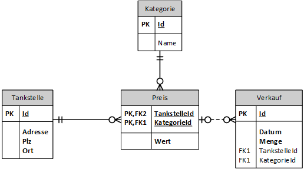
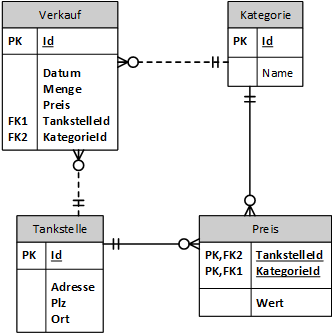
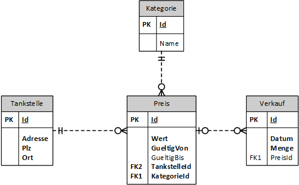

# Historisierung (Temporale Datenhaltung)

> Unter temporaler Datenhaltung (auch Historisierung genannt) versteht man in der
> Informationstechnik das Festhalten der zeitlichen Entwicklung der Daten bei Speicherung in einer Datenbank.
> <sup>https://de.wikipedia.org/wiki/Temporale_Datenhaltung</sup>

Wir betrachten das Modell einer kleinen Datenbank für eine Tankstelle. Diese Tankstelle bietet
verschiedene Kategorien von Treibstoffen zu einem bestimmten Preis an. Die Verkäufe werden mit
der verkauften Menge in Litern gespeichert.



Nun ändert sich der Benzinpreis. Der Wert wird also mit einem *UPDATE* Statement neu gesetzt. Doch
was passiert mit unseren gespeicherten Verkäufen? Da in der Tabelle *Verkauf* nur auf den Preis
*referenziert* wird, hat sich auch der Jahresumsatz durch die Preisänderung verändert.

In der Datenmodellierung gibt es häufig Fälle, wo der Zustand zu einem bestimmten Zeitpunkt in
der Vergangenheit abgefragt wird:

- Welchen Lagerstand hatte ein Produkt im Laufe der Zeit?
- Welches Gehalt hatte ein Mitarbeiter?
- Welche Vertragskonditionen (Tarif) hat ein Kunde, der zu einem bestimmten Zeitpunkt den Vertrag
  abgeschlossen hat?
- Wer hat Datenkorrekturen (z. B. Noteneintragung) durchgeführt und was war der vorherige Wert?  

Als Faustregel kann man im Allgemeinen sagen: *INSERT* Anweisungen sind besser als *UPDATE*
Anweisungen, denn sie überschreiben keine alten Daten. Verwenden Sie nur *UPDATE*, wenn Sie den
alten Stand der Daten nicht mehr benötigen.

Ein einfacher Ansatz, um den Preis eines Verkaufes in der Vergangenheit herauszufinden, wäre das
zusätzliche Speichern in der Tabelle Verkauf:



Die Tabelle Preis beinhaltet den aktuellen Wert, der auf der Homepage oder der Zapfsäule angezeigt
wird. Bei einem Verkauf wird dieser Wert übernommen. Wollen Sie allerdings den Preisverlauf als
Diagramm darstellen, ergibt sich allerdings ein Problem:

- Von wann bis wann galt dieser Preis? Sie sehen nur das Verkaufsdatum, wann ein Kunde getankt hat.
- Was passiert, wenn kein Kunde zu diesem Preis getankt hat (z. B. Sonntag)?

Diese Überlegungen können wir nur mit einer Überarbeitung der Preistabelle lösen. Wir speichern nun
ein *Zeitintervall*, wann der Preis gültig ist.



Für diese Speicherung müssen Sie allerdings einiges beachten:

- Der letzte (aktuelle) Preis hat als Attribut *GueltigBis* den Wert NULL oder ein hohes Datum
  (z. B. 31.12.2999).
- Beim Einfügen eines neuen Preises muss *GueltigBis* des vorher aktuellen Preises begrenzt werden.
- Die Intervalle dürfen keine Lücken aufweisen.

Genaugenommen können Sie auch auf *GueltigBis* verzichten, da die Intervalle ja immer anschließend
sind. Dies würde die Abfragen allerdings komplizierter machen, da Sie mit einer Unterabfrage einmal
den Beginn des Intervalls mit *MAX(GueltigVon) WHERE GueltigVon <= :Zieldatum* herausfinden müssen.

## Abfragebeispiele

In der SQLite Datenbank [Tankstellen.db](Tankstellen.db) sind Musterdaten mit dem oben gezeigten
Modell gespeichert. Wir fragen nun verschiedene Sachen ab.

Folgende Daten sind in der Tabelle *Tankstelle*:

| Id  | Adresse           | Plz  | Ort                |
| --- | ----------------- | ---- | ------------------ |
| 1   | 5908 Ratke Loop   | 5886 | New Dock           |
| 2   | 14207 Huels Point | 1265 | South Lillianaberg |

Folgende Daten sind in der Tabelle *Kategorie*:

| Id  | Name          |
| --- | ------------- |
| 1   | Benzin super  |
| 2   | Benzin normal |
| 3   | Diesel        |

### Preis zum Zeitpunkt *t*

Die Preise für die Tankstelle 1 für Benzin super sind wie folgt abzufragen:

```sql
SELECT *
FROM Preis p
WHERE p.KategorieId = 1 AND p.TankstelleId = 1
ORDER BY p.GueltigVon;
```

| Id  | Wert   | GueltigVon | GueltigBis | TankstelleId | KategorieId |
| --- | ------ | ---------- | ---------- | ------------ | ----------- |
| 9   | 1.3    | 2019-03-22 | 2019-05-11 | 1            | 1           |
| 14  | 1.2829 | 2019-05-11 | 2019-08-09 | 1            | 1           |
| 23  | 1.2915 | 2019-08-09 | 2019-09-18 | 1            | 1           |
| 27  | 1.2824 | 2019-09-18 | 2019-10-18 | 1            | 1           |
| 30  | 1.2871 | 2019-10-18 | 2019-11-17 | 1            | 1           |
| 33  | 1.2819 | 2019-11-17 |            | 1            | 1           |

Wollen wir nun wissen, welche Preise für die Tankstelle 1 am 1. April 2019 eingetragen
wurden, fragen wir mit 2 Kriterien ab:

```sql
SELECT *
FROM Preis p
WHERE
    p.TankstelleId = 1 AND
    p.GueltigVon <= '2019-04-01' AND p.GueltigBis > '2019-04-01';
```

| Id  | Wert  | GueltigVon | GueltigBis | TankstelleId | KategorieId |
| --- | ----- | ---------- | ---------- | ------------ | ----------- |
| 6   | 1.111 | 2019-02-20 | 2019-07-10 | 1            | 3           |
| 8   | 1.2   | 2019-03-12 | 2019-08-29 | 1            | 2           |
| 9   | 1.3   | 2019-03-22 | 2019-05-11 | 1            | 1           |

Beachten Sie, dass wir für *GueltigVon* den Operator <=  verwenden und für *GueltigBis* den
Operator >.

Wir versuchen nun, den Preis für den 1. November 2019 nach derselben Methode herauszufinden.
Auf einmal sehen wir nur mehr 1 Datensatz im Ergebnis:

| Id  | Wert   | GueltigVon | GueltigBis | TankstelleId | KategorieId |
| --- | ------ | ---------- | ---------- | ------------ | ----------- |
| 30  | 1.2871 | 2019-10-18 | 2019-11-17 | 1            | 1           |

Das Problem ist der Wert NULL, wenn der Preis aktuell gültig ist. In der Kategorie 2 und 3 hat
der Preis, der am 1.11.2019 gilt, kein Enddatum, da er noch gilt. Da NULL aber beim Vergleich mit
dem > Operator nicht true liefert, wird er ausgefiltert.

Mit *COALESCE* können wir das Problem lösen, indem wir ein hohes Datum in der Zukunft für unseren
NULL wert zurückgeben lassen.

```c#
SELECT *
FROM Preis p
WHERE
    p.TankstelleId = 1 AND
    p.GueltigVon <= '2019-11-01' AND COALESCE(p.GueltigBis, DATE('2099-12-31')) > '2019-11-01';
```

| Id  | Wert   | GueltigVon | GueltigBis | TankstelleId | KategorieId |
| --- | ------ | ---------- | ---------- | ------------ | ----------- |
| 20  | 1.1238 | 2019-07-10 |            | 1            | 3           |
| 28  | 1.2044 | 2019-09-28 |            | 1            | 2           |
| 30  | 1.2871 | 2019-10-18 | 2019-11-17 | 1            | 1           |

Das Abfragen des gerade gültigen Preises ist mit der Information, dass *GueltigBis* im letzten
Intervall den Wert NULL hat, sehr einfach:

```c#
SELECT *
FROM Preis p
WHERE p.TankstelleId = 1 AND p.GueltigBis IS NULL;
```

| Id  | Wert   | GueltigVon | GueltigBis | TankstelleId | KategorieId |
| --- | ------ | ---------- | ---------- | ------------ | ----------- |
| 20  | 1.1238 | 2019-07-10 |            | 1            | 3           |
| 28  | 1.2044 | 2019-09-28 |            | 1            | 2           |
| 33  | 1.2819 | 2019-11-17 |            | 1            | 1           |

## Übung

**(1)** In der Tankstellendatenbank gibt es eine Tabelle *Tag*. Diese ist sehr einfach gebaut: Sie
speichert einfach jeden einzelnen Tag des 21. Jahrhunderts (1.1.2000 - 31.12.2099). Schreiben
Sie eine Abfrage, die den Tagespreis für Diesel (Kategorie 3) im Jahr 2019 an der
Tankstelle 1 ausgibt. Hinweis: Verwenden Sie die Intervallabfrage im JOIN Ausdruck.

**(2)** Ermitteln Sie mit einem SQL Statement den Durchschnittspreis im Juli 2019 für Diesel
(Kategorie 3). Beachten Sie, dass bei der Berechnung des Durchschnittes die einzelnen Tage
verwendet werden, um jeden Tag des Monats - egal wie lange der Preis gilt - gleich stark zu 
gewichten. Korrekte Antwort: 1.1011 Euro.

**(3)** In unserer Schuldatenbank sind Schüler (Vor- und Zuname sowie Geburtsdatum) einer Klasse
(Bezeichnung und Stammraum) zugeordnet. Erstellen Sie ein kleines Modell, bei dem Sie herausfinden
können, welche Klasse jeder Schüler in jedem Schuljahr besucht hat.

**(4)** Verbinden Sie mit der Schülertabelle aus Übung (3) eine Tabelle Zeugnisnoten. Diese
Zeugnisnoten werden von einem Lehrer (Vor- und Zuname) in einem Fach (Bezeichnung und Langname)
für eine bestimmtes Schuljahr eingetragen. Anstatt die Note einfach zu überschreiben, wollen
Sie ein Protokoll haben, wer die Note geändert hat. Wie finden Sie die aktuelle Note heraus? Geben
Sie die SQL Abfrage hierfür an.
