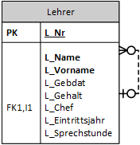
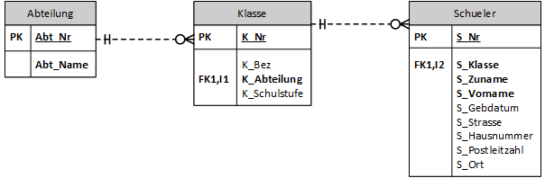
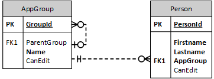
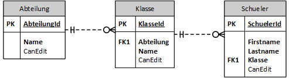

# Rekursive Beziehungen und Gruppen

## Was ist eine rekursive Beziehung

Rekursive Beziehungen sind Beziehungen, die auf die eigene Tabelle verweisen. Bereits in der
Schuldatenbank haben wir eine solche Beziehung in der Lehrertabelle:



Dies deutet schon darauf hin, wo diese Beziehungsart häufig verwendet wird: Beim Abbilden von
Hierarchien. Das ist allerdings nicht der einzige Fall:

- Menüstrukturen mit einem übergeordneten Menüpunkt.
- Gruppen, die andere Gruppen enthalten können.
- Verweise zu Vorgängern (z. B. Auflage eines Buches)

Mit dem zweiten Punkt, nämlich Gruppen, beschäftigen wir uns genauer.

## Gruppen in unserer Schuldatenbank

Eine Gruppe, wie sie in dieser Übung verwendet wird, entspricht einer Menge von Benutzern,
wie sie z. B. im ActiveDirectory
verwendet wird. In unserem ActiveDirectory gibt es eine Gruppe pro Abteilung
(Informatik, Wirtschaftsingenieur, ...), und diese Gruppen beinhalten die Klassen. Die Klasse ist schlussendlich die Gruppe, in der die Schüler gespeichert sind.

In unserer Schuldatenbank haben wir diesen Fall als separate Tabellen abgebildet:



Dadurch ist die Gruppeneinteilung sehr starr, hat allerdings auch Vorteile:

- Wir können spezifische Attribute (AV, Schulstufe, ...) zuordnen.
- Die Abfragen sind sehr einfach (JOIN Operationen).
- Die Datenqualität ist sehr hoch, Constraints können natürlich ebenfalls spezifisch festgelegt werden.

## Allgemeiner Ansatz: Gruppe als abstrakte Tabelle

Häufig dienen Gruppen zur Festlegung von Rechten in einer Applikation. Im Gegensatz zu unserem
Schulbeispiel haben sie keine "reale" Bedeutung, sondern dienen nur zur Benutzerverwaltung. Unsere
Schule können wir - wenn wir die Abteilungen und Klassen als Gruppen auffassen - z. B. so speichern:



Der Name *AppGroup* wurde deshalb gewählt, da *Group* oft ein reserviertes Wort ist.

Die Vorteile dieser Methode sind:

- Neue Gruppen können ohne Änderung des Schemas eingefügt werden.
- Es können beliebige Hierarchien aufgebaut werden.

Natürlich gibt es auch Nachteile:

- Die Attribute jeder Gruppe gelten für alle Gruppen und können daher nur sehr allgemein sein.
  Deswegen ist diese Art der Speicherung nur sinnvoll, wenn die Gruppen keine höhere Bedeutung
  in der Businesslogik haben.
- Beziehungen auf die Gruppen gelten natürlich auch nur für alle Gruppen.
- Die Abfragen sind schwieriger, gerade bei unbegrenzten Hierarchien.  
- Was machen Sie, wenn Kreise gebaut werden (einfachster Fall: Gruppe A hat A als übergeordnete
  Gruppe).

## Musterdatenbank: Umgang mit Applikationsrechten

Damit diese Punkte klarer werden, ist in der Datei [rightmanagement.sql](rightmanagement.sql) ein
SQL Dump, der eine SQLite Datenbank erstellt und auch die entsprechenden Abfragen beinhaltet.

Die Datenbank speichert dabei pro Gruppe ein Attribut *CanEdit*. Es soll angeben, ob ein Mitglied
der Gruppe Editieren darf. Erstellen Sie mit DBeaver eine leere SQLite Datenbabk und führen Sie die Anweisungen aus, um die Datenbank zu erzeugen.

### Klassischer Ansatz: Speichern der Gruppen als eigene Tabellen

Wenn wir die Abteilung und die Klasse als Gruppen auffassen und speichern möchten, ob
diese in unserer Applikation editieren dürfen, wäre ein erster Ansatz dieses Schema:



Es ergeben sich allerdings Situationen, die wir bedenken müssen:

- Was passiert, wenn die Abteilung editieren darf (*CanEdit* ist 1), die Klasse jedoch nicht?
- Kann die Person selbst ein spezielles Editierrecht bekommen?
- Was passiert, wenn das Recht *NULL* ist?

Die Antworten haben natürlich Sie in Ihrer Applikation in der Hand. Verbreitet wird jedoch so
gearbeitet:

- Das nächstgelegene Recht wird verwendet. Hat die Klasse das Editierrecht und die Abteilung nicht,
  so darf die Klasse editieren.
- *NULL* bedeutet nicht festgelegt. Es wird das übergeordnete Recht verwendet.

Mit *COALESCE* können Sie diese Fälle leicht abbilden. Die folgende Abfrage liefert die effektiven
Rechte der eingetragenen Schüler:

```sql
SELECT a.Name AS Abt, k.Name AS Klasse, s.Firstname, s.Lastname,
       a.CanEdit AS CanEditAbt,
       k.CanEdit AS CanEditKlasse,
       s.CanEdit AS CanEditSchueler,
       COALESCE(s.CanEdit, k.CanEdit, a.CanEdit, 0) AS EffectiveEdit
FROM Abteilung a INNER JOIN Klasse k ON (a.AbteilungId = k.Abteilung)
                 INNER JOIN Schueler s ON (k.KlasseId = s.Klasse)
ORDER BY a.Name, k.Name, s.Lastname;
```

| Abt                  | Klasse | Firstname | Lastname | CanEditAbt | CanEditKlasse | CanEditSchueler | EffectiveEdit |
| -------------------- | ------ | --------- | -------- | ---------- | ------------- | --------------- | ------------- |
| Informatik Abend     | 2AKIF  | Bee       | Apted    | NULL       | NULL          | 1               | 1             |
| Informatik Abend     | 2AKIF  | Selig     | Grabiec  | NULL       | NULL          | NULL            | 0             |
| Informatik Abend     | 2BKIF  | Jeth      | Lewknor  | NULL       | 1             | NULL            | 1             |
| Informatik Abend     | 2BKIF  | Hiram     | Ramsted  | NULL       | 1             | NULL            | 1             |
| Wirtschaftsingenieur | 1AHWIT | Velvet    | Adshed   | 0          | NULL          | NULL            | 0             |
| Wirtschaftsingenieur | 1AHWIT | Garrick   | Trusdale | 0          | NULL          | NULL            | 0             |
| Wirtschaftsingenieur | 2AHWIT | Kennan    | Imloch   | 0          | 1             | NULL            | 1             |
| Wirtschaftsingenieur | 2AHWIT | Mitchell  | Rearden  | 0          | 1             | 0               | 0             |

Beachten Sie das abschließende 0 bei *COALESCE*. Es setzt die Rechte - wenn nirgends ein Wert
definiert ist - schlussendlich auf 0. Überlegen Sie sich, wie die Spalte *EffectiveEdit* zustande
kommt, indem Sie die einzelnen Rechte der Gruppen ansehen.

### Speichern der Gruppen als Tabelle AppGroup

Im 2. Teil des SQL Dumps werden 2 Tabellen angelegt, die die Schüler allgemeinen Gruppen zuordnen:


Dabei gibt es 2 Hauptgruppen (Studierende und Lehrende). Die Gruppe *Studierende* hat als
Untergruppen die Abteilungen, und jede Abteilung hat ihre Klassen als Untergruppe. Weiters gibt es
noch die Gruppe *Lehrende*, die eine Untergruppe *Karenziert* besitzt.

Möchten wir nun herausfinden, welche effektiven Rechte die einzelnen Personen haben, müssten wir
eigentlich eine Rekursion erzeugen. Dies ist in SQL auch möglich (nächster Punkt), oft kann aber
davon ausgegangen werden, dass nur eine begrenzte Tiefe erlaubt ist. In dieser Abfrage werden
die effektiven Rechte bei maximal 3 Hierarchiestufen ermittelt:

```sql
SELECT p.Lastname, p.Firstname,
    p.CanEdit AS EditFromPerson,
    g1.Name AS Group1, g1.CanEdit AS EditFromGroup1,
    g2.Name AS Group2, g2.CanEdit AS EditFromGroup2,
    g3.Name AS Group3, g3.CanEdit AS EditFromGroup3,
    COALESCE(p.CanEdit, g1.CanEdit, g2.CanEdit, g3.CanEdit, 0) AS EffectiveEdit
FROM Person p LEFT JOIN AppGroup g1 ON (p.AppGroup = g1.GroupId)
 LEFT JOIN AppGroup g2 ON (g1.ParentGroup = g2.GroupId)
 LEFT JOIN AppGroup g3 ON (g2.ParentGroup = g3.GroupId);
```

Hier wird - und das ist das Wesen einer Beziehung auf sich selbst - die Tabelle mehrmals verwendet.
Deswegen ist hier der Alias besonders wichtig, sonst kann die Abfrage nicht ausgeführt werden.

Das Ergebnis ist auch hier eine Tabelle mit den Rechten, die die Gruppen dieser Person besitzt.
In *EffectiveEdit* wird wieder das berechnete Recht ausgegeben.

| Lastname    | Firstname | EditFromPerson | Group1     | EditFromGroup1 | Group2               | EditFromGroup2 | Group3      | EditFromGroup3 | EffectiveEdit |
| ----------- | --------- | -------------- | ---------- | -------------- | -------------------- | -------------- | ----------- | -------------- | ------------- |
| Grabiec     | Selig     |                | 2AKIF      |                | Informatik Abend     |                | Studierende |                | 0             |
| Apted       | Bee       | 1              | 2AKIF      |                | Informatik Abend     |                | Studierende |                | 1             |
| Ramsted     | Hiram     |                | 2BKIF      | 1              | Informatik Abend     |                | Studierende |                | 1             |
| Lewknor     | Jeth      |                | 2BKIF      | 1              | Informatik Abend     |                | Studierende |                | 1             |
| Trusdale    | Garrick   |                | 1AHWIT     |                | Wirtschaftsingenieur | 0              | Studierende |                | 0             |
| Adshed      | Velvet    |                | 1AHWIT     |                | Wirtschaftsingenieur | 0              | Studierende |                | 0             |
| Imloch      | Kennan    |                | 2AHWIT     | 1              | Wirtschaftsingenieur | 0              | Studierende |                | 1             |
| Rearden     | Mitchell  | 0              | 2AHWIT     | 1              | Wirtschaftsingenieur | 0              | Studierende |                | 0             |
| Kitchingman | Kristofer |                | Lehrende   | 1              |                      |                |             |                | 1             |
| Brettor     | Filberto  |                | Lehrende   | 1              |                      |                |             |                | 1             |
| McTeague    | Tamma     |                | Karenziert | 0              | Lehrende             | 1              |             |                | 0             |


### Zusatzinfo: Unbegrenzte Tiefe mit einer rekursiven Abfrage

In SQL gibt es neben Views auch eine WITH Klausel. Es ist eine auf eine Anweisung begrenzte
View. Details dazu können Sie z. B. auf [modern-sql.com](https://modern-sql.com/de/feature/with)
nachlesen.

Das Prinzip dieser Abfrage ist, dass die erzeugte View (hier RightsCTE) in der Abfrage wieder
verwendet wird. CTE steht für Common Table Expression. So wie in Programmieren muss auch auf
das Ende der Rekursion geachtet werden, damit sie nicht endlos wird. Das Ende ist dann erreicht,
wenn alle *ParentGroup* Spalten den Wert NULL haben.

Die effektiven Rechte können in den Zeilen abgelesen werden, die die oberste Gruppe darstellen.
Deswegen wird im letzten Select auch *ParentGroup IS NULL* verwendet.

Natürlich kostet diese Abfrage viel Zeit, denn sie ist nicht auf Personen beschränkt. Daher wird
diese Abfrage meist in einer Stored Procedure mit einem Parameter (die Personen-ID) umgesetzt.

```sql
WITH RightsCTE AS
(
SELECT p.PersonId, p.Lastname, p.Firstname,
       g.GroupId, g.Name, g.ParentGroup,
       COALESCE(p.CanEdit, g.CanEdit) AS CanEdit
FROM Person p INNER JOIN AppGroup g ON (p.AppGroup = g.GroupId)
UNION ALL
    SELECT
        r.PersonId, r.Lastname, r.Firstname,
        g1.GroupId, g1.Name, g1.ParentGroup, -- Hier werden Daten der parent group ausgegeben.
        COALESCE(r.CanEdit, g1.CanEdit)      -- Effekive Rechte berechnen, wenn wir die Hierarchie hinauf gehen.
    -- Join zwischen der eigenen CTE Tabelle und der neuen Gruppe
    FROM RightsCTE r INNER JOIN AppGroup g1 ON (r.ParentGroup = g1.GroupId)
)
SELECT * FROM RightsCTE WHERE ParentGroup IS NULL;
```

## Übung

Ein Unternehmen tritt an Sie mit folgendem Problem heran: Unser Verwaltungssystem ist im Moment so
aufgebaut, dass jeder nach erfolgtem Login alles sehen und ändern kann. Das war bis jetzt kein
Problem, da wir nur wenige Mitarbeiter hatten. Nun möchten wir aber Lehrlinge und Praktikanten
aufnehmen. Außerdem kam von den Außendienstmitarbeitern der Einwand, dass sie die meisten Menüpunkte
ja sowieso nie brauchen und es auf ihren Tablets nur verwirrt. Daher sollen Sie das System adaptieren.

In einer Vorbesprechung bekommen Sie folgende Informationen

- Unsere Verwaltung hat mehrere Module: Auftragsabwicklung, Servicefahrten, Zeiterfassung und
  Urlaubsverwaltung. Jedes Modul ist durch eine URL (z. B. firma.at/auftrag) eindeutig identifiziert
  und die Menüpunkte verweisen auf diese Adressen.
- Es gibt 2 Hauptgruppen: Außendienst und Büro. Praktikanten und Lehrlinge werden in der Gruppe
  *Praktikant* erfasst, diese ist eine Untergruppe von Büro.
- Es ist nicht vorgesehen, dass Personen spezielle Rechte haben. Das Rechtemanagement wird
  vollständig über die Gruppen gelöst.
- Im Büro sollen die Mitarbeiter alle Module einsehen und editieren dürfen.
- Die Praktikanten und Lehrlinge sollen allerdings nur bei der Auftragsabwicklung Editierrechte haben.
  Sonst dürfen sie die Servicefahrten einsehen, Zeiterfassung und Urlaubsverwaltung dürfen nicht
  sichtbar sein.
- Wird keine Berechtigung gesetzt, so wird 0 (kein Recht) angenommen.
- Das nächstgelegene Recht wird genommen. Hat die Gruppe also das Recht zu editieren,
  und die übergeordnete Gruppe nicht, so darf diese Gruppe editieren.  
- Eine spezielle Gruppe ist die der Administratoren. Sie können allerdings nur auf das Modul
  Usermanagement zugreifen und sonst nichts sehen. Damit möchten wir erreichen, dass der
  Administrationsuser nur für diesen Zweck verwendet wird.

Setzen Sie diese Anforderungen in ein Datenmodell um, welches

- Die Module des Programmes speichert. Identifizierend ist hierbei die URL, es gibt noch eine
  Spalte mit dem Anzeigenamen im Menü.
- Die Gruppen sollen alle in einer Tabelle verwaltet werden. Dabei ist die Hierachie wie in der
  Angabe abzubilden.
- Die Personen sind User und haben eine User-ID, die der Admin beim Anlegen festlegt. Meist ist dies
  der Nachname. Andere Attribute (Vorname, Nachname, ...) werden nach Ihrem Ermessen gespeichert.
- Die Berechtigung können Sie in einer Tabelle *Rights* speichern. Sie entsteht durch die Auflösung
  der n:m Beziehung zwischen Gruppe und Modul. Als Recht werden die Attribute *CanDisplay* und
  *CanEdit* gespeichert.

Erstellen Sie danach die *CREATE TABLE* Anweisungen und fügen Sie die in der Angabe definierten
Gruppen samt der Hierarchie ein. Für die Mitarbeiter können Sie mit
[Mockaroo](https://www.mockaroo.com/) entsprechende Daten generieren:

- 2 Mitarbeiter in der Gruppe Büro.
- 2 Mitarbeiter in der Gruppe Außendienst
- 2 Mitarbeiter in der Gruppe Praktikant.
- 1 Mitarbeiter in der Gruppe Administrator.

Schreiben Sie danach eine SQL Abfrage, die die effektiven Rechte einer Person pro Modul ermittelt.
Die folgende Ausgabe kann so aussehen (Beispiel, Ihre Daten können abweichen):

| PersonId | Zuname     | Vorname | Modul         | CanDisplay | CanEdit |
| -------- | ---------- | ------- | ------------- | ---------- | ------- |
| 1000     | Mustermann | Max     | Servicefahrt  | 1          | 1       |
| 1000     | Mustermann | Max     | Zeiterfassung | 0          | 0       |

Gehen Sie beim Erstellen der Abfrage so vor:

- Sie können bei Ihrer Abfrage davon ausgehen, dass maximal 3 Hierarchieebenen vorhanden sind.
  Somit ist keine rekursive Abfrage nötig.
- Erstellen Sie zuerst den JOIN, der die Rechte der Gruppe ausgibt, die der Person direkt
  zugeordnet sind.
- Danach erstellen Sie den JOIN über die parent group. Achten Sie auf den Alias und die mehrmalige
  Verwendung der *Rights* Tabelle.
- Ermitteln Sie mit *COALESCE* die effektiven Rechte für die Person pro Modul.  
- Wird eine Person nicht im entsprechenden Modul gefunden, so verweigert das Programm automatisch
  die Anzeige. Sie müssen daher nicht alle Module und alle Personen kombinieren.
