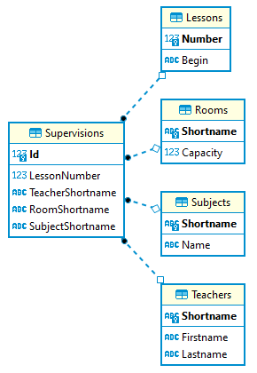

# Überprüfung in DBI

Klasse: 4CAIF  
Datum: 4. Mai 2022  
Thema: Unterabfragen in SQL

Aktuell finden an unserer Schule die Klausurprüfungen in Deutsch, Englisch, Mathematik und
Fachtheorie statt. Die Prüfungen finden in mehreren Räumen statt. Pro Tag wird 1 Gegenstand
geprüft. Natürlich muss auch eine Aufsicht (Supervision) dafür eingeplant werden. Diese Aufsicht ist eine
Lehrkraft, die im Raum anwesend ist.

Das Datenmodell besteht aus den folgenden Tabellen:



## Generieren der Datenbank

Öffne in Docker Desktop eine Shell des Oracle Containers. Führe danach die folgenden Befehle aus.
Sie laden die .NET 6 SDK und den Generator der Datenbank. Danach wird der Generator ausgeführt.

```bash
if [ -d "/opt/oracle" ]; then 
    DOWNLOADER="curl -s"
    RUNCMD="export DOTNET_SYSTEM_GLOBALIZATION_INVARIANT=1 && dotnet run -- oracle"
else 
    HOME=/tmp
    DOWNLOADER="wget -q -O /dev/stdout"
    RUNCMD="export DOTNET_SYSTEM_GLOBALIZATION_INVARIANT=0 && dotnet run -- sqlserver"
fi

cd $HOME
$DOWNLOADER https://raw.githubusercontent.com/schletz/Dbi2Sem/master/dotnet_install.sh > dotnet_install.sh
chmod a+x dotnet_install.sh
. ./dotnet_install.sh

mkdir $HOME/aufsichtPlanner
cd $HOME/aufsichtPlanner
for srcfile in AufsichtPlanner.csproj MultiDbContext.cs Program.cs
do
    $DOWNLOADER https://raw.githubusercontent.com/schletz/Dbi2Sem/master/AufsichtPlanner/$srcfile > $srcfile
done
eval $RUNCMD
```
## Arbeitsauftrag

Kopieren Sie die Vorlage unter den Beispielen in eine neue Datei. Benennen Sie diese Datei nach
ihrem Accountnamen (z. B. *MUS123456.sql*). Geben Sie die gelöste Datei unkomprimiert in Microsoft
Teams ab. Syntaktisch fehlerhafte Statements können nicht gewertet werden.

**(1)** In welchen Räumen gibt es keinerlei Prüfungen, d. h. es gibt keinen Datensatz
in der Supervisions Tabelle?

| Shortname | Capacity |
| --------- | -------- |
| B3.10     | 32       |
| B4.10     | 24       |

**(2)** Welche Lehrer haben keine Aufsicht?

| Shortname | Firstname | Lastname |
| --------- | --------- | -------- |
| HER       | Tommy     | Herweg   |
| MAL       | Ilja      | Mallmann |
| NER       | Jeremie   | Nerius   |
| RUT       | Brian     | Ruth     |
| STI       | Fynn      | Stief    |

**(3)** Welche Lehrer haben in D Aufsicht, aber nicht in E?

| Shortname | Firstname | Lastname |
| --------- | --------- | -------- |
| GOL       | Lionel    | Goldbeck |
| KLE       | Cedric    | Klemme   |
| LAC       | Luka      | Lack     |

**(4)** Gibt es Kollisionen in der Aufsichtsplanung, d. h. ein Lehrer hat zur gleichen Zeit im selben
Fach mehrere Aufsichten eingeteilt? Hinweis: Lösen Sie mit einer Gruppierung und mit HAVING.

| TeacherShortname | LessonNumber | SubjectShortname |
| ---------------- | ------------ | ---------------- |
| CLE              | 1            | FT               |
| CLE              | 5            | D                |
| DAI              | 5            | D                |
| DAI              | 7            | FT               |
| GOL              | 7            | AM               |
| KLE              | 1            | D                |
| KON              | 5            | FT               |
| KRO              | 1            | D                |
| RAN              | 7            | FT               |
| ROG              | 1            | E                |
| ROG              | 3            | FT               |


**(5)** Welche Lehrer haben in allen Gegenständen (Shortname ist D, E, FT und AM) mindestens eine Stunde Aufsicht?

| Shortname | Firstname | Lastname     |
| --------- | --------- | ------------ |
| ASC       | Helene    | Aschenbroich |
| GRÜ       | Charlie   | Grüner       |
| KNE       | Franziska | Knetsch      |
| KRA       | Marit     | Krauspe      |
| RAN       | Kassandra | Rangen       |
| ROG       | Carolina  | Roggatz      |

**(6)** Welche Stunden haben im Raum B3.06 im Gegenstand Fachtheorie (Shortname ist FT) keine Aufsicht eingetragen?
Fragen Sie die Tabelle Lessons ab und prüfen für jede Lesson die Aufsichtstabelle.

| Number | Begin    |
| ------ | -------- |
| 1      | 08:00:00 |
| 2      | 08:50:00 |
| 4      | 10:45:00 |
| 8      | 14:25:00 |

**(7)** Geben Sie für die letzte Stunde pro Fach die Aufsicht für jeden Raum aus. Ermitteln Sie die letzte Stunde
des Faches aus der Aufsichtstabelle, indem sie die höchste Stunde für das entsprechende Fach ermitteln.
Grund: Die Prüfungsgegenstände dauern nicht immer 8 Stunden.

| Id  | LessonNumber | TeacherShortname | RoomShortname | SubjectShortname |
| --- | ------------ | ---------------- | ------------- | ---------------- |
| 10  | 7            | HIL              | B4.07         | D                |
| 15  | 7            | KRA              | B4.08         | D                |
| 22  | 7            | ASC              | B3.11         | D                |
| 33  | 7            | KNE              | B3.08         | E                |
| 55  | 7            | ROG              | B4.11         | E                |
| 66  | 8            | KRO              | B3.09         | AM               |
| 81  | 8            | COT              | B3.06         | AM               |
| 85  | 8            | LAC              | B3.11         | AM               |
| 94  | 8            | BIE              | B4.09         | FT               |

**(8)** Welche Lehrer haben in der Stunde danach (LessonNumber + 1) auch noch in diesem Fach Aufsicht,
haben also eine Doppelstunde in diesem Fach Aufsicht? Geben Sie den Datensatz aus Supervisions
der ersten Stunde dieses Blockes aus.

| Id  | LessonNumber | TeacherShortname | RoomShortname | SubjectShortname |
| --- | ------------ | ---------------- | ------------- | ---------------- |
| 6   | 5            | DAI              | B3.07         | D                |
| 11  | 3            | COT              | B3.09         | D                |
| 14  | 4            | CLE              | B4.08         | D                |
| 25  | 5            | DAI              | B4.06         | D                |
| 28  | 5            | ASC              | B3.11         | E                |
| 37  | 5            | HIL              | B4.06         | E                |
| 41  | 6            | KNE              | B4.09         | E                |
| 62  | 4            | RAN              | B3.09         | AM               |
| 67  | 1            | LOS              | B4.11         | AM               |
| 68  | 3            | KNE              | B4.11         | AM               |
| 86  | 1            | BEG              | B3.07         | FT               |


**(9)** Erstellen Sie eine View *vTeacherSupervisions* mit der Anzahl der Stunden, die jeder Lehrer
in den einzelnen Gegenständen (Shortname ist D, E, AM und FT) hat.

| Shortname | Firstname | Lastname     | AufsichtD | AufsichtE | AufsichtAM | AufsichtFT |
| --------- | --------- | ------------ | --------- | --------- | ---------- | ---------- |
| ASC       | Helene    | Aschenbroich | 1         | 3         | 1          | 1          |
| BEG       | Jonathan  | Beggerow     | 0         | 0         | 0          | 2          |
| BIE       | Danny     | Bielert      | 1         | 1         | 0          | 2          |
| CLE       | Sidney    | Cleve        | 4         | 1         | 0          | 2          |
| COT       | Fabienne  | Cotthardt    | 2         | 1         | 3          | 0          |
| DAI       | Jonah     | Daimer       | 3         | 1         | 0          | 3          |
| FEN       | Tarik     | Fenner       | 1         | 3         | 0          | 2          |
| GOL       | Lionel    | Goldbeck     | 1         | 0         | 2          | 0          |
| GRÜ       | Charlie   | Grüner       | 1         | 1         | 1          | 1          |
| HAD       | Elisa     | Hadfield     | 0         | 0         | 1          | 1          |
| HER       | Tommy     | Herweg       | 0         | 0         | 0          | 0          |
| HIL       | Lili      | Hilgendorf   | 1         | 2         | 0          | 1          |
| HON       | Leo       | Honz         | 1         | 1         | 0          | 0          |
| KLE       | Cedric    | Klemme       | 2         | 0         | 2          | 1          |
| KNE       | Franziska | Knetsch      | 1         | 2         | 3          | 1          |
| KON       | Luis      | Konow        | 0         | 2         | 1          | 3          |
| KRA       | Marit     | Krauspe      | 1         | 1         | 1          | 1          |
| KRO       | Timon     | Krohn        | 2         | 1         | 1          | 0          |
| LAC       | Luka      | Lack         | 1         | 0         | 2          | 0          |
| LOS       | Melissa   | Losch        | 1         | 1         | 3          | 0          |
| MAL       | Ilja      | Mallmann     | 0         | 0         | 0          | 0          |
| MAT       | Liah      | Matthes      | 0         | 2         | 1          | 0          |
| NER       | Jeremie   | Nerius       | 0         | 0         | 0          | 0          |
| RAN       | Kassandra | Rangen       | 1         | 1         | 3          | 2          |
| REU       | Aylin     | Reuss        | 0         | 0         | 2          | 0          |
| ROG       | Carolina  | Roggatz      | 1         | 3         | 1          | 2          |
| RUT       | Brian     | Ruth         | 0         | 0         | 0          | 0          |
| STI       | Fynn      | Stief        | 0         | 0         | 0          | 0          |
| STR       | Frida     | Streller     | 0         | 1         | 1          | 0          |
| TSA       | Arda      | Tsamonikian  | 0         | 1         | 1          | 1          |

**(10)** Mit Hilfe dieser View beantworten Sie folgende Frage: Welche Lehrer haben mehr Stunden Aufsicht
in D als in E?

| Shortname | Firstname | Lastname  | AufsichtD | AufsichtE | AufsichtAM | AufsichtFT |
| --------- | --------- | --------- | --------- | --------- | ---------- | ---------- |
| CLE       | Sidney    | Cleve     | 4         | 1         | 0          | 2          |
| COT       | Fabienne  | Cotthardt | 2         | 1         | 3          | 0          |
| DAI       | Jonah     | Daimer    | 3         | 1         | 0          | 3          |
| GOL       | Lionel    | Goldbeck  | 1         | 0         | 2          | 0          |
| KLE       | Cedric    | Klemme    | 2         | 0         | 2          | 1          |
| KRO       | Timon     | Krohn     | 2         | 1         | 1          | 0          |
| LAC       | Luka      | Lack      | 1         | 0         | 2          | 0          |


## Vorlage

```sql
-- *************************************************************************************************
-- Lösung zu Unterabfragen
-- Vor- und Zuname:
-- Accountname:
-- *************************************************************************************************

-- (1) In welchen Räumen gibt es keinerlei Prüfungen, d. h. es gibt keinen Datensatz
-- in der Supervisions Tabelle?

-- *************************************************************************************************
-- (2) Welche Lehrer haben keine Aufsicht?

-- *************************************************************************************************
-- (3) Welche Lehrer haben in D Aufsicht, aber nicht in E?

-- *************************************************************************************************
-- (4) Gibt es Kollisionen in der Aufsichtsplanung, d. h. ein Lehrer hat zur gleichen Zeit im selben
--     Fach mehrere Aufsichten eingeteilt? Hinweis: Lösen Sie mit einer Gruppierung und mit HAVING.

-- *************************************************************************************************
-- (5) Welche Lehrer haben in allen Gegenständen (Shortname ist D, E, FT und AM) mindestens eine Stunde Aufsicht?

-- *************************************************************************************************
-- (6) Welche Stunden haben im Raum B3.06 im Gegenstand Fachtheorie (Shortname ist FT) keine Aufsicht eingetragen?
--     Fragen Sie die Tabelle Lessons ab und prüfen für jede Lesson die Aufsichtstabelle.

-- *************************************************************************************************
-- (7) Geben Sie für die letzte Stunde pro Fach die Aufsicht für jeden Raum aus. Ermitteln Sie die letzte Stunde
--     des Faches aus der Aufsichtstabelle, indem sie die höchste Stunde für das entsprechende Fach ermitteln.
--     Grund: Die Prüfungsgegenstände dauern nicht immer 8 Stunden.

-- *************************************************************************************************
-- (8) Welche Lehrer haben in der Stunde danach (LessonNumber + 1) auch noch in diesem Fach Aufsicht,
--     haben also eine Doppelstunde in diesem Fach Aufsicht? Geben Sie den Datensatz aus Supervisions
--     der ersten Stunde dieses Blockes aus.

-- *************************************************************************************************
-- (9) Erstellen Sie eine View vTeacherSupervisions mit der Anzahl der Stunden, die jeder Lehrer
--     in den einzelnen Gegenständen (D, E, AM und FT) hat.

-- *************************************************************************************************
-- (10) Mit Hilfe dieser View beantworten Sie folgende Frage: Welche Lehrer haben mehr Stunden Aufsicht
--     in D als in E?

```