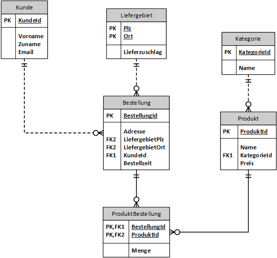

# Aufgabenstellung zu Unterabfragen

## Datenbank und Schema

Eine Datenbank soll das Backend einer kleinen Pizzaria mit Lieferservice simulieren.
Diese Datenbank hat folgendes Schema:



- Die Tabelle *Kunden* speichert alle registrierten Kunden. Die Adresse wird bei jeder Bestellung
  angegeben, deswegen findet sie sich nicht dort wieder.
- Da unterschiedliche Lieferzuschläge verrechnet werden, wurde eine Tabelle *Liefergebiet* erstellt.
  Als Schlüssel dient die Kombination zwischen PLZ und Ort, da eine PLZ auch mehrere Orte umfassen
  kann. Der Lieferzuschlag ist der Preis, der pro Bestellung aufgeschlagen wird.
- Die Bestellung des Kunden ist in der Tabelle *Bestellung* erfasst. Dort wird die Adresse gespeichert,
  an die die Speisen geliefert werden.
- Die verfügbaren Speisen sind in der Taballe *Produkt* erfasst. Sie sind jeweils einer Kategorie
  zugeordnet (Pizza, Fisch, Pasta, ...)  
- Zwischen Bestellung und Produkt stellt die Tabelle *ProduktBestellung* die Auflösung der n:m
  Beziehung dar, da eine Bestellung natürlich mehrere Produkte umfassen kann.

## Generieren der Datenbank

Öffne in Docker Desktop eine Shell des Oracle oder SQL Server Containers. Kopiere danach die
folgenden Befehle in das Fenster. Sie laden die .NET 6 SDK und den Generator der Datenbank. Drücke
*Enter*, um die Befehle auszuführen. Am Ende wirst du nach dem Admin Passwort der Datenbank
gefragt. Hast du den Container mit den Standardpasswörtern (*oracle* für Oracle bzw. *SqlServer2019*
für Sql Server 2019) erstellt, musst du nur *Enter* drücken.

```bash
if [ -d "/opt/oracle" ]; then 
    DOWNLOADER="curl -s"
    RUNCMD="export DOTNET_SYSTEM_GLOBALIZATION_INVARIANT=1 && dotnet run -- oracle"
else 
    HOME=/tmp
    DOWNLOADER="wget -q -O /dev/stdout"
    RUNCMD="export DOTNET_SYSTEM_GLOBALIZATION_INVARIANT=0 && dotnet run -- sqlserver"
fi

cd $HOME
$DOWNLOADER https://raw.githubusercontent.com/schletz/Dbi2Sem/master/dotnet_install.sh > dotnet_install.sh
chmod a+x dotnet_install.sh
. ./dotnet_install.sh

mkdir -p $HOME/lieferservice
cd $HOME/lieferservice
for srcfile in Lieferservice.csproj Bestellung.cs Kategorie.cs Kunde.cs Liefergebiet.cs LieferserviceContext.cs MultiDbContext.cs Produkt.cs ProduktBestellung.cs Program.cs 
do
    $DOWNLOADER https://raw.githubusercontent.com/schletz/Dbi2Sem/master/Lieferservice/$srcfile > $srcfile
done
eval $RUNCMD
```

## Bewertung und Abgabe

Jede korrekt gelöste Aufgabe bekommt 1 Punkt. Eine Aufgabe gilt als korrekt gelöst, wenn

- Die ausgegebenen Datensätze mit der Musterlösung übereinstimmen. Formatierung und Sortierung
  müssen allerdings nicht beachtet werden, Spaltennamen jedoch schon.
- Bei Zahlen kann es durch die Maschinengenauigkeit zu leichten Abweichungen
  in der letzten Kommastelle kommen (statt 0.1 wird 0.099999999 ausgegeben). Das ist in Ordnung.  
- Die Abfrage allgemeingültig ist, also keine fix eingetragenen Werte hat oder Sonderfälle, die
  nur in diesem Datenbestand zutreffen, verwendet.

Verwenden Sie das untenstehende Muster für Ihre SQL Datei und schreiben Sie Ihren Namen
hinein. Schreiben Sie Ihre Lösung unter den entsprechenden Kommentar mit der Aufgabennummer.
Geben Sie diese Datei in Teams bis 7. Mai 2020 um 12:00 ab.

Würde die Aufgabenstellung separat benotet werden, ergibt sich - zu Ihrer Selbteinschätzung -
folgende Skala: 12 Punkte: 1, 11 - 10 Punkte: 2, 9 - 8 Punkte: 3, 7 Punkte: 4

## Aufgaben

**(1)** Für welche Liefergebiete wird der meiste Lieferzuschlag verrechnet?

| Plz  | Ort  | Lieferzuschlag |
| ---- | ---- | -------------- |
| 1180 | Wien | 8.0            |
| 1170 | Wien | 8.0            |
| 1160 | Wien | 8.0            |

**(2)** Geben Sie die teuersten Produkte in der Kategorie 2 (Pasti) aus. Beachten Sie, dass
dies auch mehr Produkte sein können.

| ProduktId | Name           | KategorieId | Preis |
| --------- | -------------- | ----------- | ----- |
| 5         | All Arabiata   | 2           | 7.5   |
| 6         | Alla Bolognese | 2           | 7.5   |

**(3)** Welche Produkte aus der Kategorie 2 sind teurer als das teuerste Produkt der
Kategorie 1. Geben Sie den Preis des teuersten Produktes der Kategorie 1 in der Spalte
*MaxKategorie1* aus.

| ProduktId | Name           | KategorieId | Preis | MaxKategorie1 |
| --------- | -------------- | ----------- | ----- | ------------- |
| 5         | All Arabiata   | 2           | 7.5   | 7.0           |
| 6         | Alla Bolognese | 2           | 7.5   | 7.0           |

**(4)** Welche Bestellungen beinhalten Produkte der Kategorie Pizza (Kategorie-ID 1)?

| BestellungId | Adresse              | LiefergebietPlz | LiefergebietOrt | KundeId | Bestellzeit             |
| ------------ | -------------------- | --------------- | --------------- | ------- | ----------------------- |
| 2            | 586 Parisian Manors  | 1050            | Wien            | 7       | 2020-05-02 22:23:38.000 |
| 3            | 93592 Juana Village  | 1060            | Wien            | 9       | 2020-05-03 02:59:55.000 |
| 4            | 0364 Della Harbor    | 1040            | Wien            | 9       | 2020-05-01 23:27:30.000 |
| 9            | 498 Christina Bypass | 1160            | Wien            | 3       | 2020-05-04 07:41:29.000 |
| 10           | 859 Lucius Forges    | 1160            | Wien            | 3       | 2020-05-01 18:17:26.000 |
| 12           | 334 Ritchie Haven    | 1170            | Wien            | 6       | 2020-05-05 00:22:08.000 |
| 14           | 332 Bryce Circle     | 1050            | Wien            | 5       | 2020-05-03 22:27:50.000 |

**(5)** Welche Kunden gaben nie eine Bestellung auf?

| KundeId | Vorname | Zuname  | Email         |
| ------- | ------- | ------- | ------------- |
| 4       | Jonas   | Fischer | jonas@mail.at |
| 8       | Oskar   | Becker  | oskar@mail.at |

**(6)** Welche Kunden bestellten eine Speise aus der Kategorie 3 (Pesce)

| KundeId | Vorname    | Zuname  | Email              |
| ------- | ---------- | ------- | ------------------ |
| 1       | Lukas      | Müller  | lukas@mail.at      |
| 2       | Konstantin | Schmidt | konstantin@mail.at |
| 5       | Elias      | Weber   | elias@mail.at      |
| 7       | David      | Wagner  | david@mail.at      |
| 9       | Philipp    | Schulz  | philipp@mail.at    |

**(7)** Welche Kunden bestellten eine Speise aus der Kategorie 1 (Pizza) und 3 (Pesce)

| KundeId | Vorname | Zuname | Email           |
| ------- | ------- | ------ | --------------- |
| 5       | Elias   | Weber  | elias@mail.at   |
| 7       | David   | Wagner | david@mail.at   |
| 9       | Philipp | Schulz | philipp@mail.at |

**(8)** Welche Kunden bestellten nie Speisen aus der Kategorie 2 (Pasti)? Schließen Sie
alle Kunden aus, die nie etwas bestellt haben.

| KundeId | Vorname    | Zuname  | Email              |
| ------- | ---------- | ------- | ------------------ |
| 2       | Konstantin | Schmidt | konstantin@mail.at |

**(9)** Listen Sie zu jeder Bestellung die Anzahl der Produkte pro Kategorie-ID. Die Anzahl berechnet
sich aus der Summe der Menge. Sie können annehmen,
dass als Kategorie-ID nur die Werte 1, 2 oder 3 vorkommt. Geben Sie diese Werte in der Spalte
Kategorie1, Kategorie2 bzw. Kategorie3 aus.

| BestellungId | Adresse                | LiefergebietPlz | LiefergebietOrt | KundeId | Bestellzeit             | MengeKategorie1 | MengeKategorie2 | MengeKategorie3 |
| ------------ | ---------------------- | --------------- | --------------- | ------- | ----------------------- | --------------- | --------------- | --------------- |
| 1            | 627 Josianne Ways      | 1170            | Wien            | 7       | 2020-05-04 05:13:11.000 | 0               | 0               | 1               |
| 2            | 586 Parisian Manors    | 1050            | Wien            | 7       | 2020-05-02 22:23:38.000 | 1               | 1               | 0               |
| 3            | 93592 Juana Village    | 1060            | Wien            | 9       | 2020-05-03 02:59:55.000 | 2               | 1               | 0               |
| 4            | 0364 Della Harbor      | 1040            | Wien            | 9       | 2020-05-01 23:27:30.000 | 1               | 0               | 1               |
| 5            | 08118 Goyette Park     | 1180            | Wien            | 1       | 2020-05-01 04:53:46.000 | 0               | 1               | 1               |
| 6            | 93578 Marlen Squares   | 1050            | Wien            | 1       | 2020-05-01 16:23:38.000 | 0               | 1               | 1               |
| 7            | 26071 Lesch Extensions | 1040            | Wien            | 1       | 2020-05-05 23:35:25.000 | 0               | 2               | 0               |
| 8            | 55660 Alysa Path       | 1180            | Wien            | 2       | 2020-05-02 00:24:22.000 | 0               | 0               | 1               |
| 9            | 498 Christina Bypass   | 1160            | Wien            | 3       | 2020-05-04 07:41:29.000 | 1               | 0               | 0               |
| 10           | 859 Lucius Forges      | 1160            | Wien            | 3       | 2020-05-01 18:17:26.000 | 2               | 1               | 0               |
| 11           | 465 Cartwright Canyon  | 1050            | Wien            | 6       | 2020-05-03 21:27:04.000 | 0               | 2               | 0               |
| 12           | 334 Ritchie Haven      | 1170            | Wien            | 6       | 2020-05-05 00:22:08.000 | 1               | 1               | 0               |
| 13           | 20314 Ronny Crescent   | 1180            | Wien            | 5       | 2020-05-04 18:53:43.000 | 0               | 2               | 0               |
| 14           | 332 Bryce Circle       | 1050            | Wien            | 5       | 2020-05-03 22:27:50.000 | 1               | 0               | 0               |
| 15           | 814 Ruth Terrace       | 1160            | Wien            | 5       | 2020-05-02 02:16:43.000 | 0               | 1               | 1               |

**(10)** Erstellen Sie eine View *vBestellungen*, die pro Bestellung die Kundendaten und den Gesamtbetrag
ausgibt. Der Gesamtbetrag (Spalte *Betrag*) berechnet sich aus *Menge x Preis + Lieferzuschlag*
Beachten Sie folgende Hinweise:

- Der Lieferzuschlag wird pro Bestellung nur 1x aufgeschlagen. Daher müssen Sie zuerst den
  Wert der Bestellung mit Menge x Preis in einer Unterabfrage ermitteln.
- Die Tabelle Liefergebiet hat einen zusammengesetzten Schlüssel aus PLZ und Ort, den Sie
  mit der Tabelle Bestellung verknüpfen müssen.

| KundeId | Vorname    | Zuname    | Email              | BestellungId | Bestellzeit             | Adresse                | Lieferzuschlag | Betrag |
| ------- | ---------- | --------- | ------------------ | ------------ | ----------------------- | ---------------------- | -------------- | ------ |
| 1       | Lukas      | Müller    | lukas@mail.at      | 5            | 2020-05-01 04:53:46.000 | 08118 Goyette Park     | 8.00           | 40.00  |
| 1       | Lukas      | Müller    | lukas@mail.at      | 6            | 2020-05-01 16:23:38.000 | 93578 Marlen Squares   | 5.00           | 31.50  |
| 1       | Lukas      | Müller    | lukas@mail.at      | 7            | 2020-05-05 23:35:25.000 | 26071 Lesch Extensions | 5.00           | 33.00  |
| 2       | Konstantin | Schmidt   | konstantin@mail.at | 8            | 2020-05-02 00:24:22.000 | 55660 Alysa Path       | 8.00           | 36.50  |
| 3       | Ben        | Schneider | ben@mail.at        | 9            | 2020-05-04 07:41:29.000 | 498 Christina Bypass   | 8.00           | 23.00  |
| 3       | Ben        | Schneider | ben@mail.at        | 10           | 2020-05-01 18:17:26.000 | 859 Lucius Forges      | 8.00           | 56.00  |
| 5       | Elias      | Weber     | elias@mail.at      | 13           | 2020-05-04 18:53:43.000 | 20314 Ronny Crescent   | 8.00           | 30.50  |
| 5       | Elias      | Weber     | elias@mail.at      | 14           | 2020-05-03 22:27:50.000 | 332 Bryce Circle       | 5.00           | 19.00  |
| 5       | Elias      | Weber     | elias@mail.at      | 15           | 2020-05-02 02:16:43.000 | 814 Ruth Terrace       | 8.00           | 53.50  |
| 6       | Niklas     | Meyer     | niklas@mail.at     | 11           | 2020-05-03 21:27:04.000 | 465 Cartwright Canyon  | 5.00           | 42.50  |
| 6       | Niklas     | Meyer     | niklas@mail.at     | 12           | 2020-05-05 00:22:08.000 | 334 Ritchie Haven      | 8.00           | 28.50  |
| 7       | David      | Wagner    | david@mail.at      | 1            | 2020-05-04 05:13:11.000 | 627 Josianne Ways      | 8.00           | 19.50  |
| 7       | David      | Wagner    | david@mail.at      | 2            | 2020-05-02 22:23:38.000 | 586 Parisian Manors    | 5.00           | 18.50  |
| 9       | Philipp    | Schulz    | philipp@mail.at    | 3            | 2020-05-03 02:59:55.000 | 93592 Juana Village    | 5.00           | 38.50  |
| 9       | Philipp    | Schulz    | philipp@mail.at    | 4            | 2020-05-01 23:27:30.000 | 0364 Della Harbor      | 5.00           | 45.50  |


**(11)** Erstellen Sie eine View *vKundenumsatz*, die pro Kunde den Gesamtumsatz berechnet.
Sie können entweder Ihre View *vBestellungen* verwenden oder die Abfrage neu aufbauen.

| KundeId | Vorname    | Zuname    | Gesamtumsatz |
| ------- | ---------- | --------- | ------------ |
| 1       | Lukas      | Müller    | 104.50       |
| 2       | Konstantin | Schmidt   | 36.50        |
| 3       | Ben        | Schneider | 79.00        |
| 5       | Elias      | Weber     | 103.00       |
| 6       | Niklas     | Meyer     | 71.00        |
| 7       | David      | Wagner    | 38.00        |
| 9       | Philipp    | Schulz    | 84.00        |


**(12)** Listen Sie die umsatzstärksten Kunden auf. Verwenden Sie zur Beantwortung die View
*vKundenumsatz*. Beachten Sie, dass auch mehrere Kunden diesen Umsatz erreichen können.

| KundeId | Vorname | Zuname | Gesamtumsatz |
| ------- | ------- | ------ | ------------ |
| 1       | Lukas   | Müller | 104.5        |

## Vorlage für die SQL Datei

```sql
-- ÜBUNG ZU SQL UNTERABFRAGEN
-- ZUNAME VORNAME

-- Aufgabe 1

-- Aufgabe 2

-- Aufgabe 3

-- Aufgabe 4

-- Aufgabe 5

-- Aufgabe 6

-- Aufgabe 7

-- Aufgabe 8

-- Aufgabe 9

-- Aufgabe 10

-- Aufgabe 11

-- Aufgabe 12

```
