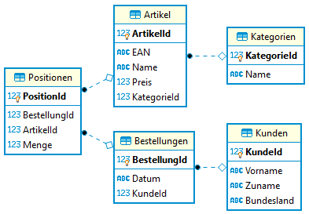

# Aufgabenstellung zu Unterabfragen

## Datenbank und Schema

Eine kleine Datenbank speichert Verkäufe aus einem Onlineshop. Sie Datenbank hat folgendes Schema:



- Die Tabelle *Kunden* speichert alle registrierten Kunden. Das Bundesland wird mit dem Kürzel gespeichert
  und hat im Datenbestand die Werte *B*, *N* oder *W*.
- Kunden können mehrere Bestellungen aufgeben. Diese Bestellung hat ein Bestelldatum und verweist auf
  den Kunden, der sie aufgegeben hat.
- Die Bestellung umfasst mehrere Positionen. In der Position wird der Artikel der Bestellung
  zugeordnet. Auch die Menge der bestellten Artikel wird dort gespeichert.
- Der Artikel wird einer Kategorie zugeordnet und hat einen Preis.

## Generieren der Datenbank

Öffne in Docker Desktop eine Shell des Oracle oder SQL Server Containers. Kopiere danach die
folgenden Befehle in das Fenster. Sie laden die .NET 6 SDK und den Generator der Datenbank.
Am Ende wirst du nach dem Admin Passwort der Datenbank gefragt. Hast du den Container mit den
Standardpasswörtern (*oracle* für Oracle bzw. *SqlServer2019* für Sql Server 2019) erstellt,
musst du nur *Enter* drücken.

```bash
if [ -d "/opt/oracle" ]; then DOWNLOADER="curl -s"; else DOWNLOADER="wget -q -O /dev/stdout"; fi
$DOWNLOADER https://raw.githubusercontent.com/schletz/Dbi2Sem/master/start_dotnet.sh > /tmp/start_dotnet.sh
chmod a+x /tmp/start_dotnet.sh
/tmp/start_dotnet.sh https://raw.githubusercontent.com/schletz/Dbi2Sem/master/Onlineshop/Onlineshop.tar

```

## Bewertung und Abgabe

Jede korrekt gelöste Aufgabe bekommt 1 Punkt. Eine Aufgabe gilt als korrekt gelöst, wenn

- Die ausgegebenen Datensätze mit der Musterlösung übereinstimmen. Formatierung und Sortierung
  müssen allerdings nicht beachtet werden, Spaltennamen jedoch schon.
- Bei Zahlen kann es durch die Maschinengenauigkeit zu leichten Abweichungen
  in der letzten Kommastelle kommen (statt 0.1 wird 0.099999999 ausgegeben). Das ist in Ordnung.  
- Die Abfrage allgemeingültig ist, also keine fix eingetragenen Werte hat oder Sonderfälle, die
  nur in diesem Datenbestand zutreffen, verwendet.

Falls Sie den Eindruck haben, dass die Musterausgabe nicht korrekt ist, vermerken Sie bitte
Ihre Argumentation in der Abgabedatei. Dies wird dann berücksichtigt.

Verwenden Sie das untenstehende Muster für Ihre SQL Datei und schreiben Sie Ihren Namen
hinein. Schreiben Sie Ihre Lösung unter den entsprechenden Kommentar mit der Aufgabennummer.
Geben Sie diese Datei in Teams bis 22. April 2020 um 12:00 ab.

Würde die Aufgabenstellung separat benotet werden, ergibt sich - zu Ihrer Selbteinschätzung -
folgende Skala: 12 Punkte: 1, 11 - 10 Punkte: 2, 9 - 8 Punkte: 3, 7 Punkte: 4

## Aufgaben

**(1)** Geben Sie die teuersten Artikel aus, die in der Tabelle Artikel gespeichert sind.

| ArtikelId | EAN           | Name                      | Preis    | KategorieId |
| --------- | ------------- | ------------------------- | -------- | ----------- |
| 7         | 3971100666748 | Unbranded Steel Fish      | 226.0000 | 1           |
| 9         | 3948358760443 | Awesome Concrete Sausages | 226.0000 | 1           |
| 12        | 4070396806834 | Refined Soft Fish         | 226.0000 | 2           |

**(2)** Geben Sie die teuersten Artikel der Kategorie 4 (KategorieId) aus.

| ArtikelId | EAN           | Name                    | Preis    | KategorieId |
| --------- | ------------- | ----------------------- | -------- | ----------- |
| 8         | 7161398081910 | Unbranded Plastic Chips | 225.3000 | 4           |


**(3)** Welche Artikel in der Kategorie 1 sind teurer als der teuerste Artikel in Kategorie 4?

| ArtikelId | EAN           | Name                      | Preis    | KategorieId |
| --------- | ------------- | ------------------------- | -------- | ----------- |
| 3         | 2208113939738 | Practical Steel Hat       | 225.6000 | 1           |
| 7         | 3971100666748 | Unbranded Steel Fish      | 226.0000 | 1           |
| 9         | 3948358760443 | Awesome Concrete Sausages | 226.0000 | 1           |

**(4)** Gibt es "leere" Bestellungen, also Bestellungen ohne Positionen? Hinweis: Am Einfachsten
        funktioniert dies mit *NOT EXISTS*.

| BestellungId | Datum                   | KundeId |
| ------------ | ----------------------- | ------- |
| 3            | 2020-01-17 07:00:51.574 | 14      |
| 5            | 2020-01-05 22:26:16.437 | 2       |
| 29           | 2020-01-15 23:59:09.545 | 10      |
| 37           | 2020-01-01 06:32:01.870 | 4       |
| 44           | 2020-01-19 03:49:56.680 | 14      |
| 56           | 2020-01-12 12:48:02.591 | 9       |
| 59           | 2020-01-04 18:32:28.250 | 8       |

**(5)** Welche Artikel aus der Kategorie 4 (*KategorieId*) wurden von Kunden aus Niederösterreich
        (*Kunde.Bundesland* ist *N*) gekauft? Gehen Sie dafür von den Positionen zu den Bestellungen
        und dann zum Kunden.

| ArtikelId | EAN           | Name                    | Preis    | KategorieId |
| --------- | ------------- | ----------------------- | -------- | ----------- |
| 1         | 4468862113713 | Practical Frozen Cheese | 162.8600 | 4           |
| 2         | 5609588818509 | Small Steel Car         | 202.1300 | 4           |
| 5         | 6509346919051 | Handmade Soft Chips     | 176.0200 | 4           |
| 6         | 5593362843682 | Gorgeous Rubber Car     | 220.5100 | 4           |
| 8         | 7161398081910 | Unbranded Plastic Chips | 225.3000 | 4           |
| 11        | 6733367368356 | Incredible Frozen Chair | 178.1300 | 4           |
| 13        | 5157522431449 | Tasty Frozen Car        | 174.3700 | 4           |
| 14        | 7691287529907 | Licensed Wooden Tuna    | 222.0500 | 4           |
| 15        | 3861984507131 | Ergonomic Soft Cheese   | 165.2900 | 4           |

**(6)** Welche Produkte wurden niemals von Kunden aus Niederösterreich gekauft?

| ArtikelId | EAN           | Name                      | Preis    | KategorieId |
| --------- | ------------- | ------------------------- | -------- | ----------- |
| 9         | 3948358760443 | Awesome Concrete Sausages | 226.0000 | 1           |


**(7)** Listen Sie alle Bestellungen auf, die Artikel mit der KategorieId 2, aber nicht mit der
         KategorieId 4 enthalten.

| BestellungId | Datum                   | KundeId |
| ------------ | ----------------------- | ------- |
| 8            | 2020-01-05 06:54:04.250 | 16      |
| 25           | 2020-01-02 16:10:33.496 | 7       |
| 26           | 2020-01-14 11:04:45.547 | 14      |
| 42           | 2020-01-02 15:33:18.882 | 14      |
| 52           | 2020-01-19 08:58:03.801 | 7       |


**(8)** Welche Bestellungen umfassen nur Artikel der KategorieId 2? Achtung:
        Bestellungen ohne Positionen sollen hierfür ausgeschlossen werden.

| BestellungId | Datum                   | KundeId |
| ------------ | ----------------------- | ------- |
| 8            | 2020-01-05 06:54:04.250 | 16      |
| 25           | 2020-01-02 16:10:33.496 | 7       |
| 42           | 2020-01-02 15:33:18.882 | 14      |
| 52           | 2020-01-19 08:58:03.801 | 7       |

**(9)** Erstellen Sie eine View *vUmsatzstatistik*, die pro Kunde den Umsatz aufsummiert. Sie
        berechnen den Umsatz einer Position mit Menge x Artikelpreis. Die nachfolgenden Daten
        entstehen bei der Abfrage `SELECT * FROM vUmsatzstatistik`.

| KundeId | Vorname | Zuname     | Bundesland | Kundenumsatz |
| ------- | ------- | ---------- | ---------- | ------------ |
| 1       | Dedric  | Shanahan   | W          | 19330.8100   |
| 2       | Alaina  | Bashirian  | N          | 11156.3800   |
| 3       | Johan   | Weimann    | N          | 11886.9000   |
| 4       | Taylor  | Metz       | W          | 13368.1300   |
| 5       | Rebekah | Morar      | W          | 6035.7100    |
| 6       | Holden  | Mohr       | B          | 3303.9000    |
| 7       | Bethel  | Corwin     | W          | 5360.0500    |
| 9       | Rachael | Walter     | B          | 17451.4100   |
| 10      | Brianne | Dare       | N          | 3687.8200    |
| 11      | Jaron   | Pagac      | B          | 4563.0000    |
| 12      | Merl    | Ryan       | B          | 15122.7400   |
| 13      | Prince  | Mitchell   | N          | 7890.1700    |
| 14      | Kara    | Gorczany   | W          | 9996.8500    |
| 15      | Jailyn  | Stokes     | B          | 5754.1100    |
| 16      | Elliot  | Vandervort | B          | 4330.4500    |

**(10)** Geben Sie mit Hilfe dieser View den umsatzstärksten Kunden pro Bundesland aus. Beachten
         Sie, dass es auch mehrere Kunden pro Bundesland geben kann, die diesen Umsatz generieren.

| KundeId | Vorname | Zuname   | Bundesland | Kundenumsatz |
| ------- | ------- | -------- | ---------- | ------------ |
| 9       | Rachael | Walter   | B          | 17451.4100   |
| 3       | Johan   | Weimann  | N          | 11886.9000   |
| 1       | Dedric  | Shanahan | W          | 19330.8100   |


**(11)** Erstellen Sie mit Hilfe dieser View die Umsatzstatistik pro Bundesland.

| Bundesland | Umsatz     |
| ---------- | ---------- |
| B          | 50525.6100 |
| N          | 34621.2700 |
| W          | 54091.5500 |

## Vorlage für die SQL Datei

```sql
-- ÜBUNG ZU SQL UNTERABFRAGEN
-- ZUNAME VORNAME

-- Aufgabe 1

-- Aufgabe 2

-- Aufgabe 3

-- Aufgabe 4

-- Aufgabe 5

-- Aufgabe 6

-- Aufgabe 7

-- Aufgabe 8

-- Aufgabe 9

-- Aufgabe 10

-- Aufgabe 11

```
