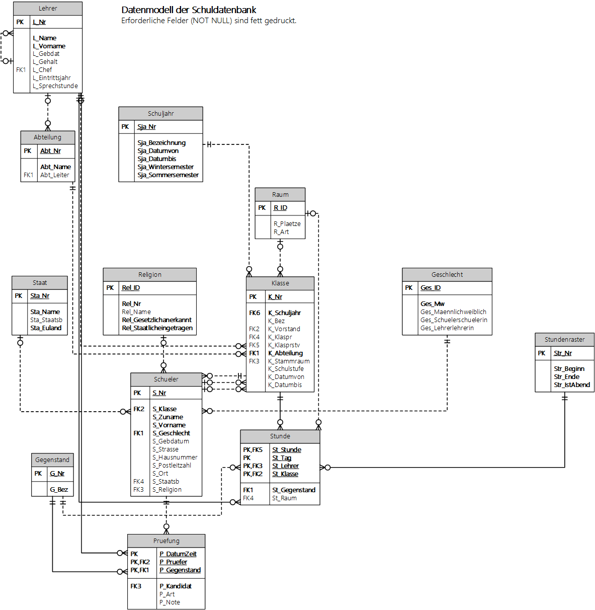

# DBI im 4. Semester bzw. im III. Jahrgang

## Lehrinhalte

<table>
    <tr>
        <th>Erweitertes SQL (4. Semester / III. Jahrgang)</th>
        <th>Erweiterte Modellierung (4. Semester / III. Jahrgang)</th>
    </tr>
    <tr>
        <td valign="top">
            <b>Erweitertes SQL</b>
            <ol>
                <li><a href="11_SingleValueNonCorresponding">Nicht korrelierte Unterabfragen, die einen Wert liefern</a>
                </li>
                <li><a href="12_SingleValueCorresponding">Korrelierte Unterabfragen, die einen Wert liefern</a></li>
                <li><a href="13_ListSubqueries">Unterabfragen, die Listen liefern (IN, NOT IN, EXISTS)</a></li>
                <li><a href="14_FromSubqueries">Views und Unterabfragen in FROM</a></li>
                <li><a href="21_Null">Umgang mit NULL</a></li>
            </ol>
            <b>Übungen zu SQL</b>
            <ol>
                <li><a href="AufsichtPlanner">Matura Aufsichtsplanung</a></li>
                <li><a href="Lieferservice">Lieferservice</a></li>
                <li><a href="Onlineshop">Onlineshop</a></li>
                <li><a href="WienerlinienDb">WienerlinienDb</a></li>
                <li><a href="SchneeDb">Schneedatenbank (nur Datenbank)</a></li>
            </ol>
            <b>Einstieg Datenbankadministration</b>
            <ol>
                <li><a href="22_Transactions">Transaktionen</a></li>
                <li><a href="23_Index">Verwenden von Indizes</a></li>
            </ol>
        </td>
        <td valign="top">
            <b>ER Modellierung</b>
            <ol>
                <li><a href="31_Normalisierung">Normalformen</a></li>
                <li><a href="32_Generalisierung">Generalisierung</a></li>
                <li><a href="33_Historisierung">Historisierung</a></li>
                <li><a href="34_EntityAttribute">Entity Attribute Model</a></li>
                <li><a href="35_RekursiveBeziehungen">Rekursive Beziehungen</a></li>
            </ol>
            <b>Modellierungsprojekt</b>
            <ol>
                <li><a href="VorlageDbiModellierungsprojekt.docx">Wordvorlage</li>
            </ol>
        </td>
    </tr>
</table>

## Informationen zum Start

### Auf Basis von Oracle (Kollegs)

- [Oracle 21 XE als Docker Image](01_OracleVM/03_Docker/README.md)
- [Installation von DBeaver](01_OracleVM/01_Dbeaver/README.md)
- [Anlegen der Musterdatenbank (SchulDb) in Oracle](SchulDbGenerator/README.md)

### Auf Basis von SQL Server (HIF)
- [SQL Server als Docker Image](01_SQLServer/README.md)
- [Anlegen der Musterdatenbank (SchulDb) in SQL Server](SchulDbGenerator/README.md)


### Optionale Punkte
- [Installation von JetBrains DataGrip](01_OracleVM/02_DataGrip/README.md)
- [Installation von PlantUML in VS Code](03_PlantUml/README.md)


Optional kann die Schuldatenbank auch als [SQLite Datenbank](Schule.db) geladen werden. Dies ist
nur eine Notmaßnahme.

## Die Schuldatenbank



## Synchronisieren des Repositories in einen Ordner

1. Laden Sie von https://git-scm.com/downloads die Git Tools (Button *Download 2.xx for Windows*)
herunter. Es können alle Standardeinstellungen belassen werden, bei *Adjusting your PATH environment*
muss aber der mittlere Punkt (*Git from the command line [...]*) ausgewählt sein.
2. Legen Sie einen Ordner auf der Festplatte an, wo die Daten gespeichert werden sollen
(z. B. *C:\Schule\DBI\Repo*).
3. Initialisieren Sie den Ordner mit folgenden Befehlen, die in der Windows Konsole in diesem Verzeichnis
ausgeführt werden:

```text
git clone https://github.com/schletz/Dbi2Sem.git
```

### Nachträgliches Synchronisieren

Führen Sie die Datei *resetGit.cmd* aus. Dadurch werden die lokalen Änderungen zurückgesetzt und der
neue Stand wird vom Server übertragen.