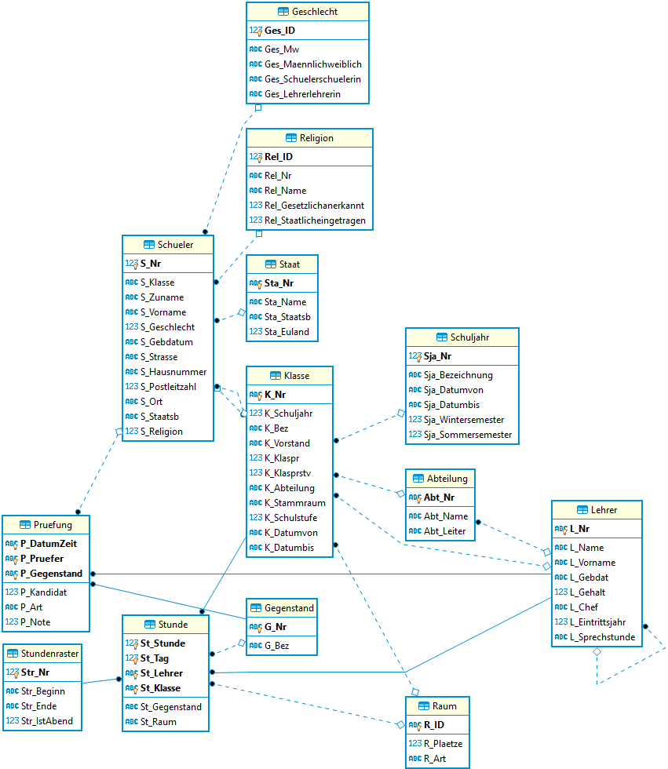

# DBI im 2. Semester

## Lehrinhalte

<table>
    <tr>
        <th>1</th> <th>2</th> <th>3</th> <th>4</th> <th>5</th>
    </tr>
    <tr>
        <td colspan="2" rowspan="2" style="vertical-align:top">
            ER Modellierung
            <ol>
                <li><a href="">Normalformen</a></li>
                <li><a href="">Generalisierung</a></li>
                <li><a href="">Hierarchien</a></li>
                <li><a href="">Gruppen und Rollen</a></li>
                <li><a href="">Modellierungsprojekt</a></li>
            </ol>
        </td>
        <td colspan="3" style="vertical-align:top">
            Erweitertes SQL
            <ol>
                <li><a href="11_SingleValueNonCorresponding">Nicht korrespondierende Unterabfragen, die einen Wert liefern</a></li>
                <li><a href="12_SingleValueCorresponding">Korrespondierende Unterabfragen, die einen Wert liefern</a></li>
                <li><a href="13_ListSubqueries">Unterabfragen, die Listen liefern (IN, NOT IN, EXISTS)</a></li>
                <li><a href="14_FromSubqueries">Unterabfragen, die in FROM verwendet werden</a></li>
                <li><a href="15_WindowFunctions">Window Functions](15_WindowFunctions)</a></li>
            </ol>
        </td>
    </tr>
    <tr>
        <td colspan="3" style="vertical-align:top">
            Bereich Datenbankadministration
            <ol>
            <li><a href="21_Views">Views</a></li>
            <li><a href="22_Null">NULL Values</a></li>
            <li><a href="23_Transaktionen">Transaktionen</a></li>
            </ol>
        </td>
    </tr>

</table>

## Die verwendete Schuldatenbank

- [Download als SQLite Datenbank](Schule.db)
- [Download als Access Datenbank](Schule.mdb)
- [Download als Sql Server (LocalDB) Datenbank](Schule.mdf)

Um die SQL Server Datenbank zu verwenden, müssen Sie die Datei im SQL Server Management Studio (SSMS)
mit folgender Abfrage einhängen:

```sql
USE [master]
GO
CREATE DATABASE [Schule] ON (FILENAME = N'C:\PATH\Schule.mdf') FOR ATTACH
GO
```



## Synchronisieren des Repositories in einen Ordner

1. Laden Sie von https://git-scm.com/downloads die Git Tools (Button *Download 2.xx for Windows*)
    herunter. Es können alle Standardeinstellungen belassen werden, bei *Adjusting your PATH environment*
    muss aber der mittlere Punkt (*Git from the command line [...]*) ausgewählt sein.
2. Legen Sie einen Ordner auf der Festplatte an, wo die Daten gespeichert werden sollen
    (z. B. *C:\Schule\DBI\Repo*).
3. Initialisieren Sie den Ordner mit folgenden Befehlen, die in der Windows Konsole in diesem Verzeichnis
    ausgeführt werden:

```text
git init
git remote add origin https://github.com/schletz/Dbi2Sem.git
git fetch --all
git reset --hard origin/master
```

### Nachträgliches Synchronisieren

Führen Sie die Datei *resetGit.cmd* aus. Dadurch werden die lokalen Änderungen zurückgesetzt und der
neue Stand wird vom Server übertragen.
