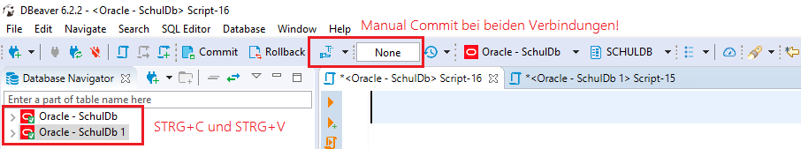

# Aufgabenstellung zu Transaktionen und Index

Basis für diese Aufgabenstellung ist die Oracle VM und die
[Schuldatenbank](https://github.com/schletz/Dbi2Sem/tree/master/SchulDbGenerator).

Verwenden Sie als Vorlage die Muster SQL Datei unten in der Angabe. Verbinden Sie sich für die
Transaktionsaufgabe mit 2 Verbindungen in DBeaver zur Oracle Datenbank. Schalten Sie bei allen
Verbindungen den Modus auf *manual commit*.



Geben Sie die SQL Datei (versehen mit Ihrem Namen) in Teams bis 9. Juni um 20:20 ab.

## 1 Transaktion und Usersichten

Bald werden wir die Räumlichkeiten des Textilforschungsinstituts (ÖTI) für die Schule nutzen können.
Dafür werden in unserer Datenbank schon einmal Räume angelegt. Ein Raum kann z. B. mit

```sql
INSERT INTO RAUM (R_ID) VALUES ('OETI01');
```

angelegt werden. Erzeugen Sie INSERT Statements mit den entsprechenden COMMIT Anweisungen, sodass
die Connections nach der Ausführung der SQL Anweisungen folgende Sicht auf die Daten haben. Die
Anweisungen sollen ohne Fehler oder Busy Wait durchlaufen.

### Sicht von Verbindung 1

| R_ID   | R_PLAETZE | R_ART |
| ------ | --------- | ----- |
| OETI01 |           |       |
| OETI02 |           |       |

### Sicht von Verbindung 2

| R_ID   | R_PLAETZE | R_ART |
| ------ | --------- | ----- |
| OETI01 |           |       |
| OETI03 |           |       |

## 2 COMMIT und ROLLBACK

Folgende Anweisungen werden unter der Verbindung 1 absgesetzt. Setzen Sie *COMMIT* und *ROLLBACK*
Anweisungen an die richtigen Stellen, sodass das Ergebnis den unten gezeigten Ausgaben entspricht.

```sql
INSERT INTO RAUM (R_ID) VALUES ('OETI11');
INSERT INTO RAUM (R_ID) VALUES ('OETI12');
INSERT INTO RAUM (R_ID) VALUES ('OETI13');
INSERT INTO RAUM (R_ID) VALUES ('OETI14');
```

### Sicht von Verbindung 1

| R_ID   | R_PLAETZE | R_ART |
| ------ | --------- | ----- |
| OETI11 |           |       |
| OETI12 |           |       |
| OETI14 |           |       |

### Sicht von Verbindung 2

| R_ID   | R_PLAETZE | R_ART |
| ------ | --------- | ----- |
| OETI11 |           |       |
| OETI12 |           |       |

## Busy Wait

Erzeugen Sie durch UPDATE Statements für die Raumtabelle einen Zustand, sodass Verbindung 2 ein
*BUSY WAIT* bei der Ausführung des Statements erhält.

## Deadlock

Erzeugen Sie durch UPDATE Statements für die Raumtabelle einen Zustand, sodass ein Deadlock entsteht.


## Index anlegen

**(1)** Legen Sie in der Tabelle *Staat* einen Index an, der die Spalte *STA_NAME* indiziert. Falls
dafür ein UNIQUE Index infrage kommt, legen Sie einen solchen an.

**(2)** Legen Sie einen Index für die Tabelle *Prüfung* an, sodass folgende SQL Abfrage unterstützt wird:

```sql
SELECT * FROM PRUEFUNG
WHERE P_PRUEFER = 'SZ';
```

**(3)** In einer Applikation werden häufig pro Prüfer die Gegenstände, die der Prüfer prüft, ausgegeben.
Legen Sie einen Index an, der dieses Szenario bestmöglich unterstüzt. Achten Sie auf die Reihenfolge
der Indexspalten.

**(4)** Macht es Sinn, die Spalte *P_Note* zu indizieren? Begründen Sie Ihre Aussage.

## Muster SQL Datei


```sql
-- *************************************************************************************************
-- AUFGABENSTELLUNG ZU TRANSAKTIONEN UND INDEX
-- Name:
-- Klasse: 4CAIF
-- Datum: 8. Juni 2020
-- *************************************************************************************************

-- *************************************************************************************************
-- RAUM ANLEGEN
-- *************************************************************************************************
-- Statements in Verbindung 1


SELECT * FROM RAUM WHERE R_ID LIKE 'OETI%';
-- Statements in Verbindung 2


SELECT * FROM RAUM WHERE R_ID LIKE 'OETI%';

-- *************************************************************************************************
-- COMMIT und ROLLBACK setzen (alles in Verbindung 1)
-- *************************************************************************************************
INSERT INTO RAUM (R_ID) VALUES ('OETI11');
INSERT INTO RAUM (R_ID) VALUES ('OETI12');
INSERT INTO RAUM (R_ID) VALUES ('OETI13');
INSERT INTO RAUM (R_ID) VALUES ('OETI14');

-- *************************************************************************************************
-- BUSY WAIT
-- *************************************************************************************************
-- Statements in Verbindung 1

-- Statements in Verbindung 2 (muss BUSY WAIT liefern)

-- *************************************************************************************************
-- DEADLOCK
-- *************************************************************************************************
-- Statements in Verbindung 1

-- Statements in Verbindung 2

-- Statements in Verbindung 1 (liefert den Dead Lock)


-- *************************************************************************************************
-- INDEX
-- *************************************************************************************************
-- Index auf STA_NAME (Tabelle Staat)

-- Index für SELECT * FROM PRUEFUNG WHERE P_PRUEFER = 'SZ';

-- Index für die Gegenstände pro Prüfer (Tabelle Pruefung)

-- Index für P_Note (Tabelle Pruefung)


```

## Bewertung

- Transaktion und Usersichten: 1 Punkt
- COMMIT und ROLLBACK: 1 Punkt
- Busy Wait: 1 Punkt
- Deadlock: 1 Punkt
- Index Beispiel 1: 1 Punkt
- Index Beispiel 2: 1 Punkt
- Index Beispiel 3: 1 Punkt
- Index Beispiel 4: 1 Punkt
