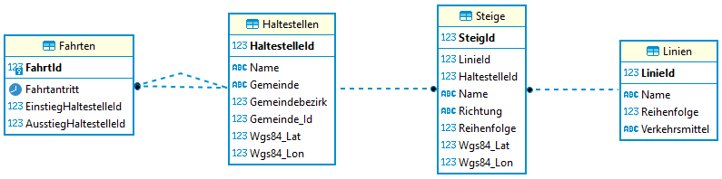

# Übungsdatenbank zu Unterabfragen: Wiener Linien

Die folgende Datenbank beinhaltet die offiziellen Daten der Wiener Linien über die Haltestellen,
Steige und Linien. Die Daten können unter folgender URL abgerufen werden:

- csv-linien: https://data.wien.gv.at/csv/wienerlinien-ogd-linien.csv
- csv-haltestellen: https://data.wien.gv.at/csv/wienerlinien-ogd-haltestellen.csv
- csv-steige: https://data.wien.gv.at/csv/wienerlinien-ogd-steige.csv

Aus diesen Daten wurde eine Auswahl von 10 Linien getroffen, damit die Ergebnismenge überschaubar
bleibt. Die Bezirke sind Musterdaten und entsprchen nicht dem echten Gemeindebezirk der Haltestelle.



Jede Haltestelle hat mehrere Steige, von denen eine Linie abfährt. Es wird zwischen Haltestellen
auf der Hin- und auf der Rückfahrt unterschieden.

## Generieren der Datenbank

Öffne in Docker Desktop eine Shell des Oracle oder SQL Server Containers. Kopiere danach die
folgenden Befehle in das Fenster. Sie laden die .NET 6 SDK und den Generator der Datenbank.
Am Ende wirst du nach dem Admin Passwort der Datenbank gefragt. Hast du den Container mit den
Standardpasswörtern (*oracle* für Oracle bzw. *SqlServer2019* für Sql Server 2019) erstellt,
musst du nur *Enter* drücken.

```bash
if [ -d "/opt/oracle" ]; then DOWNLOADER="curl -s"; else DOWNLOADER="wget -q -O /dev/stdout"; fi
$DOWNLOADER https://raw.githubusercontent.com/schletz/Dbi2Sem/master/start_dotnet.sh > /tmp/start_dotnet.sh
chmod a+x /tmp/start_dotnet.sh
/tmp/start_dotnet.sh https://raw.githubusercontent.com/schletz/Dbi2Sem/master/WienerlinienDb/WienerlinienDb.tar

```


## Übungsaufgaben

**(1)** Welche Haltestellen fährt die Linie 42 im 10. Bezirk an? Geben Sie jede Haltestelle nur 1x
        aus. Sie können das Beispiel mit einem JOIN oder einer Unterabfrage lösen.

| HaltestelleId | Name            | Gemeinde | Gemeindebezirk | Gemeinde_Id | Wgs84_Lat        | Wgs84_Lon        |
| ------------- | --------------- | -------- | -------------- | ----------- | ---------------- | ---------------- |
| 214460178     | Antonigasse     | Wien     | 10             | 90001       | 48.2259528660072 | 16.32978184724   |
| 214460627     | Hildebrandgasse | Wien     | 10             | 90001       | 48.2231580146262 | 16.3385763538715 |
| 214461347     | Sommarugagasse  | Wien     | 10             | 90001       | 48.2261683086003 | 16.3316323767253 |
| 214461481     | Vinzenzgasse    | Wien     | 10             | 90001       | 48.2250013170396 | 16.3344171541061 |

**(2)** Von welchen Haltestellen können Sie vom 37A in den N31 umsteigen?

| HaltestelleId | Name           | Gemeinde | Gemeindebezirk | Gemeinde_Id | Wgs84_Lat        | Wgs84_Lon        |
| ------------- | -------------- | -------- | -------------- | ----------- | ---------------- | ---------------- |
| 214460674     | Höchstädtplatz | Wien     | 11             | 90001       | 48.2392427792165 | 16.3769074670449 |

**(3)** Welche Haltestellen fährt der 16A zwar am Hinweg (Steig.Richtung = 'H'), aber nicht am
        Rückweg (Steig.Richtung = 'R') an.  

| HaltestelleId | Name                           | Gemeinde | Gemeindebezirk | Gemeinde_Id | Wgs84_Lat        | Wgs84_Lon        |
| ------------- | ------------------------------ | -------- | -------------- | ----------- | ---------------- | ---------------- |
| 214460140     | Breitenfurter St/Altmannsd Str | Wien     | 10             | 90001       | 48.1655992519806 | 16.3166125451748 |
| 214461103     | Pfarrgasse                     | Wien     | 11             | 90001       | 48.1496351919079 | 16.347092382765  |
| 214461219     | Sagedergasse                   | Wien     | 10             | 90001       | 48.1615427900746 | 16.3177534055856 |
| 214461712     | Edmund-Reim-Gasse              | Wien     | 10             | 90001       | 48.162525477941  | 16.3142050602134 |
| 214461880     | Hetzendorf S/Altmannsdf. Str.  | Wien     | 10             | 90001       | 48.166605828002  | 16.3157501625021 |

**(4)** Welche Linien fahren im 13. Bezirk?

| LinieId   | Name |
| --------- | ---- |
| 214434095 | 92A  |
| 215096144 | 88B  |

**(5)** Welche Linien fahren NUR im 13. Bezirk? Achten Sie auf Linien, die keinen Bezirk eingetragen
        haben.

| LinieId   | Name |
| --------- | ---- |
| 215096144 | 88B  |

**(6)** Welche Fahrten beginnen auf der Linie 42?

| FahrtId | Fahrtantritt        | EinstiegHaltestelleId | AusstiegHaltestelleId |
| ------- | ------------------- | --------------------- | --------------------- |
| 12      | 2020-04-07 05:24:03 | 214460178             | 214461778             |
| 26      | 2020-04-09 16:14:39 | 214461481             | 214461505             |
| 36      | 2020-04-08 21:10:27 | 214461558             | 214461557             |
| 61      | 2020-04-10 01:52:22 | 214461558             | 214468727             |

**(7)** Welche Fahrten beginnen und enden auf der Linie 88B?

| FahrtId | Fahrtantritt        | EinstiegHaltestelleId | AusstiegHaltestelleId |
| ------- | ------------------- | --------------------- | --------------------- |
| 7       | 2020-04-10 21:03:25 | 214461297             | 214461628             |
| 13      | 2020-04-06 01:05:57 | 214461245             | 214550392             |

**(8)** Erstellen Sie eine View *vLinieninfo*: Geben Sie alle Informationen aus der Linientabelle
        samt der Anzahl der Haltestellen auf der Richtung H und der Richtung R aus. Zusätzlich sind
        noch ID, Name, GemeindeId, Gemeindename und Gemeindebezirk aus der Tabelle Haltestelle
        für die Anfangshaltestelle (Reihenfolge 1 in Richtung H) und der Endhaltestelle
        (Reihenfolge 1 in der Richtung R) auszugeben.

| LinieId   | Name | Reihenfolge | Verkehrsmittel | AnzHaltestellenHin | AnzHaltestellenRetour | BeginnHaltestelleId | BeginnHaltestelleName          | BeginnHaltestelleGemeindeId | BeginnHaltestelleGemeinde | BeginnHaltestelleGemeindebezirk | EndeHaltestelleId | EndeHaltestelleName       | EndeHaltestelleGemeindeId | EndeHaltestelleGemeinde | EndeHaltestelleGemeindebezirk |
| --------- | ---- | ----------- | -------------- | ------------------ | --------------------- | ------------------- | ------------------------------ | --------------------------- | ------------------------- | ------------------------------- | ----------------- | ------------------------- | ------------------------- | ----------------------- | ----------------------------- |
| 214433755 | 42   | 42          | ptTram         | 9                  | 10                    | 214461263           | Schottentor                    | 90001                       | Wien                      | 11                              | 214460178         | Antonigasse               | 90001                     | Wien                    | 10                            |
| 214433827 | 16A  | 118         | ptBusCity      | 33                 | 34                    | 214460944           | Marschallplatz                 | 90001                       | Wien                      | 10                              | 214460119         | Alaudagasse               | 90001                     | Wien                    | 11                            |
| 214433863 | 37A  | 137         | ptBusCity      | 19                 | 19                    | 214460385           | Engerthstraße/Traisengasse     | 90001                       | Wien                      | 11                              | 214460356         | Dänenstraße               | 90001                     | Wien                    | 10                            |
| 214433925 | 72A  | 181         | ptBusCity      | 25                 | 25                    | 214461778           | Gasometer                      | 90001                       | Wien                      | 12                              | 214461616         | Schemmerlstraße/Unterfeld | 90001                     | Wien                    | 12                            |
| 214433965 | N31  | 331         | ptBusNight     | 23                 | 23                    | 214461276           | Schwedenplatz                  | 90001                       | Wien                      | 11                              | 214461374         | Stammersdorf              | 90001                     | Wien                    | 12                            |
| 214433975 | N46  | 346         | ptBusNight     | 19                 | 20                    | 214461068           | Oper/Karlsplatz U              | 90001                       | Wien                      | 11                              | 214461133         | Otto-Wagner-Spital        | 90001                     | Wien                    | 10                            |
| 214433981 | N62  | 362         | ptBusNight     | 22                 | 24                    | 214461068           | Oper/Karlsplatz U              | 90001                       | Wien                      | 11                              | 214460609         | Speising, Hermesstraße    | 90001                     | Wien                    | 10                            |
| 214434095 | 92A  | 197         | ptBusCity      | 27                 | 29                    | 214460746           | Kaisermühlen-VIC               | 90001                       | Wien                      | 12                              | 214461560         | Zachgasse                 | 90001                     | Wien                    | 13                            |
| 215096144 | 88B  | 195         | ptBusCity      | 12                 | 13                    | 214550392           | Seestadt                       | 90001                       | Wien                      | 13                              | 214461166         | Eßling, Wegmayersiedlung  | 90001                     | Wien                    | 13                            |
| 302692523 | 11   | 0           | ptBusRegion    | 12                 | 8                     | 214468148           | Hart/St Pölten Wolfenbergerstr | 30201                       | Hart (St Pölten)          |                                 | 214468727         | St. Georgen/Stfd Schulen  | 30201                     | St Georgen/Steinfeld    |                               |

Beantworten Sie mit Hilfe dieser View die folgenden 3 Abfragebeispiele:

**(9)** Welche Linie hat die meisten Haltestellen auf der Hinrichtung? Beachten Sie, dass auch mehrere
        Linien diese Anzahl haben könnten (auch wenn es in diesem Datenbestand nicht so ist).

| LinieId   | Name | AnzHaltestellenHin |
| --------- | ---- | ------------------ |
| 214433827 | 16A  | 33                 |

**(10)** Welche Linie beginnt und endet im selben Bezirk?

| LinieId   | Name | BeginnHaltestelleGemeindebezirk |
| --------- | ---- | ------------------------------- |
| 214433925 | 72A  | 12                              |
| 215096144 | 88B  | 13                              |

**(11)** Welche Fahrten beginnen an der Einstiegsstelle einer Linie?

| LinieId   | Name | FahrtId | Fahrtantritt        | EinstiegHaltestelleId | AusstiegHaltestelleId |
| --------- | ---- | ------- | ------------------- | --------------------- | --------------------- |
| 214433827 | 16A  | 11      | 2020-04-07 03:32:11 | 214460944             | 214468148             |
| 302692523 | 11   | 30      | 2020-04-10 00:06:04 | 214468148             | 214461276             |
